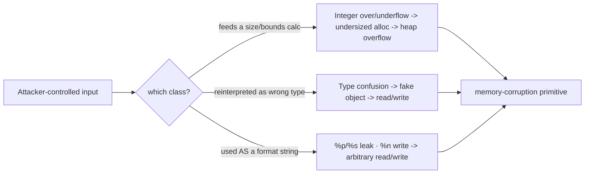

# 🔢 Integer, Type Confusion & Format String Bugs

> [!danger] Authorized simulation / lab binaries only
> Practise on binaries you compile or own. These bug classes underpin many real CVEs; understanding them drives secure coding and detection. Never target software you are not authorized to test.

## Parent Learning Order
Stack Corruption -> Heap Exploitation & Use-After-Free -> Integer, Type Confusion & Format String Bugs

## Bugs That Become Memory Corruption Indirectly

> *No buffer was overflowed, every write stayed inside its bounds, and memory is corrupt anyway. How?*
>
> Hold your answer — the section below is the response.

Stack and heap overflows corrupt memory *directly*. This note covers the subtler classes where **valid-looking logic silently turns into a memory-safety violation**: an **integer** miscalculation that produces a wrong size, a **type confusion** that treats one object as another, and a **format string** flaw that hands an attacker a read/write primitive through `printf`. They are grouped because they share a theme — *the corruption is a second-order consequence of a logic/parsing mistake*, not an obvious buffer overrun — which is exactly why they slip past casual review and produce so many high-severity CVEs.

The unifying insight: **the program trusts a computed value or a declared type, and the attacker controls the input that makes that value or type wrong.**

> [!tip] The analogy, and where it breaks
> These bugs are like a warehouse that orders boxes based on a clerk's arithmetic: if you trick the clerk into computing "0 boxes needed" for a huge shipment (integer overflow), the goods spill onto the floor (heap overflow); a format string is like handing the clerk a label-printer template that also lets you *read and rewrite* any shelf's contents. The analogy breaks on visibility: a warehouse error is obvious when goods spill, whereas these bugs often produce *no visible symptom until exploited* — the arithmetic looked fine and the printf "worked," so they hide in code that passed review and tests.

**Prerequisites:** **Binary Exploitation Fundamentals**, **Heap Exploitation & Use-After-Free** (integer bugs usually lead to heap overflows), and C integer/format semantics.

## Integer Bugs → Memory Corruption

Integers are fixed-width, so arithmetic can **overflow, underflow, truncate, or flip sign** — and when the wrong result feeds an allocation size or a bounds check, memory corruption follows:

```c
// ❌ integer overflow in a size calculation
void *buf = malloc(count * size);   // count*size wraps to a small number...
memcpy(buf, src, count * size);     // ...but the copy uses the huge intended length -> heap overflow
```

Common variants: **signedness** (a negative length passed to a function expecting `size_t` becomes enormous), **truncation** (a 64-bit length stored in a 32-bit field), and **allocation arithmetic** (`n*sizeof(x)` wrapping). The bug is in the *math*; the crash is in a later copy — which is why they are hard to spot.

## Type Confusion

**Type confusion** occurs when code treats a chunk of memory as the *wrong type* — e.g. a script hands an object of type `A` to code that assumes type `B`, so a field that is an integer in `A` is dereferenced as a pointer in `B`. This is endemic in language runtimes and browsers (JS engines), where a single confused type gives an attacker a fake object with attacker-chosen "pointers," yielding read/write primitives. The root cause is a missing or bypassed type check, not a buffer size.

## Format String: A Read/Write Primitive from printf

When user input becomes the *format string* itself — `printf(user_input)` instead of `printf("%s", user_input)` — the attacker controls format specifiers:

- `%p`/`%x` — **leak** stack memory (defeat ASLR/canary by reading addresses).
- `%s` — **read** arbitrary memory (dereference a pointer on the stack).
- `%n` — **write** the number of bytes printed so far to a pointed-at address → an arbitrary write.

A format string is uniquely powerful: one bug gives *both* read (leak) and write (`%n`) primitives, often enough for full exploitation on its own.



## Worked Example: One Misused printf Is an Arbitrary Read

The bug is a single missing format string, and it is easy to look at without
seeing:

```c
if (fgets(in, sizeof in, stdin)) printf(in);   // user input AS the format string
```

`printf(in)` rather than `printf("%s", in)`. The compiler accepts it, it behaves
correctly for every input without a `%`, and it hands the attacker the format
parser.

**Confirming the bug** takes one line — if the specifiers are interpreted rather
than printed, the program is reading arguments that were never passed:

```shell-session
analyst@lab:/tmp/fmt-lab$ echo 'AAAA %p %p %p %p' | ./fmt | head -1
say something: AAAA 0x7ffd4c1a2e50 0x7f3a9c8d5760 0x1 0x7ffd4c1a2f38
```

`printf` believes it was given four pointer arguments. It was given none, so it
reads whatever occupies the argument registers and then walks up the stack. Those
are real values from the process, printed to the attacker.

**Turning it into a targeted read.** Positional specifiers (`%N$x`) address a
specific slot instead of walking one at a time:

```shell-session
analyst@lab:/tmp/fmt-lab$ for i in $(seq 1 10); do printf "%%%d\$x" $i | ./fmt | head -1; done | grep -i c0decafe
say something: c0decafe
```

The value `0xC0DECAFE` was a local variable in `main`. Nothing passed it to
`printf`; the format string reached up the stack and read it. On a real target
that same primitive leaks a stack canary — defeating the canary check — or a libc
pointer, defeating ASLR. And `%n`, which *writes* the number of bytes printed so
far to a pointed-to address, converts the same bug into an arbitrary write.

**The fix, and why it is verifiable:**

```shell-session
analyst@lab:/tmp/fmt-lab$ echo 'AAAA %p %p %p' | ./fmt_fixed | head -1
say something: AAAA %p %p %p
```

The specifiers now appear literally, because the input is an argument rather than
the format. Compiling with `-Wformat-security` rejects the original pattern at
build time, which is where this class should be caught — it is one of the few
memory-safety bugs a compiler can reliably find by inspection.

## Why the crash site is rarely the bug

- **Blaming the crash site, not the cause.** An integer-overflow heap corruption crashes in `memcpy`, far from the buggy arithmetic — trace the *size* back to its computation.
- **Assuming `%n` is available.** Many libc builds and hardened configs disable `%n` in writable format strings (`_FORTIFY_SOURCE`), so a format bug may be leak-only — test the read primitive first.
- **Signedness confusion in your own exploit.** Off-by-sign errors while crafting the malicious length are easy to make; verify the value the program actually computes.
- **Type confusion needs the runtime's model.** Exploiting it requires understanding the specific engine's object layout — it is not a generic byte overflow.
- **`printf("%s", user)` is safe.** The bug is *only* when input is the format argument; correctly-used printf is fine — don't over-report.

**The deliberate break:** memory corruption reads as a write that went out of bounds — a buffer overflowed because something copied too much.

In this family every write is **in bounds according to the program's own arithmetic**. An integer overflow makes a size calculation produce a small number, so the copy that follows is correct with respect to a length that is wrong; type confusion makes a perfectly valid field access land on a different object's layout; a format string turns `printf` into a read/write primitive using nothing but its documented behaviour. The bounds check ran and passed. The bound itself was already wrong, which is why the write looks legitimate everywhere you inspect it.

**How you'd spot it:** look upstream of the write, at the calculation that produced the size or the cast that produced the type — the write site itself will look correct and tells you nothing. The recognisable shapes are a length computed by multiplication or addition from untrusted values with no overflow check, and a downcast or union access whose discriminating tag came from the input. Build-time flags catch much of it outright: `-Wformat-security`, `_FORTIFY_SOURCE` and the integer sanitizers reject at compile or run time what code review keeps missing.

## Security Implications — the Defender's View

- **Compiler & libc hardening:** `-Wformat -Wformat-security` (and `-Werror`) reject format-string bugs at build; `_FORTIFY_SOURCE` restricts `%n`; `-ftrapv`/`-fsanitize=integer` catch integer overflow.
- **Checked arithmetic & safe types:** `__builtin_mul_overflow`, `size_t` discipline, and languages with checked/big integers remove the size-calculation class.
- **Type safety:** strongly-typed/memory-safe languages and runtime type checks eliminate type confusion — the reason browser vendors invest in it heavily.
- **Detection:** static analysis flags `printf(user)` and unchecked `a*b` sizes; fuzzing with ASan/UBSan catches integer and type bugs at the point of undefined behavior.

## Summary

You should now be able to:

- Explain why these bugs cause corruption *indirectly* (a wrong value or type), and what `printf(user_input)` allows.
- Leak stack memory (including a secret) with positional format specifiers, and explain how an integer overflow in a size calc leads to a heap overflow.
- Explain the read+write power of `%n`/`%s`, why type confusion needs the runtime's object model, and how `-Wformat-security`, checked arithmetic, `_FORTIFY_SOURCE`, and memory-/type-safe languages defend each class.

---
> 🔼 Up: [[Memory Corruption Exploitation]]
