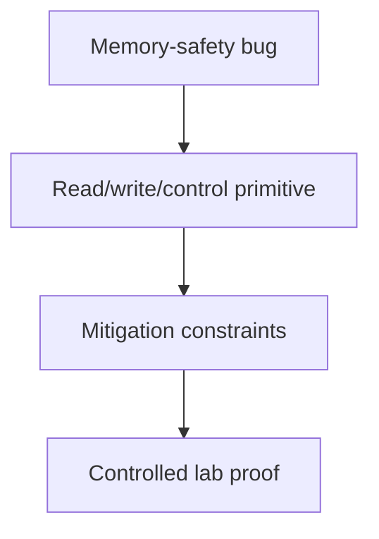

# Memory Corruption Exploitation

## 🗺️ Zero-to-Mastery Learning Path

1. [[Stack Corruption]]
2. [[Heap Exploitation & Use-After-Free]]
3. [[Integer, Type Confusion & Format String Bugs]]

---
> 🔼 Up: [[Exploit Development]]
