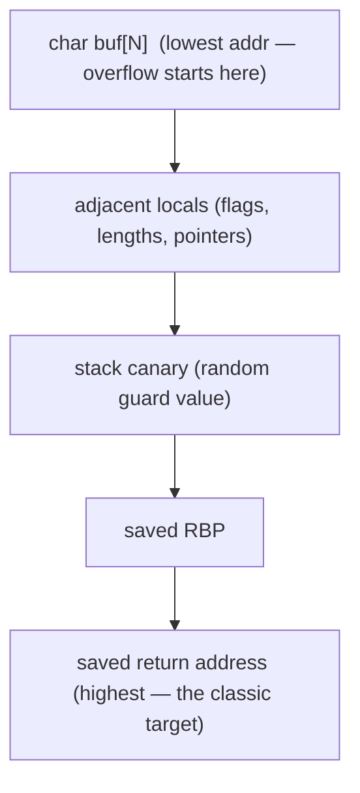

# 🥞 Stack Corruption

> [!danger] Authorized simulation / lab binaries only
> Practise on binaries you compile or own. Understanding stack corruption drives both exploitation and compiler-hardening/detection work. Never target software you are not authorized to test.

## Parent Learning Order
Stack Corruption -> Heap Exploitation & Use-After-Free -> Integer, Type Confusion & Format String Bugs

## Corrupting More Than the Return Address

**Binary Exploitation Fundamentals** showed the headline stack attack: overflow a buffer, overwrite the saved return address, redirect RIP. This note goes wider and deeper into **stack corruption** as a class — because not every useful corruption reaches the return address. A local buffer overflow also marches through *other local variables* and the *saved frame pointer* on the way, and even a **single byte** past the end (an off-by-one) can be decisive. And this is where the primary defense — the **stack canary** — lives, so understanding stack corruption means understanding both how to reach interesting stack data and how the canary is designed to stop you.

The broader idea: **the stack is a shared, ordered scratchpad, and an overflow corrupts everything between the buffer and the top of the frame** — return address, saved RBP, and any adjacent locals. Which of those you corrupt determines the exploit.

> [!tip] The analogy, and where it breaks
> Local variables on the stack are like items packed tightly in a single drawer with the "exit note" (return address) at the back — shove too much into the front item and you crush everything behind it, including possibly just nudging the item next to it. The analogy breaks on precision: crushing a drawer is messy, whereas a good stack exploit overwrites *exactly* the adjacent variable (or one byte of it) and nothing else, turning a blunt overflow into a surgical change of a single flag or length.

**Prerequisites:** **Binary Exploitation Fundamentals** (overflow → return address) and **CPU, Assembly & the ABI** (frame layout, saved RBP).

## What Lives on the Stack, and What You Can Corrupt

Within one frame (higher addresses at the bottom), a typical layout an overflow crosses:



- **Adjacent locals** — overwriting an `int authenticated` or a length field can bypass logic or enlarge a later copy *without ever touching the return address* (so no canary is triggered).
- **Saved RBP** — corrupting it enables "stack pivot"/frame-pointer tricks.
- **The canary** — a random value the compiler places *before* the saved RBP/return address; the function checks it on exit and aborts if changed.
- **Off-by-one** — writing exactly one byte too many can overwrite the least-significant byte of the saved RBP (a "frame pointer overwrite") or a canary's null byte — small overflows are still exploitable.

Read the frame from higher addresses (top) to lower (bottom): the saved return address (RIP) and saved RBP sit *above* the local `buf[64]`. A linear overflow that begins inside the buffer therefore writes **upward** through the saved frame pointer and into the return address — which is precisely why controlling `buf` eventually controls RIP. The canary below is inserted between the locals and the saved registers to detect exactly this upward march.

## The Stack Canary and Its Limits

The **stack canary** (`-fstack-protector`) is the primary mitigation: a random value written between the locals and the return address at function entry, verified before `ret`. If an overflow reached the return address, it also clobbered the canary → the check fails → `*** stack smashing detected ***` and the process aborts. Its limits (and thus the bypasses):

- It does **not** protect *adjacent locals below it* — a targeted overwrite of a flag or length is invisible to the canary.
- It can be **leaked** (via a separate info-leak/format-string bug) and then rewritten with its correct value.
- **Partial/off-by-one** overflows may avoid disturbing it.

## Worked Example: An Overflow That Never Touches the Return Address

The canonical mental image of stack corruption is a smashed return address. This
example shows the more common and quieter case first — corrupting a neighbour —
then shows what the canary does and does not catch.

**The specimen.** A local flag sits immediately next to an unbounded buffer:

```c
#include <stdio.h>
#include <string.h>
int main(void){
    volatile int authenticated = 0;   // adjacent local
    char buf[16];
    printf("password: ");
    gets(buf);                        // no bounds check at all
    if (authenticated) puts("AUTH-BYPASS");
    else puts("denied");
    return 0;
}
```

Built with the canary disabled, 28 bytes of input reach past the 16-byte buffer
and land on the flag:

```shell-session
analyst@lab:/tmp/stack-lab$ gcc -fno-stack-protector -O0 -w auth.c -o auth_nocanary
analyst@lab:/tmp/stack-lab$ python3 -c "import sys; sys.stdout.buffer.write(b'A'*24 + b'\x01\x00\x00\x00')" | ./auth_nocanary
password: AUTH-BYPASS
```

Read what did *not* happen. The return address was never touched, `RIP` was never
redirected, and no control flow was hijacked. Twenty-four bytes of padding
carried the write past `buf` and four more bytes set `authenticated` to a
non-zero value. The program then took its own `if` branch, correctly, on
corrupted data. This is stack corruption achieving its goal purely through data.

**Now the same source with the canary enabled**, overflowing far enough to reach
the return address:

```shell-session
analyst@lab:/tmp/stack-lab$ gcc -fstack-protector-all -O0 -w auth.c -o auth_canary
analyst@lab:/tmp/stack-lab$ python3 -c "import sys; sys.stdout.buffer.write(b'A'*100)" | ./auth_canary; echo "exit=$?"
password: *** stack smashing detected ***: terminated
exit=134
```

Exit code 134 is SIGABRT — the process killed itself on purpose. That is the
control working exactly as designed, and it is worth recognising in a crash
triage: a `stack smashing detected` abort is not a bug in the program, it is the
program refusing to return to an attacker-supplied address.

**The two results together are the lesson.** The canary sits *between* the local
variables and the return address. It therefore protects the return address and
nothing below it — the first overflow flew underneath it and was never a
candidate for detection. A canary is a control-flow-integrity measure, not a
bounds check, and defending the first case needs bounds-checked APIs or a
language that will not compile `gets` at all.

## Overflows that never touch the return address

- **Assuming every overflow needs RIP.** Many real exploits corrupt an adjacent length or flag, never touching the return address (and never tripping the canary) — look at *all* the frame's data.
- **Canary abort mistaken for a failed exploit.** `stack smashing detected` means the overflow *worked* but the canary caught it — that is the control functioning, and it points you toward a leak or a below-canary target.
- **Off-by-one dismissed as harmless.** One byte can overwrite a pointer's low byte or a null terminator — do not assume a tiny overflow is safe.
- **Local stack layout ≠ compiler's.** Compilers reorder locals and add padding; verify the actual layout in a debugger rather than assuming source order.
- **ASLR vs the canary.** These defend different things — a canary stops the overwrite; ASLR randomizes addresses. Bypassing one does not bypass the other.

## Security Implications — the Defender's View

- **Enable stack protectors everywhere** (`-fstack-protector-strong`/`-all`) and treat a canary abort as a high-signal detection — a crashing service with "stack smashing detected" is an attack indicator.
- **Bounds-checked APIs and safe languages** remove the class: `strncpy`/`snprintf` with correct sizes, `std::string`, or Rust eliminate the unbounded copy.
- **Shadow stacks (Intel CET)** keep a protected copy of return addresses, catching a corrupted stack return even if the canary is bypassed.
- **Compiler warnings + fuzzing** catch these pre-ship; ASan (AddressSanitizer) in testing flags the overflow at the moment it happens, with the exact line.

## Summary

You should now be able to:

- Explain that a stack overflow corrupts everything between the buffer and the return address, and what a stack canary is.
- Overflow a buffer to overwrite an adjacent flag (bypassing logic with no RIP control), and demonstrate the canary catching a return-address overflow.
- Explain why the canary doesn't protect below-canary locals, how it can be leaked or off-by-one'd, and how shadow stacks, bounds-checked APIs, safe languages, and ASan defend the class.

---
> 🔼 Up: [[Memory Corruption Exploitation]]
