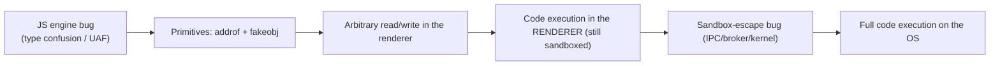

# 🌐 Browser Exploitation Theory

> [!danger] Authorized research only
> Real browser exploitation targets specific engine bugs and is developed against your own builds in isolated VMs. The lab here is a *benign illustration* of a memory-reinterpretation primitive in Node — not an exploit. Never target browsers or users you are not authorized to test.

## Parent Learning Order
Userland Exploitation: Linux & Windows -> Kernel Exploitation Theory -> Browser Exploitation Theory

## The Most-Attacked Program on Every Device

> *Which program on your device downloads and executes code written by strangers, by design, all day?*
>
> Hold your answer — the section below is the response.

A modern browser is the largest, most-exposed attack surface most people run: it downloads and executes untrusted code (JavaScript, WebAssembly) from any website, parses dozens of complex formats, and JIT-compiles hostile input at high speed. **Browser exploitation** turns a bug in that machinery into code execution *just from visiting a page* — the foundation of drive-by attacks and the most valuable exploits on the market. It is *theory* here because a working browser exploit is deeply tied to one engine's internals and cannot be a safe single-machine lab, but the model matters: it shows how all the prior primitives combine, under a sandbox, into a full chain.

The defining reality: **one bug is never enough.** Browsers isolate the untrusted renderer in a **sandbox**, so an attacker needs a *chain* — a renderer bug for code execution, then a *separate* sandbox-escape bug, then often a kernel bug for full system control.

> [!tip] The analogy, and where it breaks
> A browser is like a bank that lets any stranger walk in and run their own experiments in a sealed glovebox (the sandbox): the JS engine is the glovebox, and an engine bug lets you do anything *inside* it — but you're still in the box, so you need a *second* flaw to breach the glovebox glass, and a third to leave the building. The analogy breaks on speed and scale: a glovebox handles one experiment, whereas a browser JIT-compiles and runs millions of adversarial operations per second, so attackers can probe for the exact optimization mistake that cracks the box.

**Prerequisites:** **Integer, Type Confusion & Format String Bugs** (type confusion), **Heap Exploitation & Use-After-Free**, and **Exploit Reliability** (chains, leaks).

## The Attack Surface and the Chain

| Component | Why it's attacked |
|---|---|
| **JS engine (JIT)** | Type confusion / optimization bugs → memory corruption from script |
| **DOM / renderer** | UAF from complex object lifetimes |
| **WebAssembly** | RWX-adjacent execution, bounds bugs |
| **Parsers (image, font, PDF)** | Memory corruption in C/C++ parsers |
| **IPC / sandbox broker** | The boundary a renderer bug must cross to escape |

A typical chain:



The two magic **primitives** that a JS-engine bug is refined into:

- **addrof(obj)** — leak the memory address of a JavaScript object (defeats ASLR from within the engine).
- **fakeobj(addr)** — craft a fake object at an attacker-chosen address.

Together they bootstrap an **arbitrary read/write** primitive inside the renderer, from which everything else follows. They are usually built by abusing how the engine reinterprets a value's *type* — e.g. a type confusion that lets you view a floating-point value's raw bits as a pointer, and vice-versa.

## Worked Example: The Primitive Every Browser Exploit Is Built From

Browser exploitation reduces to one capability: being able to read the same bytes
as two different types. JavaScript offers a legitimate, safe version of that, and
looking at it makes the illegitimate version legible.

```javascript
const buf = new ArrayBuffer(8);
const f64 = new Float64Array(buf);   // view those 8 bytes as a double
const u32 = new Uint32Array(buf);    // view the SAME 8 bytes as two integers

f64[0] = 3.14159;
console.log("float   :", f64[0]);
console.log("raw bits:", "0x" + u32[1].toString(16) + u32[0].toString(16));

u32[0] = 0x41414141; u32[1] = 0x00007fff;   // choose the bits directly
console.log("float from chosen bits:", f64[0]);
```

```shell-session
analyst@lab:/tmp/br-lab$ node prim.js
float   : 3.14159
raw bits: 0x400921f9f01b866e
float from chosen bits: 6.94906e-310
```

The same eight bytes were read as a number and as raw integers, and then written
as integers and read back as a number. Nothing here is a vulnerability — typed
arrays are designed to do exactly this, over a buffer that holds only data.

**A type-confusion bug gives an attacker the same capability over an object
reference**, and that changes everything:

- Read an object's pointer bits as a number — that is **addrof**, and it leaks
  where an object lives.
- Write chosen bits and have the engine treat them as an object pointer — that is
  **fakeobj**, and it forges an object at an address of your choosing.

Together, `addrof` and `fakeobj` compose into arbitrary read and write inside the
renderer, which is why exploit writeups treat reaching them as the milestone
rather than the finish.

**And the renderer is not the finish.** A modern drive-by chain needs a distinct
bug at each stage, and the defence at each stage is what forces the next one:

| Stage | What it achieves | The control that forces another bug |
|:--|:--|:--|
| Engine bug (type confusion / UAF) | the primitive above | shape-integrity checks in the JIT |
| addrof + fakeobj | arbitrary read/write in the renderer | JIT hardening, pointer authentication |
| Renderer RCE | code execution — still sandboxed | site isolation, multi-process sandbox |
| Sandbox escape | out of the renderer | broker hardening, least-privilege renderer |
| OS control | root or SYSTEM | kernel mitigations |

The reason a browser bug is rarely a browser *compromise* is that each row is a
separate vulnerability. That is also why full chains are expensive and why
defenders get real value from breaking any single row rather than all of them.

## Why renderer RCE is not game over

- **Stopping at renderer RCE.** Code execution in the sandboxed renderer is not "game over" — without a sandbox escape you're confined; a real weaponized exploit needs the full chain.
- **Engine-version specificity.** JS-engine internals (object shapes, JIT behavior) change constantly; an exploit is pinned to an exact build and rots fast.
- **JIT mitigations.** Modern engines add JIT hardening, pointer authentication (ARM PAC), and structure integrity checks that break classic addrof/fakeobj — check what the target enforces.
- **Non-determinism.** GC timing and heap state make engine exploits flaky; heavy reliability engineering (grooming the engine's allocator) is required.
- **Confusing a crash for exploitability.** A JS bug that crashes the tab may not yield the controlled type confusion needed for primitives — triage carefully.

**The deliberate break:** code execution reads as compromise. Get the CPU running your instructions and the machine is yours.

In a browser it lands you inside a **sandboxed renderer with almost no authority** — no filesystem to speak of, no other origin's data, and a restricted set of system calls. That is why a real browser exploit is a *chain* rather than a bug: one flaw in the engine for execution, and a second, entirely separate flaw to escape the sandbox. Site isolation extends the same logic to origins, so a bug in one site's renderer is contained from the others by design rather than by luck.

**How you'd spot it:** read any browser advisory by asking which link of the chain it supplies. "Renderer RCE" and "sandbox escape" are different products at very different prices, and an attacker holding only the first still needs the second from somewhere. That is also why the two defensive investments that dominate everything else are site isolation and fast automatic updates — one raises the number of bugs required, the other shortens how long any pair stays usable.

## Security Implications — the Defender's View

- **The multi-process sandbox is the core defense:** isolating the renderer (site isolation) means a single engine bug is contained, forcing attackers to chain a second bug — the single most important browser security investment.
- **JIT & engine hardening:** structure/shape integrity checks, JIT write-protection, pointer authentication, and control-flow integrity break the primitive-building step.
- **Fast auto-update:** because exploits are version-pinned and bugs are found constantly, rapid patching (and short update cycles) is decisive.
- **Reduce surface & risk:** disabling unneeded features (legacy plugins, some WASM/JIT via "lockdown"/"enhanced security" modes) shrinks the attack surface for high-risk users.
- **Detection:** exploit kits, anomalous JIT/RWX behavior, and renderer crashes are signals; sandbox-escape attempts show unusual IPC/broker activity.

## Summary

You should now be able to:

- Explain why a browser is so exposed and why the sandbox means an attacker needs more than one bug.
- Describe the addrof/fakeobj primitives and the type-confusion bit-reinterpretation that builds them, and map a browser exploit chain to its stages.
- Explain why site isolation forces a chained sandbox escape, how JIT/shape hardening and PAC break the primitive step, and why version-pinning and GC non-determinism make browser exploits fragile — and thus why fast auto-update is decisive.

---
> 🔼 Up: [[Platform Exploitation]]
