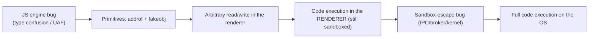

# 🌐 Browser Exploitation Theory

> [!danger] Authorized research only
> Real browser exploitation targets specific engine bugs and is developed against your own builds in isolated VMs. The lab here is a *benign illustration* of a memory-reinterpretation primitive in Node — not an exploit. Never target browsers or users you are not authorized to test.

## Parent Learning Order
Userland Exploitation: Linux & Windows -> Kernel Exploitation Theory -> Browser Exploitation Theory

## Start at Zero: The Most-Attacked Program on Every Device

A modern browser is the largest, most-exposed attack surface most people run: it downloads and executes untrusted code (JavaScript, WebAssembly) from any website, parses dozens of complex formats, and JIT-compiles hostile input at high speed. **Browser exploitation** turns a bug in that machinery into code execution *just from visiting a page* — the foundation of drive-by attacks and the most valuable exploits on the market. It is *theory* here because a working browser exploit is deeply tied to one engine's internals and cannot be a safe single-machine lab, but the model matters: it shows how all the prior primitives combine, under a sandbox, into a full chain.

The defining reality: **one bug is never enough.** Browsers isolate the untrusted renderer in a **sandbox**, so an attacker needs a *chain* — a renderer bug for code execution, then a *separate* sandbox-escape bug, then often a kernel bug for full system control.

> [!tip] The analogy, and where it breaks
> A browser is like a bank that lets any stranger walk in and run their own experiments in a sealed glovebox (the sandbox): the JS engine is the glovebox, and an engine bug lets you do anything *inside* it — but you're still in the box, so you need a *second* flaw to breach the glovebox glass, and a third to leave the building. The analogy breaks on speed and scale: a glovebox handles one experiment, whereas a browser JIT-compiles and runs millions of adversarial operations per second, so attackers can probe for the exact optimization mistake that cracks the box.

**Prerequisites:** **Integer, Type Confusion & Format String Bugs** (type confusion), **Heap Exploitation & Use-After-Free**, and **Exploit Reliability** (chains, leaks).

## The Attack Surface and the Chain

| Component | Why it's attacked |
|---|---|
| **JS engine (JIT)** | Type confusion / optimization bugs → memory corruption from script |
| **DOM / renderer** | UAF from complex object lifetimes |
| **WebAssembly** | RWX-adjacent execution, bounds bugs |
| **Parsers (image, font, PDF)** | Memory corruption in C/C++ parsers |
| **IPC / sandbox broker** | The boundary a renderer bug must cross to escape |

A typical chain:



The two magic **primitives** that a JS-engine bug is refined into:

- **addrof(obj)** — leak the memory address of a JavaScript object (defeats ASLR from within the engine).
- **fakeobj(addr)** — craft a fake object at an attacker-chosen address.

Together they bootstrap an **arbitrary read/write** primitive inside the renderer, from which everything else follows. They are usually built by abusing how the engine reinterprets a value's *type* — e.g. a type confusion that lets you view a floating-point value's raw bits as a pointer, and vice-versa.

## Failure Modes and Interpretation

- **Stopping at renderer RCE.** Code execution in the sandboxed renderer is not "game over" — without a sandbox escape you're confined; a real weaponized exploit needs the full chain.
- **Engine-version specificity.** JS-engine internals (object shapes, JIT behavior) change constantly; an exploit is pinned to an exact build and rots fast.
- **JIT mitigations.** Modern engines add JIT hardening, pointer authentication (ARM PAC), and structure integrity checks that break classic addrof/fakeobj — check what the target enforces.
- **Non-determinism.** GC timing and heap state make engine exploits flaky; heavy reliability engineering (grooming the engine's allocator) is required.
- **Confusing a crash for exploitability.** A JS bug that crashes the tab may not yield the controlled type confusion needed for primitives — triage carefully.

## Security Implications — the Defender's View

- **The multi-process sandbox is the core defense:** isolating the renderer (site isolation) means a single engine bug is contained, forcing attackers to chain a second bug — the single most important browser security investment.
- **JIT & engine hardening:** structure/shape integrity checks, JIT write-protection, pointer authentication, and control-flow integrity break the primitive-building step.
- **Fast auto-update:** because exploits are version-pinned and bugs are found constantly, rapid patching (and short update cycles) is decisive.
- **Reduce surface & risk:** disabling unneeded features (legacy plugins, some WASM/JIT via "lockdown"/"enhanced security" modes) shrinks the attack surface for high-risk users.
- **Detection:** exploit kits, anomalous JIT/RWX behavior, and renderer crashes are signals; sandbox-escape attempts show unusual IPC/broker activity.

## Authorized Lab: The Reinterpretation Primitive Behind addrof (Benign)

> [!info] Runs on one machine with Node.js — a benign demonstration of the float↔integer bit-reinterpretation that real addrof primitives abuse, plus a chain-mapping exercise
> This is legitimate JS (ArrayBuffer aliasing), NOT an exploit — it shows the *concept* a type-confusion bug weaponizes. Skip step 1-2 if Node isn't installed and do the exercise. Step 4 cleans up.

### Step 1 — Reinterpret a float's bits as integers (the core trick)

```bash
mkdir -p /tmp/br-lab && cd /tmp/br-lab
cat > prim.js <<'EOF'
// A DataView lets us view the SAME bytes as different types — the essence of
// how a type-confusion bug turns a JS value into a raw pointer and back.
const buf = new ArrayBuffer(8);
const f64 = new Float64Array(buf);
const u32 = new Uint32Array(buf);
f64[0] = 3.14159;                       // store a double
console.log("float   :", f64[0]);
console.log("raw bits:", "0x" + u32[1].toString(16) + u32[0].toString(16));
// go the other way: craft a "value" from chosen bits (a fake pointer, conceptually)
u32[0] = 0x41414141; u32[1] = 0x00007fff;
console.log("C2R-CANARY float-from-bits:", f64[0]);
EOF
command -v node >/dev/null && node prim.js || echo "(node not installed — read the exercise in step 3)"
```

```text
float   : 3.14159
raw bits: 0x400921f9f01b866e
C2R-CANARY float-from-bits: 6.94906e-310
```

### Step 2 — Interpret why this matters

```bash
echo "The SAME 8 bytes were read as a float AND as raw integers. A type-confusion bug gives an attacker exactly this:"
echo " - view an object reference's bits as an integer  -> addrof (leak an address)"
echo " - write chosen bits and have them treated as an object pointer -> fakeobj (forge an object)"
echo "addrof + fakeobj => arbitrary read/write in the renderer => RCE (still sandboxed)."
```

```text
The SAME 8 bytes were read as a float AND as raw integers. A type-confusion bug gives an attacker exactly this:
 - view an object reference's bits as an integer  -> addrof (leak an address)
 - write chosen bits and have them treated as an object pointer -> fakeobj (forge an object)
addrof + fakeobj => arbitrary read/write in the renderer => RCE (still sandboxed).
```

### Step 3 — Analysis exercise: map a full chain

> [!info] No execution — reason through the stages a real weaponized browser exploit needs.

For a hypothetical drive-by, write the chain stage by stage and the defense at each:
1. **Engine bug** → what primitive (type confusion / UAF)? *Defense:* engine shape-integrity checks.
2. **addrof/fakeobj** → arbitrary R/W. *Defense:* JIT hardening, PAC.
3. **Renderer RCE** → still sandboxed. *Defense:* site isolation / multi-process sandbox.
4. **Sandbox escape** (a *second* bug in IPC/broker/kernel). *Defense:* broker hardening, least-privilege renderer.
5. **OS control** (often a kernel bug — links to the kernel leaf). *Defense:* kernel mitigations.

The mastery signal: you can explain *why each stage needs its own bug* and which control the defender relies on to break the chain at that stage.

### Step 4 — Cleanup

```bash
cd /; rm -rf /tmp/br-lab; ls -d /tmp/br-lab 2>&1 | tail -1
```

```text
ls: cannot access '/tmp/br-lab': No such file or directory
```

**What you should now be able to do:** explain why the browser is the highest-value attack surface, describe the renderer→sandbox-escape→OS chain and why one bug is never enough, define the addrof/fakeobj primitives and the type-confusion reinterpretation they abuse, and name site isolation, JIT hardening, and fast update as the defenses.

## Crook → Operator → Root Checkpoint

- **Crook:** Explain why a browser is so exposed and why the sandbox means an attacker needs more than one bug.
- **Operator:** Describe the addrof/fakeobj primitives and the type-confusion bit-reinterpretation that builds them, and map a browser exploit chain to its stages.
- **Root:** Explain why site isolation forces a chained sandbox escape, how JIT/shape hardening and PAC break the primitive step, and why version-pinning and GC non-determinism make browser exploits fragile — and thus why fast auto-update is decisive.

---
> 🔼 Up: [[Platform Exploitation]]
