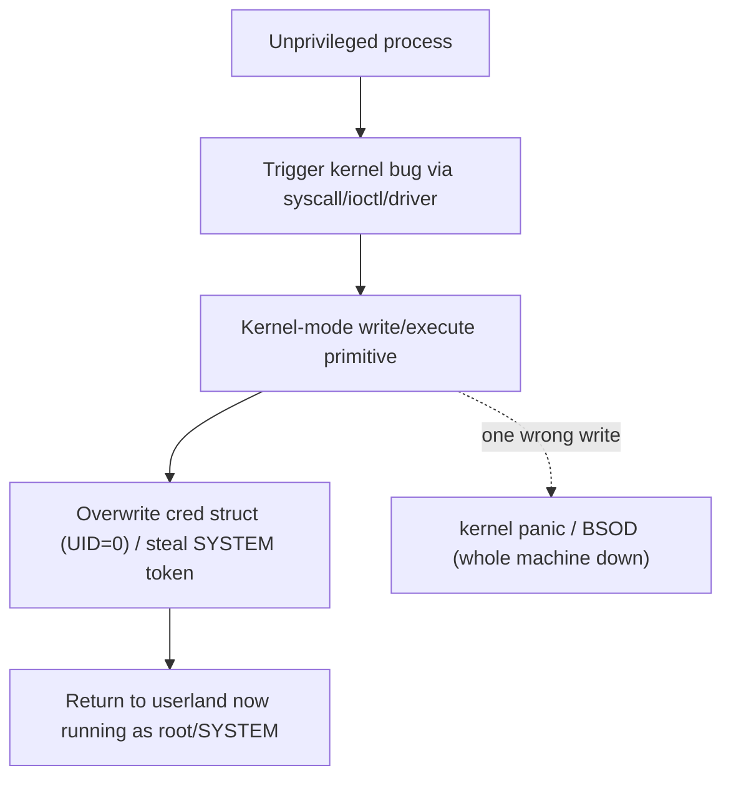

# 🧬 Kernel Exploitation Theory

> [!danger] Authorized simulation only
> Kernel exploitation is performed on VMs/lab kernels you own — a kernel bug crashes the whole machine, not one process. The lab here only *reads* mitigation state (safe, non-exploitative). Never target unauthorized systems.

## Parent Learning Order
Userland Exploitation: Linux & Windows -> Kernel Exploitation Theory -> Browser Exploitation Theory

## Attacking the Referee Itself

> *Userland exploitation hands you one process. What does a kernel bug hand you?*
>
> Hold your answer — the section below is the response.

Userland exploitation gives you control of *one process*. **Kernel exploitation** targets the operating-system kernel — the code running in **ring 0** that arbitrates all processes, memory, and hardware. Its payoff is total: a kernel bug turns a low-privileged user into **root/SYSTEM** (local privilege escalation) or lets a sandboxed process escape its confinement. Its risk is equally total: a mistake panics the entire machine. This note is *theory* because a full working kernel exploit needs a specific vulnerable kernel and a VM lab, but the mental model is essential — it is the top of the exploit-dev pillar and the mechanism behind the most severe LPE CVEs.

The defining shift from userland: **there is no bigger referee to catch you.** In userland, the kernel enforces boundaries; in the kernel, *you are inside the enforcer*, so a bug there rewrites the rules for everyone — most directly by editing the tiny structure that records "who am I."

> [!tip] The analogy, and where it breaks
> Userland exploitation is robbing one tenant's apartment; kernel exploitation is compromising the building's superintendent, who holds every key and decides who lives where. The analogy breaks on fragility: a corrupted superintendent still functions, whereas a corrupted kernel often *collapses the whole building instantly* (a panic/BSOD) — so kernel exploitation is uniquely unforgiving, and reliability engineering matters even more than in userland.

**Prerequisites:** the OS Internals kernel leaves (Linux kernel internals, Windows architecture), and all prior Exploit-Dev primitives.

## The Kernel Attack Surface and the Goal

The kernel exposes itself to unprivileged code through a few channels, each an attack surface:

| Surface | Example |
|---|---|
| **System calls** | Bugs in syscall argument handling |
| **Device drivers** | `ioctl` handlers (huge, often third-party, weakly audited) |
| **Filesystems / parsers** | Malformed images, network packets parsed in-kernel |
| **eBPF / subsystems** | Verifier or JIT bugs |

The classic goal on Linux is to overwrite the current task's **credential structure (`struct cred`)** — the few bytes recording your UID/GID. Set them to 0 and your process *is* root (`commit_creds(prepare_kernel_cred(0))` is the canonical primitive). On Windows, the analogous move is **token stealing**: copy a SYSTEM process's access token into your process. Either way, the target is the small piece of kernel memory that answers "what privileges does this process have?"



## Kernel-Specific Mitigations

The kernel has its own hardening, mirroring userland but stronger:

| Mitigation | What it stops |
|---|---|
| **KASLR** | Randomizes the kernel base (needs a leak to defeat) |
| **SMEP** | Kernel can't *execute* user-space pages (defeats ret2usr) |
| **SMAP** | Kernel can't *read/write* user-space pages carelessly |
| **KPTI** | Isolates kernel/user page tables (Meltdown defense; also raises the bar) |
| **kptr_restrict / dmesg_restrict** | Hide kernel pointers from unprivileged users (deny leaks) |
| **Lockdown, CFI, stack canaries** | Constrain control flow and catch corruption |

**SMEP** is pivotal: it killed the old "point the kernel at user-space shellcode" (ret2usr) technique, forcing kernel ROP or data-only attacks — the same arms race as userland, one ring down.

## Worked Example: Reading a Kernel's Mitigation State Before Attacking It

Kernel exploitation is unforgiving — a mistake panics the machine rather than
crashing a process — so the first work is reconnaissance against the defences
rather than the bug. Four settings decide how hard the target is, and all four
are readable without privilege.

**Are kernel pointers hidden, and is KASLR on?**

```shell-session
analyst@lab:~$ cat /proc/sys/kernel/kptr_restrict
1
analyst@lab:~$ cat /proc/sys/kernel/dmesg_restrict
1
analyst@lab:~$ grep -qw nokaslr /proc/cmdline && echo "KASLR DISABLED" || echo "KASLR enabled"
KASLR enabled
```

`kptr_restrict = 1` hides kernel pointers from unprivileged readers and
`dmesg_restrict = 1` closes the kernel log, which is historically one of the
richest sources of accidentally-printed addresses.

**Verifying the restriction actually applies to you**, rather than trusting the
setting:

```shell-session
analyst@lab:~$ head -1 /proc/kallsyms
0000000000000000 T startup_64
```

The symbol name is readable; the address is zeroed. That single line is the
difference between a KASLR bypass costing nothing and costing a whole separate
information-disclosure bug.

**What the CPU enforces:**

```shell-session
analyst@lab:~$ grep -o -m1 -E 'smep|smap' /proc/cpuinfo | sort -u | tr '\n' ' '
smap smep
```

SMEP means the kernel cannot execute pages that belong to userspace, which kills
`ret2usr` — the old and comfortable technique of pointing a corrupted kernel
function pointer at attacker code sitting in user memory. SMAP extends the same
idea to reads and writes.

**The assessment that follows from those four lines.** KASLR plus a restricted
`kallsyms` means the attacker needs a separate leak before any address is usable.
SMEP and SMAP mean that even with control of a kernel pointer, user-mapped
shellcode is unreachable, so the technique must become kernel-ROP or a data-only
attack — typically overwriting the `cred` structure of the current process to set
its UID to 0, which never executes attacker code at all and therefore never
touches the protections above.

Which is the useful conclusion: mitigations do not stop kernel exploitation, they
select the technique. The next place to look on this host is the surface those
mitigations do not cover — unprivileged user namespaces, unprivileged eBPF, and
any third-party driver exposing an `ioctl`.

## Working on a target that panics when you're wrong

- **Instability = a downed machine.** A failed kernel exploit panics the host; always work in a snapshotted VM and expect crashes while developing.
- **KASLR needs a leak.** Hardcoded kernel addresses fail; you need an info-leak (often via a separate bug or a `dmesg`/pointer disclosure) — restricted by `kptr_restrict`.
- **SMEP/SMAP break ret2usr.** Redirecting the kernel to user-space code faults; modern kernel exploits use kernel-ROP or data-only (`cred`) attacks.
- **Version specificity.** Kernel structures and offsets change between versions/configs; an exploit is tightly coupled to the exact target kernel.
- **Driver bugs vary wildly.** Third-party `ioctl` handlers are a rich but idiosyncratic surface — each needs its own reversing.

**The deliberate break:** kernel bugs carry the highest payoff, so kernel exploitation reads as the highest-leverage place to spend effort.

The payoff is total and the working conditions are unforgiving. A mistake does not throw an exception — it panics the machine, taking your access, the evidence and the reproduction with it, often along with whatever else the host was doing. And the leverage is concentrated somewhere unglamorous: most kernel privilege escalation arrives through **optional surface** — an unused driver, an `ioctl` nobody restricted, unprivileged user namespaces, unprivileged eBPF — rather than through the core the effort tends to be aimed at.

**How you'd spot it:** read the mitigation state before touching anything, because it decides which approaches are viable rather than merely harder: KASLR, SMEP, SMAP, KPTI, `kptr_restrict`, `dmesg_restrict`, lockdown and CFI each remove a specific step. Defensively the same fact sets the priority — surface reduction outperforms patch speed alone, so unloading drivers nothing uses, restricting `ioctl` access, and disabling unprivileged namespaces and eBPF where nothing needs them removes the paths most local escalation actually takes.

## Security Implications — the Defender's View

- **Enable and keep kernel mitigations on:** KASLR, SMEP, SMAP, KPTI, `kptr_restrict=2`, `dmesg_restrict=1`, lockdown, and CFI together make kernel exploitation dramatically harder and less reliable.
- **Reduce attack surface:** unload unused drivers, restrict `ioctl` access, disable unprivileged eBPF/user-namespaces where not needed — most kernel LPE comes through optional surface.
- **Patch fast:** kernel LPE CVEs are frequent and high-impact; timely patching is the primary control.
- **Detection:** unexpected privilege changes (a process's UID becoming 0 without setuid), kernel warnings/oopses, and driver crashes are signals; kernel runtime integrity (e.g. hypervisor-enforced) catches `cred`/token tampering.

## Summary

You should now be able to:

- Explain the difference between userland and kernel exploitation and why a kernel bug yields total control (and can crash the machine).
- Name the kernel attack surfaces and the `cred`-overwrite / token-steal goal, and inspect a system's KASLR/SMEP/SMAP/kptr_restrict state.
- Explain why SMEP killed ret2usr, why KASLR needs an info-leak, and how the full kernel-mitigation set plus attack-surface reduction and fast patching defend the kernel.

---
> 🔼 Up: [[Platform Exploitation]]
