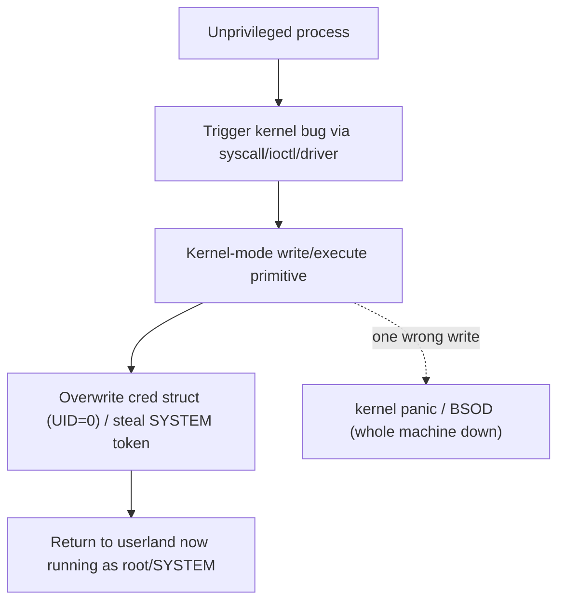

# 🧬 Kernel Exploitation Theory

> [!danger] Authorized simulation only
> Kernel exploitation is performed on VMs/lab kernels you own — a kernel bug crashes the whole machine, not one process. The lab here only *reads* mitigation state (safe, non-exploitative). Never target unauthorized systems.

## Parent Learning Order
Userland Exploitation: Linux & Windows -> Kernel Exploitation Theory -> Browser Exploitation Theory

## Start at Zero: Attacking the Referee Itself

Userland exploitation gives you control of *one process*. **Kernel exploitation** targets the operating-system kernel — the code running in **ring 0** that arbitrates all processes, memory, and hardware. Its payoff is total: a kernel bug turns a low-privileged user into **root/SYSTEM** (local privilege escalation) or lets a sandboxed process escape its confinement. Its risk is equally total: a mistake panics the entire machine. This note is *theory* because a full working kernel exploit needs a specific vulnerable kernel and a VM lab, but the mental model is essential — it is the top of the exploit-dev pillar and the mechanism behind the most severe LPE CVEs.

The defining shift from userland: **there is no bigger referee to catch you.** In userland, the kernel enforces boundaries; in the kernel, *you are inside the enforcer*, so a bug there rewrites the rules for everyone — most directly by editing the tiny structure that records "who am I."

> [!tip] The analogy, and where it breaks
> Userland exploitation is robbing one tenant's apartment; kernel exploitation is compromising the building's superintendent, who holds every key and decides who lives where. The analogy breaks on fragility: a corrupted superintendent still functions, whereas a corrupted kernel often *collapses the whole building instantly* (a panic/BSOD) — so kernel exploitation is uniquely unforgiving, and reliability engineering matters even more than in userland.

**Prerequisites:** the OS Internals kernel leaves (Linux kernel internals, Windows architecture), and all prior Exploit-Dev primitives.

## The Kernel Attack Surface and the Goal

The kernel exposes itself to unprivileged code through a few channels, each an attack surface:

| Surface | Example |
|---|---|
| **System calls** | Bugs in syscall argument handling |
| **Device drivers** | `ioctl` handlers (huge, often third-party, weakly audited) |
| **Filesystems / parsers** | Malformed images, network packets parsed in-kernel |
| **eBPF / subsystems** | Verifier or JIT bugs |

The classic goal on Linux is to overwrite the current task's **credential structure (`struct cred`)** — the few bytes recording your UID/GID. Set them to 0 and your process *is* root (`commit_creds(prepare_kernel_cred(0))` is the canonical primitive). On Windows, the analogous move is **token stealing**: copy a SYSTEM process's access token into your process. Either way, the target is the small piece of kernel memory that answers "what privileges does this process have?"



## Kernel-Specific Mitigations

The kernel has its own hardening, mirroring userland but stronger:

| Mitigation | What it stops |
|---|---|
| **KASLR** | Randomizes the kernel base (needs a leak to defeat) |
| **SMEP** | Kernel can't *execute* user-space pages (defeats ret2usr) |
| **SMAP** | Kernel can't *read/write* user-space pages carelessly |
| **KPTI** | Isolates kernel/user page tables (Meltdown defense; also raises the bar) |
| **kptr_restrict / dmesg_restrict** | Hide kernel pointers from unprivileged users (deny leaks) |
| **Lockdown, CFI, stack canaries** | Constrain control flow and catch corruption |

**SMEP** is pivotal: it killed the old "point the kernel at user-space shellcode" (ret2usr) technique, forcing kernel ROP or data-only attacks — the same arms race as userland, one ring down.

## Failure Modes and Interpretation

- **Instability = a downed machine.** A failed kernel exploit panics the host; always work in a snapshotted VM and expect crashes while developing.
- **KASLR needs a leak.** Hardcoded kernel addresses fail; you need an info-leak (often via a separate bug or a `dmesg`/pointer disclosure) — restricted by `kptr_restrict`.
- **SMEP/SMAP break ret2usr.** Redirecting the kernel to user-space code faults; modern kernel exploits use kernel-ROP or data-only (`cred`) attacks.
- **Version specificity.** Kernel structures and offsets change between versions/configs; an exploit is tightly coupled to the exact target kernel.
- **Driver bugs vary wildly.** Third-party `ioctl` handlers are a rich but idiosyncratic surface — each needs its own reversing.

## Security Implications — the Defender's View

- **Enable and keep kernel mitigations on:** KASLR, SMEP, SMAP, KPTI, `kptr_restrict=2`, `dmesg_restrict=1`, lockdown, and CFI together make kernel exploitation dramatically harder and less reliable.
- **Reduce attack surface:** unload unused drivers, restrict `ioctl` access, disable unprivileged eBPF/user-namespaces where not needed — most kernel LPE comes through optional surface.
- **Patch fast:** kernel LPE CVEs are frequent and high-impact; timely patching is the primary control.
- **Detection:** unexpected privilege changes (a process's UID becoming 0 without setuid), kernel warnings/oopses, and driver crashes are signals; kernel runtime integrity (e.g. hypervisor-enforced) catches `cred`/token tampering.

## Authorized Lab: Inspect Your Kernel's Exploitation Defenses

> [!info] Runs on one Linux machine — read (do not exploit) the mitigation state that decides how hard kernel exploitation would be
> Purely observational and safe. No cleanup needed (read-only).

### Step 1 — Is KASLR active, and are kernel pointers hidden?

```bash
echo "kptr_restrict = $(cat /proc/sys/kernel/kptr_restrict)   (2 = hide kernel pointers from everyone)"
echo "dmesg_restrict = $(cat /proc/sys/kernel/dmesg_restrict)  (1 = unprivileged users can't read dmesg leaks)"
grep -qw nokaslr /proc/cmdline && echo "KASLR: DISABLED (nokaslr)" || echo "KASLR: enabled (default)"
```

```text
kptr_restrict = 1
dmesg_restrict = 1
KASLR: enabled (default)
```

### Step 2 — Confirm kernel pointers are actually restricted for you

```bash
head -1 /proc/kallsyms
echo "^ if the address is all zeros, kptr_restrict is hiding it from your unprivileged view (denies the info-leak KASLR bypass needs)"
```

```text
0000000000000000 T startup_64
^ if the address is all zeros, kptr_restrict is hiding it from your unprivileged view (denies the info-leak KASLR bypass needs)
```

### Step 3 — Check the CPU-level defenses SMEP/SMAP

```bash
grep -o -m1 -E 'smep|smap' /proc/cpuinfo | sort -u | tr '\n' ' '; echo
echo "smep present -> kernel cannot execute user pages (ret2usr dead); smap -> kernel can't carelessly access user memory"
```

```text
smap smep 
smep present -> kernel cannot execute user pages (ret2usr dead); smap -> kernel can't carelessly access user memory
```

### Step 4 — Interpret the target's difficulty

```bash
echo "Assessment: KASLR on + kptr_restrict hiding pointers -> attacker needs a separate info-leak bug."
echo "SMEP/SMAP present -> ret2usr blocked; attacker must use kernel-ROP or a data-only cred-overwrite."
echo "Hardening gaps to check next: unprivileged user namespaces, unprivileged eBPF, loaded 3rd-party drivers (ioctl surface)."
```

```text
Assessment: KASLR on + kptr_restrict hiding pointers -> attacker needs a separate info-leak bug.
SMEP/SMAP present -> ret2usr blocked; attacker must use kernel-ROP or a data-only cred-overwrite.
Hardening gaps to check next: unprivileged user namespaces, unprivileged eBPF, loaded 3rd-party drivers (ioctl surface).
```

**What you should now be able to do:** explain why kernel exploitation yields root/SYSTEM and why it is uniquely unforgiving, name the attack surfaces and the `cred`-overwrite/token-steal goal, describe KASLR/SMEP/SMAP/KPTI and the bypasses they force, and read a kernel's actual mitigation state to assess its difficulty.

## Crook → Operator → Root Checkpoint

- **Crook:** Explain the difference between userland and kernel exploitation and why a kernel bug yields total control (and can crash the machine).
- **Operator:** Name the kernel attack surfaces and the `cred`-overwrite / token-steal goal, and inspect a system's KASLR/SMEP/SMAP/kptr_restrict state.
- **Root:** Explain why SMEP killed ret2usr, why KASLR needs an info-leak, and how the full kernel-mitigation set plus attack-surface reduction and fast patching defend the kernel.

---
> 🔼 Up: [[Platform Exploitation]]
