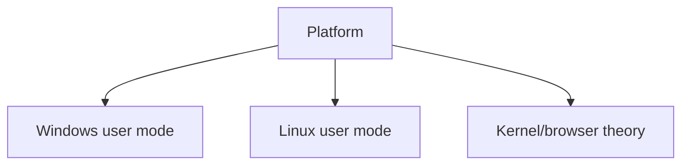

# Platform Exploitation

## 🗺️ Zero-to-Mastery Learning Path

1. [[Userland Exploitation: Linux & Windows]]
2. [[Kernel Exploitation Theory]]
3. [[Browser Exploitation Theory]]

---
> 🔼 Up: [[Exploit Development]]
