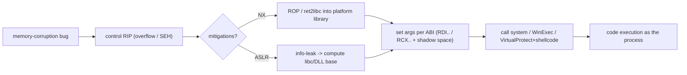

# 🖥️ Userland Exploitation: Linux & Windows

> [!danger] Authorized simulation / lab binaries only
> Practise on binaries you compile or own. This note applies the exploit-dev primitives to the two dominant userland platforms; the lab proves a benign `echo` via ret2libc, never a real shell. Never target unauthorized systems.

## Parent Learning Order
Userland Exploitation: Linux & Windows -> Kernel Exploitation Theory -> Browser Exploitation Theory

## The Same Bug, Two Operating Systems

The Exploit-Dev pillar so far taught the *primitives* (overflows, ROP, shellcode) in a mostly platform-neutral way. Real exploitation happens on a *specific* userland — a normal, non-kernel process — and **Linux** and **Windows** differ enough that the same bug is weaponized differently on each. This note consolidates userland exploitation for both: the shared workflow, and the platform-specific pieces (executable format, C library, calling convention, and the signature techniques like Linux **ret2libc** and Windows **SEH overwrites**). Learn the two side by side and you see that the *concepts* are identical while the *plumbing* changes.

The unifying idea: **userland exploitation reuses the platform's own library (libc / the Windows DLLs) as your toolbox** — the functions to spawn a process or change memory permissions are already loaded; you just redirect control into them with the right arguments for that platform's ABI.

> [!tip] The analogy, and where it breaks
> Exploiting Linux vs Windows userland is like burgling houses wired by two different electricians: the *goal* (reach the fuse box, flip the main) is identical, but one labels wires by color and the other by number, and the panels are in different rooms. The analogy breaks on the toolbox: unlike a burglar who brings tools, here the *house already contains every tool you need* (libc/kernel32) — so the skill is knowing each platform's layout well enough to use its own fittings against it.

**Prerequisites:** all prior Exploit-Dev leaves; **Executable Formats** (ELF vs PE) and **CPU, Assembly & the ABI** (System V vs Microsoft x64).

## Linux vs Windows: The Plumbing That Differs

| Aspect | Linux | Windows |
|---|---|---|
| Executable format | ELF (GOT/PLT) | PE (IAT) |
| C library / API | glibc (`system`, `execve`) | Win32 (`WinExec`, `VirtualProtect`, `CreateProcess`) |
| Calling convention (x64) | System V: RDI, RSI, RDX… | Microsoft x64: RCX, RDX, R8, R9 + 32-byte shadow space |
| Signature technique | **ret2libc** (return into `system("/bin/sh")`) | **SEH overwrite** (hijack the exception handler chain), ret2libc-style into WinAPI |
| Make memory executable | `mprotect` | `VirtualProtect` |
| Mitigations | NX, ASLR/PIE, RELRO, Full RELRO, canary | DEP, ASLR, `/GS` (canary), SafeSEH/SEHOP, CFG |

Two Windows-specific mechanics worth knowing: **SEH (Structured Exception Handling)** stores exception-handler pointers on the stack, so an overflow can overwrite a handler and, by triggering an exception, redirect execution — a classic Windows technique that **SafeSEH/SEHOP** were built to stop. And the Microsoft x64 convention requires **32 bytes of "shadow space"** on the stack before a call — forget it and your ROP-to-WinAPI call corrupts the stack.

## The Shared Workflow



The steps are the same on both platforms; only the format, library names, convention, and mitigation set change. **ret2libc** is the canonical userland technique: rather than inject shellcode (blocked by NX), return directly into a library function like `system("/bin/sh")` (Linux) or `WinExec("cmd")` (Windows).

## Worked Example: ret2libc — Calling a Function the Program Already Imports

NX stops injected shellcode. It does nothing about the code the process already
maps, and `libc` is a large and useful library to have mapped.

**The chain** does not contain instructions, only addresses and one argument:

```python
p  = b'A' * 40                       # 32-byte buffer + 8 saved RBP
p += struct.pack('<Q', pop_rdi_ret)  # gadget: pop rdi; ret
p += struct.pack('<Q', cmd_string)   # -> RDI, the argument for system()
p += struct.pack('<Q', ret_gadget)   # bare ret: fixes 16-byte stack alignment
p += struct.pack('<Q', system_plt)   # -> system(RDI)
```

```shell-session
analyst@lab:/tmp/u-lab$ setarch "$(uname -m)" -R ./vuln < chain.bin
RET2LIBC
```

The process called `system()` with an argument the attacker chose, having
executed nothing but its own code. Swap the string for `/bin/sh` and it is a
shell — the mechanism does not change.

**Two details in that chain are the ones people get wrong.**

The bare `ret` gadget before `system` exists purely for stack alignment. The
System V ABI requires `RSP` to be 16-byte aligned at a `call`, and modern libc
uses SSE instructions that fault otherwise. A chain that works everywhere except
against a real `system()` — crashing inside `movaps` — is almost always missing
this one wasted `ret`.

And `setarch -R` disables ASLR, which is honest cheating: it stands in for the
information leak a real exploit needs first. With ASLR on, `system`'s address
changes every execution, so the chain above would be built from a leaked libc
pointer minus a known offset. Skipping that step in a lab is fine as long as the
step is named, because on a real target it is most of the work.

**The Windows equivalent** differs in convention rather than in principle: the
first argument travels in `RCX` rather than `RDI`, the caller must reserve 32
bytes of shadow space before the call, and the reused function is typically
`WinExec` or `VirtualProtect` — the latter to make injected memory executable and
so escape NX entirely rather than work around it.

## The ABI mistakes that break cross-platform payloads

- **Wrong ABI.** Setting up RDI on Windows (which passes the first arg in RCX) or omitting the 32-byte shadow space corrupts the call — the single most common cross-platform mistake.
- **ASLR on the library.** libc/DLL bases are randomized; a hardcoded `system` address fails — you need a leak (or a fixed non-ASLR module).
- **Stack alignment.** System V needs 16-byte alignment at the call; a ret2libc chain often needs an extra `ret` gadget or it faults inside the library.
- **SafeSEH/SEHOP/CFG present.** Classic SEH overwrite and arbitrary indirect calls are blocked on modern Windows — check before relying on them.
- **String/argument placement.** ret2libc needs a pointer to a valid command string in memory; forgetting to place/locate it makes the call run with garbage.

## Security Implications — the Defender's View

- **Enable the full mitigation set per platform:** Linux (NX, PIE, Full RELRO, stack canary, CET) and Windows (DEP, ASLR, `/GS`, SafeSEH+SEHOP, Control Flow Guard, CET) — together they force the attacker into leaks and longer chains.
- **Deny info-leaks and maximize ASLR entropy** — since ret2libc/ROP need known library addresses, a robust ASLR without disclosure bugs defeats most userland exploitation.
- **Memory-safe languages** remove the bug at the source for new code.
- **Detection:** a process making an unexpected `system`/`WinExec`/`CreateProcess` call, RWX allocations via `VirtualProtect`/`mprotect`, and ROP-like control flow are the EDR signals; SEH-overwrite attempts show characteristic stack corruption.

## Summary

You should now be able to:

- Explain why userland exploitation reuses the platform's own library, and that Linux and Windows share concepts but differ in plumbing.
- Perform a ret2libc that calls `system` with a controlled argument under NX, and describe the Windows SEH-overwrite / WinAPI equivalent.
- Explain the ABI/shadow-space and mitigation differences between platforms, why ASLR forces a leak, and how the full per-platform mitigation set plus memory-safe languages defend userland.

---
> 🔼 Up: [[Platform Exploitation]]
