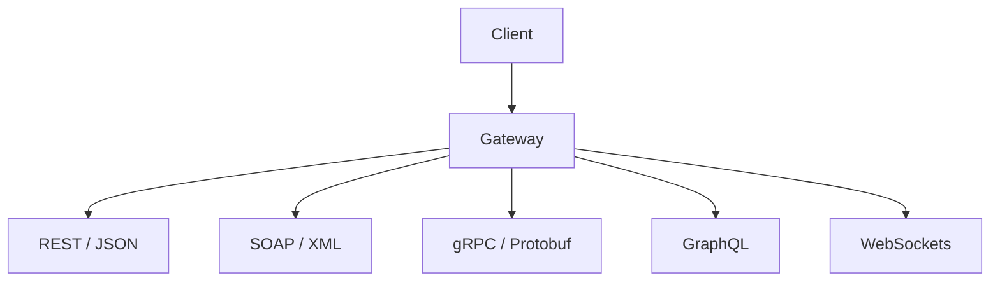

# API & Modern Protocol Testing

> [!abstract] Lifecycle branch
> Test machine-to-machine trust, object authorization, schema boundaries, state, identity, and resource controls across modern application protocols.

## 🗺️ Zero-to-Mastery Learning Path

1. [[Modern API Security Testing]]
2. [[Legacy XML Web Services Testing]]
3. [[API Security Fundamentals]]
4. [[WebSocket Security Testing]]

---
> 🔼 Up: [[Penetration Testing]]
