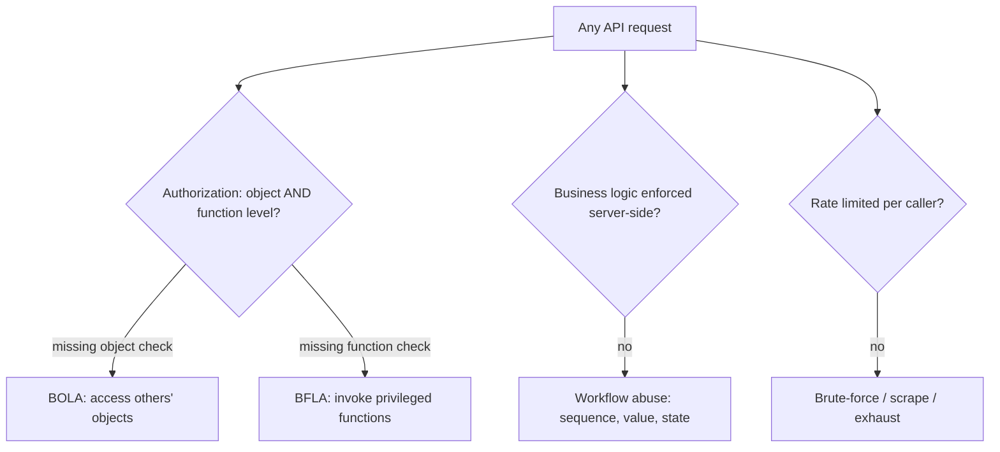

# 🔑 API Security Fundamentals

> [!warning] Authorized simulation only
> These are the cross-cutting API security concerns that apply regardless of style. Test with authorized credentials against in-scope endpoints, throttle to avoid load, and prove flaws minimally.

## Parent Learning Order
Modern API Security Testing -> Legacy XML Web Services Testing -> API Security Fundamentals -> WebSocket Security Testing

## Start at Zero: The Three Concerns Every API Shares

Whatever the transport — REST, GraphQL, gRPC, SOAP — every API faces the same three security concerns, and they map directly to the most-exploited API weaknesses. This note is the cross-cutting layer beneath the style-specific testing:

| Concern | The question | The classic flaw |
| --- | --- | --- |
| **Authorization** | May *this caller* do *this action* on *this object*? | Broken object/function-level authorization (BOLA/BFLA) |
| **Business logic** | Can the intended workflow be abused? | Sequence/quantity/state manipulation |
| **Rate limiting** | Can the API be hammered? | Brute-force, scraping, resource exhaustion |

The unifying insight is that **APIs expose logic directly to programs**, stripping away the browser UI that used to constrain how humans interacted with an application. A web form limits you to its fields; an API lets a program send *any* request, in any order, at any rate. So API security is about the server enforcing rules the UI used to enforce implicitly.

> [!tip] The analogy, and where it breaks
> An API is like a bank's teller window replaced by a self-service machine that trusts you to follow the rules. The analogy breaks because the machine has no human judgment: it will happily process "transfer -$100" (a negative amount that reverses the flow) or a thousand requests a second, unless the *code* explicitly forbids each abuse. Every rule a human teller applied by common sense must now be an explicit check.

**Prerequisites:** the modern-API-testing leaf (BOLA), and authentication/token concepts.

## Authorization: Object AND Function Level

API authorization has two dimensions, and testing must cover both:

**Object-level (BOLA/IDOR)** — may this caller access this *object*? The `/orders/42` flaw from the modern-API leaf: valid token, wrong owner. This is the number-one API risk.

**Function-level (BFLA)** — may this caller invoke this *function*? A regular user calling an admin-only endpoint (`POST /admin/promote`) that checks authentication but not *role*. The test: take a low-privilege token and try privileged operations.

```bash
# BFLA test: does a regular-user token reach an admin function? (your own lab API)
curl -s -o /dev/null -w "user token -> admin endpoint: HTTP %{http_code}\n" \
  -H "Authorization: Bearer user-token" -X POST "http://127.0.0.1:8100/admin/stats"
```

```text
user token -> admin endpoint: HTTP 200
```

A `200` means a regular user reached an admin function — broken function-level authorization. The endpoint checked the token was valid but never checked the *role*. The fix is a role check on every privileged function, server-side.

## Business Logic: Abusing the Intended Workflow

Business-logic flaws are not code bugs — the code works as written, but the *workflow* can be abused in ways the designer did not anticipate. APIs make these easy because a program can send requests the UI would never allow:

- **Sequence** — skipping a step (paying *after* the discount is applied but *before* validation).
- **Quantity/value** — negative amounts, quantity zero, integer overflow in a total.
- **State** — repeating a one-time action (applying a single-use coupon twice via a race).

These require *understanding the application's intent*, which is why they resist automated scanning — a scanner has no concept of "a discount should apply once." The test is human: model the workflow, then ask "what if I do this out of order, or with an impossible value?"

## Rate Limiting: The API Is Trivially Hammered

Because the consumer is a program, an API without rate limiting can be brute-forced, scraped, or exhausted at machine speed. Testing checks whether limits exist and are effective:

```bash
# rapid-fire requests: is there a limit, and does it trigger? (your own lab API)
for i in $(seq 1 6); do
  echo "req $i -> $(curl -s -o /dev/null -w '%{http_code}' http://127.0.0.1:8100/data)"
done
```

```text
req 1 -> 200
req 2 -> 200
req 3 -> 200
req 4 -> 429
req 5 -> 429
req 6 -> 429
```

The `429 Too Many Requests` after three calls shows a working rate limit. Its *absence* — six `200`s — would be the finding, because it enables credential-stuffing, data scraping, and resource-exhaustion DoS. Rate limiting must be scoped correctly (per user/token, and for GraphQL per query-cost, from the modern-API leaf).



## Failure Modes and Interpretation

- **Authorization tested one-dimensionally.** Testing object authz (BOLA) but forgetting function authz (BFLA), or vice versa, misses half the risk. Test both, for every role.
- **Business logic needs intent.** Without understanding what the workflow is *supposed* to do, you cannot spot its abuse — this is where automated tools fail and human testing is essential.
- **Rate limit bypasses.** A limit keyed on IP is bypassed by rotating IPs; one keyed on the token is bypassed by rotating tokens. Test *what* the limit is keyed on, not just that it exists.
- **429 as the only signal.** A rate limit that returns 429 but still *processes* the request (or leaks timing) is ineffective. Confirm the request was actually rejected.
- **Over-testing logic abuse.** Proving a negative-amount transfer with a canary account is a finding; actually moving real money is exploitation and out of bounds.

## Security Implications — Detection & Defense

- **Server-side authorization on every request** is the non-negotiable control — object-level and function-level, checked in application logic, never assumed from the token's validity or the UI's constraints.
- **Business logic must be enforced server-side** with explicit validation of sequence, value ranges, and one-time-ness — the server cannot trust the client to follow the intended workflow.
- **Rate limiting keyed on the authenticated principal** (not just IP) blunts brute-force, scraping, and exhaustion — and for GraphQL, a query-cost limit, since one request can demand unbounded work.
- **Detection is behavioral:** sequential object-ID access (BOLA), a low-privilege token hitting admin endpoints (BFLA), impossible workflow sequences, and request bursts are all valid-but-anomalous patterns that monitoring catches.
- **The API is the UI-less attack surface** — every implicit constraint the browser used to enforce must now be an explicit server check, which is the mental model that closes the whole class.

## Authorized Lab: Test All Three Concerns

> [!info] Runs on one Linux machine — builds an API with a BFLA flaw and a rate limit locally
> Loopback-bound, synthetic tokens. Step 5 removes it.

### Step 1 — Build an API with roles and a rate limit

```bash
cat > /tmp/apisec.py << 'EOF'
import http.server, time
tokens={"user-token":"user","admin-token":"admin"}
hits=[]
class H(http.server.BaseHTTPRequestHandler):
    def _role(self): return tokens.get(self.headers.get("Authorization","").replace("Bearer ",""))
    def do_GET(self):
        now=time.time(); hits[:]=[t for t in hits if now-t<10]; hits.append(now)
        if len(hits)>3: self.send_response(429); self.end_headers(); self.wfile.write(b"rate limited"); return
        self.send_response(200); self.end_headers(); self.wfile.write(b'{"data":"ok"}')
    def do_POST(self):
        role=self._role()
        if not role: self.send_response(401); self.end_headers(); return
        # BUG: checks authentication but NOT role for the admin endpoint
        if self.path=="/admin/stats":
            self.send_response(200); self.end_headers(); self.wfile.write(b'{"secret_admin_stats":42}')
        else:
            self.send_response(404); self.end_headers()
    def log_message(self,*a): pass
http.server.HTTPServer(("127.0.0.1",8100),H).serve_forever()
EOF
python3 /tmp/apisec.py &>/dev/null &
sleep 1; echo "API up (user-token, admin-token; rate limit 3/10s)"
```

```text
API up (user-token, admin-token; rate limit 3/10s)
```

### Step 2 — Function-level authorization (BFLA) finding

```bash
echo "no token   -> $(curl -s -o /dev/null -w '%{http_code}' -X POST http://127.0.0.1:8100/admin/stats)"
echo "USER token -> $(curl -s -H 'Authorization: Bearer user-token' -X POST http://127.0.0.1:8100/admin/stats)"
```

```text
no token   -> 401
USER token -> {"secret_admin_stats":42}
```

Authentication is enforced (401 unauth), but a **regular user** token reached the admin function and got secret admin data — broken function-level authorization. The endpoint never checked the role.

### Step 3 — Rate limiting works (a passing control to report)

```bash
for i in 1 2 3 4 5; do echo "req $i -> $(curl -s -o /dev/null -w '%{http_code}' http://127.0.0.1:8100/data)"; done
```

```text
req 1 -> 200
req 2 -> 200
req 3 -> 200
req 4 -> 429
req 5 -> 429
```

The 429 after three requests confirms rate limiting functions — a *verified control*, reported as a pass. Its absence would be the finding.

### Step 4 — Articulate the business-logic dimension

```bash
echo "Authorization: BFLA confirmed (user reached /admin/stats)."
echo "Rate limiting: works (429 after 3)."
echo "Business logic: would require modeling the app's workflow — e.g. can /admin/stats be reached via an unintended sequence? — the human-judgment concern."
```

```text
Authorization: BFLA confirmed (user reached /admin/stats).
Rate limiting: works (429 after 3).
Business logic: would require modeling the app's workflow — e.g. can /admin/stats be reached via an unintended sequence? — the human-judgment concern.
```

### Step 5 — Cleanup

```bash
kill %1 2>/dev/null; rm -f /tmp/apisec.py; wait 2>/dev/null
curl -s -o /dev/null -w "api gone: %{http_code}\n" --max-time 2 http://127.0.0.1:8100/data 2>&1 | grep -o 'gone.*' || echo "api gone: connection refused"
```

```text
api gone: connection refused
```

**What you should now be able to do:** test object- and function-level authorization, recognize business-logic abuse as a human-judgment concern automation misses, verify rate limiting and what it is keyed on, and explain why the API is the UI-less surface where every constraint must be an explicit server check.

## Crook → Operator → Root Checkpoint

- **Crook:** Name the three cross-cutting API concerns and explain why an API strips away the constraints a browser UI used to enforce.
- **Operator:** Test object (BOLA) and function (BFLA) authorization, verify rate limiting and what it keys on, and explain why business-logic flaws resist automated scanning.
- **Root:** Explain why server-side per-request authorization and server-enforced business logic are non-negotiable, why rate limits must key on the principal (and query-cost for GraphQL), and how all three flaws surface as valid-but-anomalous behavior to a defender.

---
> 🔼 Up: [[API & Modern Protocol Testing]]
