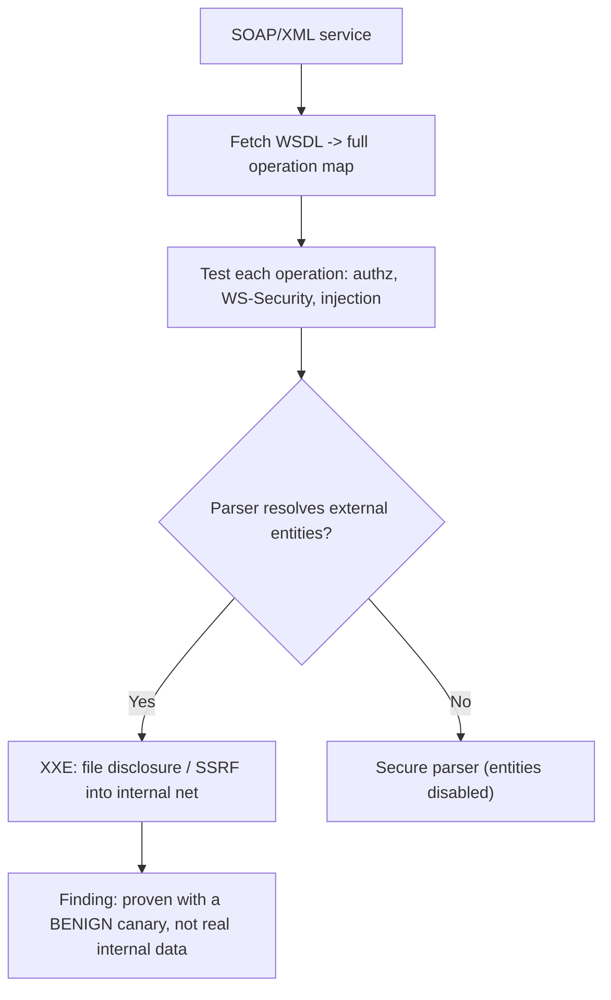

# 📜 Legacy XML Web Services Testing

> [!warning] Authorized simulation only
> Legacy XML services often front critical enterprise systems (payments, ERP). Test only in-scope endpoints, and be especially careful with XML external-entity probes, which can reach internal systems — use benign markers, never real internal targets.

## Parent Learning Order
Modern API Security Testing -> Legacy XML Web Services Testing -> API Security Fundamentals -> WebSocket Security Testing

## The Enterprise APIs That Never Died

Before REST and JSON, enterprise systems talked over **SOAP** — a heavyweight, XML-based protocol — described by **WSDL** documents and carrying **XML** payloads. These are "legacy" but far from gone: they still front banking, government, ERP, and B2B integrations, often the most sensitive systems in an organization. Testing them matters precisely because they guard high-value assets and were designed in an era with weaker default security.

The XML foundation is both their structure and their signature weakness. XML parsers are powerful — they can include external files, resolve entities, and process schemas — and that power, exposed to attacker-controlled input, is the classic legacy-web-service vulnerability: **XML External Entity (XXE)** injection.

> [!tip] The analogy, and where it breaks
> A SOAP service is like a formal bureaucratic office: rigid forms (XML), a published rulebook (WSDL) stating exactly what forms exist and their fields, and strict processing. The analogy breaks on the rulebook — a real bureaucracy guards its internal procedures, whereas a WSDL *publishes the entire API contract*, handing a tester every operation, parameter, and type for free.

**Prerequisites:** XML basics, HTTP, and the XXE concept from the file/parser leaf.

## WSDL: The API Contract, Handed Over

A **WSDL (Web Services Description Language)** document fully describes a SOAP service — every operation, its parameters, types, and the endpoint. It is meant for developer tooling to auto-generate clients, but to a tester it is a complete map of the attack surface, usually reachable by appending `?wsdl`:

```bash
# retrieve the WSDL — the full API contract (against your own lab service)
curl -s "http://127.0.0.1:8099/service?wsdl" | grep -oE '<operation name="[^"]*"|<xsd:element name="[^"]*"' | head -4
```

```text
<operation name="GetAccountBalance"
<operation name="TransferFunds"
<xsd:element name="accountId"
<xsd:element name="amount"
```

The WSDL just revealed a `TransferFunds` operation with `accountId` and `amount` parameters — the entire sensitive surface, enumerated in one request. An exposed WSDL is a reconnaissance gift, and restricting it to internal networks is a standard hardening.

## SOAP Testing: Structure and Auth

SOAP messages are XML envelopes. Testing exercises the operations the WSDL revealed, probing:

- **Authorization** — can operations be called without proper credentials, or with another user's context? (The same object-authorization question as modern APIs.)
- **SOAP-specific auth** — WS-Security headers, and whether they are actually validated.
- **Injection** — parameters flowing into backend SQL, commands, or XPath.
- **XXE** — the signature XML flaw, below.

## XXE: The Signature XML Flaw

**XML External Entity injection** exploits that XML parsers can be told to fetch external resources. If the service parses attacker-supplied XML with external entities enabled, an attacker declares an entity pointing at a file or internal URL, and the parser fetches it into the response:

```text
<!DOCTYPE r [ <!ENTITY xxe SYSTEM "file:///etc/hostname"> ]>
<request><data>&xxe;</data></request>
```

The parser resolves `&xxe;` by reading the file, and its contents appear in the response — file disclosure, or (pointing the entity at an internal URL) server-side request forgery into the internal network. This is why the warning above stresses benign markers: a careless XXE probe can genuinely reach internal systems. The proof uses a harmless target (a canary file you placed), never a real internal service.



## Proving XXE without causing the disclosure

- **XXE blast radius.** A real XXE can read sensitive files and pivot into the internal network — precisely why you must use a benign canary file/URL for proof, not a live internal target, which could cause real disclosure.
- **WSDL absence.** No `?wsdl` does not mean no service — the contract may be internal-only while the endpoint is still callable. Enumerate operations from captured traffic or documentation.
- **WS-Security theater.** A service may *have* WS-Security headers that it does not actually validate — presence of the header is not enforcement. Test whether a forged/absent token is accepted.
- **Encoding and namespace tricks.** XML's flexibility (encodings, namespace prefixes, DTD variations) means a "fixed" XXE filter may be bypassable by an alternate encoding — retest the variant neighborhood, as with any parser fix.
- **Fragility.** Legacy services fronting critical systems can be brittle; malformed XML may crash them. Probe gently.

## Security Implications — Detection & Defense

- **Disable external entity resolution** in every XML parser — the definitive XXE fix, a parser configuration that costs nothing and closes the whole class. This is the single most important legacy-web-service hardening.
- **Restrict WSDL exposure** to internal/authenticated access — do not publish the full API contract to anonymous users.
- **Validate WS-Security actually**, not decoratively — an unenforced auth header is worse than none because it implies protection that isn't there.
- **Treat legacy services as high-value** — because they front sensitive systems, their compromise is disproportionately damaging, warranting the strongest monitoring even though they are "old."
- **XXE detection** looks for outbound requests from the parser (SSRF signature) and unusual file access — a service suddenly reading `/etc/` or making internal HTTP calls is the tell.

## Summary

You should now be able to:

- Explain what SOAP/WSDL/XML services are, why they still matter, and what a WSDL hands a tester.
- Enumerate operations from a WSDL and prove XXE file disclosure with a benign canary rather than a real internal target.
- Explain why disabling external-entity resolution is the definitive XXE fix, why an unenforced WS-Security header is worse than none, and how XXE-via-SSRF detection looks for outbound requests from the parser.

---
> 🔼 Up: [[API & Modern Protocol Testing]]
