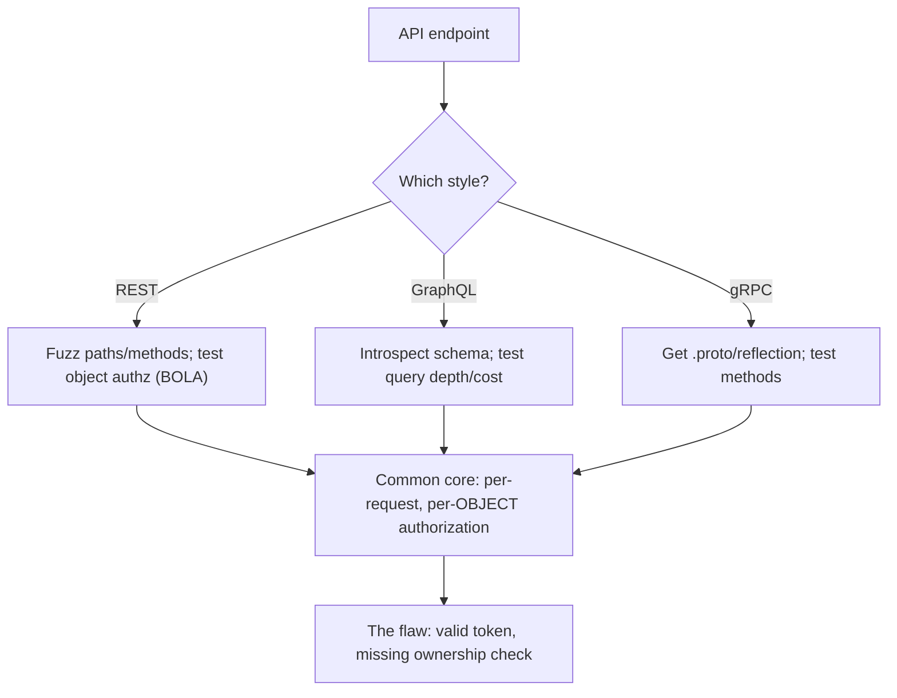

# 🔌 Modern API Security Testing

> [!warning] Authorized simulation only
> APIs are consumed by programs, so they are trivially hammered — throttle testing, avoid destructive methods against real data, and stop at proof. Test only in-scope endpoints with authorized credentials.

## Parent Learning Order
Modern API Security Testing -> Legacy XML Web Services Testing -> API Security Fundamentals -> WebSocket Security Testing

## Testing APIs, Not Pages

> *The web application was tested and passed. How much of the API did that cover?*
>
> Hold your answer — the section below is the response.

An **API (Application Programming Interface)** is a web service consumed by *programs*, not browsers — it returns structured data (JSON, binary) rather than HTML. The three dominant modern styles are **REST** (resources at URLs, JSON), **GraphQL** (one endpoint, client-specified queries), and **gRPC** (binary, schema-defined, over HTTP/2). Their transport differences (covered in the Networking domain's **REST & Modern API Transport** leaf) directly change *how you test them* — and that is this note's focus.

The unifying theme: because the consumer is code, APIs are stateless and pass an authentication token on *every* request. So the security model — and the testing — centers on **per-request, per-object authorization**: does the API check not just "is this token valid?" but "may *this* caller access *this* resource?" That single question is where most real API breaches live.

> [!tip] The analogy, and where it breaks
> Testing an API is like checking a coat-check counter: you hand over a ticket and get a coat. The analogy breaks on the flaw that matters — a good coat-check verifies the ticket *matches your coat*, whereas a broken API checks the ticket is genuine but hands you whatever coat number you name. Asking for coat #42 and getting someone else's is broken object authorization, the commonest API flaw.

**Prerequisites:** the Networking **REST & Modern API Transport** leaf (transport differences) and HTTP/token authentication.

## The Transport Style Changes the Test

The same security questions apply to all three, but *where and how you test* differs:

| Style | Transport | How you enumerate | Control that doesn't translate |
| --- | --- | --- | --- |
| **REST** | JSON over HTTP, resource per URL | Path + method fuzzing, `/v1/`, `/v2/` | Per-endpoint rate limits, path-based WAF |
| **GraphQL** | One endpoint, usually POST | **Introspection** query dumps the whole schema | Path/method controls (everything is one URL) |
| **gRPC** | Binary Protobuf over HTTP/2 | Needs the `.proto` schema or reflection | JSON-reading tools can't parse it |

The key insight: **a control that works for one style may not exist for another.** A per-endpoint REST rate limit is meaningless for GraphQL's single endpoint, where one crafted deeply-nested query can demand enormous work. A WAF reading JSON cannot inspect gRPC's binary frames. Choosing an API style is partly choosing a security posture, and testing must match the style.

**The deliberate break:** the web application was tested and the API sits behind the same authentication, so the API is covered. The front end calls it, after all — testing one tested the other.

The UI is a **client**, and it enforces things the API does not. It shows you only your own orders, offers only the actions your role permits, and submits only fields the form contains — none of which the server necessarily re-checks. Every one of those UI-side constraints is a control an attacker simply does not use, which is why **BOLA** (object-level authorisation failure) is consistently the top API risk while being nearly invisible from the front end.

The surface is also larger than the interface suggests. Old versions stay routed after new ones ship, `/v1/` still answering months after `/v2/` became the only documented path. Endpoints exist for mobile clients, for partners, for internal tooling, and appear in no documentation the client will hand you.

**How you'd spot it:** take an object identifier from your own account and request it with another account's token. Then take a documented path and try the previous version number. Both are single requests, and both routinely succeed.

## REST: Path and Method Testing

REST maps to HTTP methods, so testing exercises them: does `DELETE /orders/42` work without authorization? Does an old `/v1/` endpoint with weaker checks still exist? The signature REST finding is **broken object-level authorization (BOLA/IDOR)** — accessing `/orders/42` with a valid token that belongs to a *different* user:

```bash
# test object authorization: does user A's token retrieve user B's object? (your own lab API)
curl -s -H "Authorization: Bearer USER_A_TOKEN" "http://127.0.0.1:8097/orders/1"   # A's own
curl -s -H "Authorization: Bearer USER_A_TOKEN" "http://127.0.0.1:8097/orders/2"   # B's object
```

```text
{"id":1,"owner":"alice","total":50}
{"id":2,"owner":"bob","total":90}
```

User A's token retrieved user B's order — the API checked the token was valid but never checked *ownership*. That is the finding, proven by two requests.

## GraphQL: Introspection Is the Enumeration

GraphQL's single endpoint means the whole API is discoverable through **introspection** — a built-in query that returns the entire schema:

```bash
# introspection dumps every type, query, and mutation the API exposes
curl -s -X POST -H "Content-Type: application/json" \
  -d '{"query":"{__schema{queryType{fields{name}}}}"}' "http://127.0.0.1:8098/graphql" | head -c 200
```

```text
{"data":{"__schema":{"queryType":{"fields":[{"name":"user"},{"name":"allUsers"},{"name":"adminStats"}]}}}}
```

Introspection just handed over `adminStats` — an endpoint you should not have known existed. In production, introspection should be *disabled*, and leaving it on is a finding in itself. GraphQL also enables **query-depth attacks**: a deeply nested query (`user{friends{friends{friends...}}}`) can force exponential work, a denial-of-service that per-endpoint rate limits do not catch.



## gRPC: The Binary Challenge

gRPC uses binary Protobuf over HTTP/2, so ordinary HTTP tools see opaque bytes. Testing requires the service's **`.proto` schema** (or server reflection, if enabled — itself a disclosure). With the schema, you call methods like any RPC and test the same authorization questions. The testing difficulty is the tooling, not the concepts: the same "does this caller's token authorize this method and object?" applies, but you need a Protobuf-aware client to ask.

## Confirming BOLA without crossing into mass data access

- **BOLA is easy to miss and easy to over-test.** Confirm it with two objects (yours and another's), not by enumerating every object — that crosses into mass data access.
- **Introspection assumptions.** A GraphQL API with introspection off is not necessarily secure; the schema may be inferable through error messages and field-guessing. Off is a hardening, not a guarantee.
- **Rate-limit testing causes load.** Query-depth and rate-limit tests can genuinely overload a service. Cap your own intensity and coordinate.
- **Versioned endpoints.** An old `/v1/` with weaker authorization often survives alongside `/v2/` — test the deprecated versions, which are a recurring finding.
- **gRPC without the schema.** Concluding "gRPC is secure" because you couldn't read it is wrong — the tester lacked the tool, not the target the flaw.

## Security Implications — Detection & Defense

- **Per-request, per-object authorization is the essential control** — the server must verify on *every* request that this caller may access *this specific* resource. No network control substitutes for it; it must be in the application logic.
- **Disable introspection and server reflection in production** — they hand attackers the full schema for free.
- **Rate limiting must match the style:** per-endpoint for REST, per-query-*cost* for GraphQL (a depth/complexity limit), per-method for gRPC. A REST-style limit on a GraphQL endpoint is no protection.
- **Deprecated versions are attack surface** — retire old API versions, don't just build new ones alongside them.
- **API telemetry is behavioral:** a token accessing many sequential object IDs is the BOLA-exploitation signature, detectable even though each request is individually valid — the same "valid but anomalous" pattern as credential attacks.

## Summary

You should now be able to:

- Explain what an API is, the three modern styles, and why the security model centers on per-request authorization.
- Test REST object authorization (BOLA), enumerate a GraphQL schema via introspection, and explain why a REST rate limit doesn't protect GraphQL.
- Explain why per-object authorization must live in application logic with no network substitute, why introspection/reflection and deprecated versions are attack surface, and how BOLA exploitation is detectable as a valid-but-anomalous access pattern.

---
> 🔼 Up: [[API & Modern Protocol Testing]]
