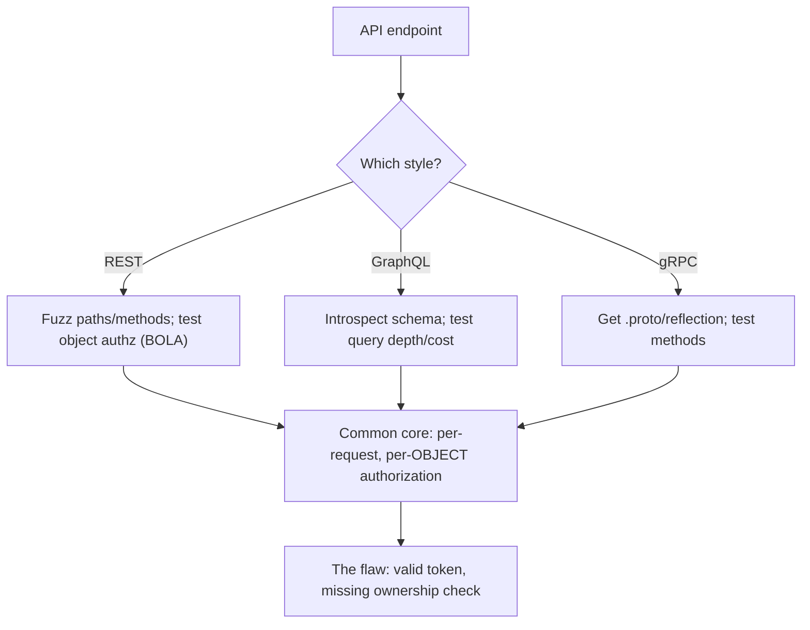

# 🔌 Modern API Security Testing

> [!warning] Authorized simulation only
> APIs are consumed by programs, so they are trivially hammered — throttle testing, avoid destructive methods against real data, and stop at proof. Test only in-scope endpoints with authorized credentials.

## Parent Learning Order
Modern API Security Testing -> Legacy XML Web Services Testing -> API Security Fundamentals -> WebSocket Security Testing

## Start at Zero: Testing APIs, Not Pages

An **API (Application Programming Interface)** is a web service consumed by *programs*, not browsers — it returns structured data (JSON, binary) rather than HTML. The three dominant modern styles are **REST** (resources at URLs, JSON), **GraphQL** (one endpoint, client-specified queries), and **gRPC** (binary, schema-defined, over HTTP/2). Their transport differences (covered in the Networking domain's **REST & Modern API Transport** leaf) directly change *how you test them* — and that is this note's focus.

The unifying theme: because the consumer is code, APIs are stateless and pass an authentication token on *every* request. So the security model — and the testing — centers on **per-request, per-object authorization**: does the API check not just "is this token valid?" but "may *this* caller access *this* resource?" That single question is where most real API breaches live.

> [!tip] The analogy, and where it breaks
> Testing an API is like checking a coat-check counter: you hand over a ticket and get a coat. The analogy breaks on the flaw that matters — a good coat-check verifies the ticket *matches your coat*, whereas a broken API checks the ticket is genuine but hands you whatever coat number you name. Asking for coat #42 and getting someone else's is broken object authorization, the commonest API flaw.

**Prerequisites:** the Networking **REST & Modern API Transport** leaf (transport differences) and HTTP/token authentication.

## The Transport Style Changes the Test

The same security questions apply to all three, but *where and how you test* differs:

| Style | Transport | How you enumerate | Control that doesn't translate |
| --- | --- | --- | --- |
| **REST** | JSON over HTTP, resource per URL | Path + method fuzzing, `/v1/`, `/v2/` | Per-endpoint rate limits, path-based WAF |
| **GraphQL** | One endpoint, usually POST | **Introspection** query dumps the whole schema | Path/method controls (everything is one URL) |
| **gRPC** | Binary Protobuf over HTTP/2 | Needs the `.proto` schema or reflection | JSON-reading tools can't parse it |

The key insight: **a control that works for one style may not exist for another.** A per-endpoint REST rate limit is meaningless for GraphQL's single endpoint, where one crafted deeply-nested query can demand enormous work. A WAF reading JSON cannot inspect gRPC's binary frames. Choosing an API style is partly choosing a security posture, and testing must match the style.

## REST: Path and Method Testing

REST maps to HTTP methods, so testing exercises them: does `DELETE /orders/42` work without authorization? Does an old `/v1/` endpoint with weaker checks still exist? The signature REST finding is **broken object-level authorization (BOLA/IDOR)** — accessing `/orders/42` with a valid token that belongs to a *different* user:

```bash
# test object authorization: does user A's token retrieve user B's object? (your own lab API)
curl -s -H "Authorization: Bearer USER_A_TOKEN" "http://127.0.0.1:8097/orders/1"   # A's own
curl -s -H "Authorization: Bearer USER_A_TOKEN" "http://127.0.0.1:8097/orders/2"   # B's object
```

```text
{"id":1,"owner":"alice","total":50}
{"id":2,"owner":"bob","total":90}
```

User A's token retrieved user B's order — the API checked the token was valid but never checked *ownership*. That is the finding, proven by two requests.

## GraphQL: Introspection Is the Enumeration

GraphQL's single endpoint means the whole API is discoverable through **introspection** — a built-in query that returns the entire schema:

```bash
# introspection dumps every type, query, and mutation the API exposes
curl -s -X POST -H "Content-Type: application/json" \
  -d '{"query":"{__schema{queryType{fields{name}}}}"}' "http://127.0.0.1:8098/graphql" | head -c 200
```

```text
{"data":{"__schema":{"queryType":{"fields":[{"name":"user"},{"name":"allUsers"},{"name":"adminStats"}]}}}}
```

Introspection just handed over `adminStats` — an endpoint you should not have known existed. In production, introspection should be *disabled*, and leaving it on is a finding in itself. GraphQL also enables **query-depth attacks**: a deeply nested query (`user{friends{friends{friends...}}}`) can force exponential work, a denial-of-service that per-endpoint rate limits do not catch.



## gRPC: The Binary Challenge

gRPC uses binary Protobuf over HTTP/2, so ordinary HTTP tools see opaque bytes. Testing requires the service's **`.proto` schema** (or server reflection, if enabled — itself a disclosure). With the schema, you call methods like any RPC and test the same authorization questions. The testing difficulty is the tooling, not the concepts: the same "does this caller's token authorize this method and object?" applies, but you need a Protobuf-aware client to ask.

## Failure Modes and Interpretation

- **BOLA is easy to miss and easy to over-test.** Confirm it with two objects (yours and another's), not by enumerating every object — that crosses into mass data access.
- **Introspection assumptions.** A GraphQL API with introspection off is not necessarily secure; the schema may be inferable through error messages and field-guessing. Off is a hardening, not a guarantee.
- **Rate-limit testing causes load.** Query-depth and rate-limit tests can genuinely overload a service. Cap your own intensity and coordinate.
- **Versioned endpoints.** An old `/v1/` with weaker authorization often survives alongside `/v2/` — test the deprecated versions, which are a recurring finding.
- **gRPC without the schema.** Concluding "gRPC is secure" because you couldn't read it is wrong — the tester lacked the tool, not the target the flaw.

## Security Implications — Detection & Defense

- **Per-request, per-object authorization is the essential control** — the server must verify on *every* request that this caller may access *this specific* resource. No network control substitutes for it; it must be in the application logic.
- **Disable introspection and server reflection in production** — they hand attackers the full schema for free.
- **Rate limiting must match the style:** per-endpoint for REST, per-query-*cost* for GraphQL (a depth/complexity limit), per-method for gRPC. A REST-style limit on a GraphQL endpoint is no protection.
- **Deprecated versions are attack surface** — retire old API versions, don't just build new ones alongside them.
- **API telemetry is behavioral:** a token accessing many sequential object IDs is the BOLA-exploitation signature, detectable even though each request is individually valid — the same "valid but anomalous" pattern as credential attacks.

## Authorized Lab: Find Broken Object Authorization

> [!info] Runs on one Linux machine — builds a REST API with a BOLA flaw locally
> The API binds to loopback with synthetic data. Step 5 removes it.

### Step 1 — Build an API that checks the token but not ownership

```bash
cat > /tmp/api.py << 'EOF'
import http.server, json
orders = {1:{"id":1,"owner":"alice","total":50}, 2:{"id":2,"owner":"bob","total":90}}
tokens = {"tok-alice":"alice","tok-bob":"bob"}   # synthetic
class H(http.server.BaseHTTPRequestHandler):
    def do_GET(self):
        auth = self.headers.get("Authorization","").replace("Bearer ","")
        user = tokens.get(auth)
        if not user: self.send_response(401); self.end_headers(); self.wfile.write(b'{"error":"unauth"}'); return
        try: oid = int(self.path.rsplit("/",1)[1])
        except: self.send_response(400); self.end_headers(); return
        o = orders.get(oid)
        # BUG: returns the object without checking o["owner"] == user
        self.send_response(200 if o else 404); self.end_headers()
        self.wfile.write(json.dumps(o or {"error":"not found"}).encode())
    def log_message(self,*a): pass
http.server.HTTPServer(("127.0.0.1",8097),H).serve_forever()
EOF
python3 /tmp/api.py &>/dev/null &
sleep 1; echo "API up on 127.0.0.1:8097 (alice=tok-alice, bob=tok-bob)"
```

```text
API up on 127.0.0.1:8097 (alice=tok-alice, bob=tok-bob)
```

### Step 2 — Authentication works (baseline)

```bash
echo "no token  -> $(curl -s -o /dev/null -w '%{http_code}' http://127.0.0.1:8097/orders/1)"
echo "alice tok -> $(curl -s -H 'Authorization: Bearer tok-alice' http://127.0.0.1:8097/orders/1)"
```

```text
no token  -> 401
alice tok -> {"id":1,"owner":"alice","total":50}
```

Authentication is enforced (401 without a token) and alice reads her own order. So far correct.

### Step 3 — The BOLA finding: alice reads bob's object

```bash
curl -s -H "Authorization: Bearer tok-alice" http://127.0.0.1:8097/orders/2
```

```text
{"id":2,"owner":"bob","total":90}
```

Alice's valid token retrieved **bob's** order (`owner:bob`). The API confirmed the token was genuine but never checked that alice *owns* object 2. That is broken object-level authorization — the commonest and most damaging API flaw — proven with a single request.

### Step 4 — Confirm it is the authorization gap, not a fluke

```bash
echo "bob's own object with bob's token -> $(curl -s -H 'Authorization: Bearer tok-bob' http://127.0.0.1:8097/orders/2 | grep -o '"owner":"[^"]*"')"
echo "The flaw: object 2 is returned to ANY valid token, not just its owner's."
```

```text
bob's own object with bob's token -> "owner":"bob"
The flaw: object 2 is returned to ANY valid token, not just its owner's.
```

### Step 5 — Cleanup

```bash
kill %1 2>/dev/null; rm -f /tmp/api.py; wait 2>/dev/null
curl -s -o /dev/null -w "api gone: %{http_code}\n" --max-time 2 http://127.0.0.1:8097/orders/1 2>&1 | grep -o 'gone.*' || echo "api gone: connection refused"
```

```text
api gone: connection refused
```

**What you should now be able to do:** explain how REST/GraphQL/gRPC transport differences change testing, use GraphQL introspection to enumerate a schema, and prove broken object-level authorization with two requests — the core API finding.

## Crook → Operator → Root Checkpoint

- **Crook:** Explain what an API is, the three modern styles, and why the security model centers on per-request authorization.
- **Operator:** Test REST object authorization (BOLA), enumerate a GraphQL schema via introspection, and explain why a REST rate limit doesn't protect GraphQL.
- **Root:** Explain why per-object authorization must live in application logic with no network substitute, why introspection/reflection and deprecated versions are attack surface, and how BOLA exploitation is detectable as a valid-but-anomalous access pattern.

---
> 🔼 Up: [[API & Modern Protocol Testing]]
