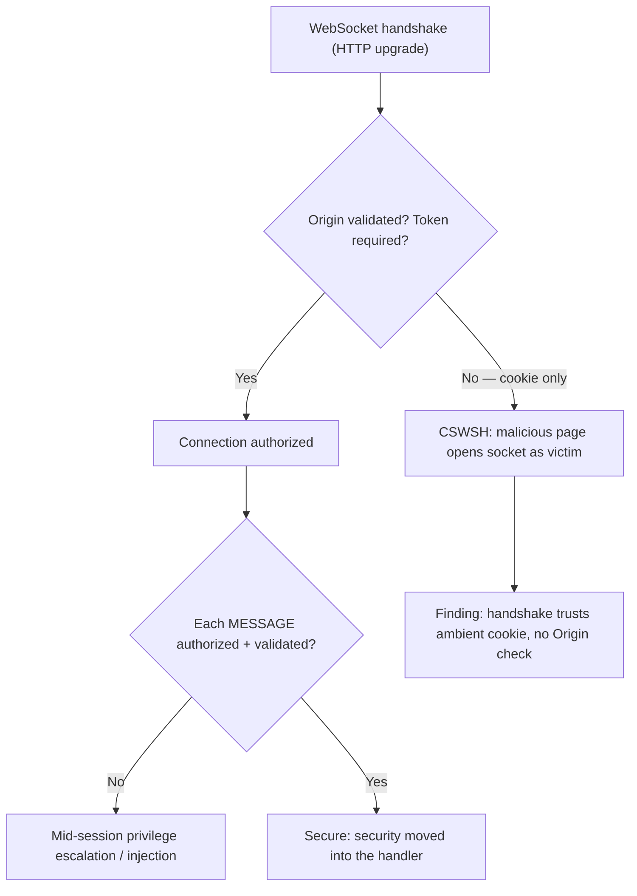

# 🔁 WebSocket Security Testing

> [!warning] Authorized simulation only
> WebSocket testing sends messages over a persistent channel and can affect real-time application state. Test only in-scope endpoints with authorized credentials, and prove flaws with benign messages.

## Parent Learning Order
Modern API Security Testing -> Legacy XML Web Services Testing -> API Security Fundamentals -> WebSocket Security Testing

## Start at Zero: The Channel That Escapes Request-Based Controls

A **WebSocket** is a persistent, bidirectional connection between browser and server — unlike HTTP's request/response, either side may send at any time (the mechanism is covered in the Networking **WebSockets & Real-Time Protocols** leaf). This changes testing fundamentally: the security controls that guard ordinary web traffic operate on *discrete HTTP requests*, but a WebSocket is *one long connection* carrying many messages that never appear as separate requests. A WAF that inspects the opening handshake sees nothing of the thousands of messages that follow.

So the central WebSocket testing lesson is that **per-request security does not apply per-message**. Authorization, input validation, and rate limiting must move *into* the message handler, and a common finding is that they didn't.

> [!tip] The analogy, and where it breaks
> A WebSocket is like a phone line left open after security checked your ID at the door — the guard verified you once, and now everything you say down the line is unmonitored. The analogy breaks because the "guard" (WAF/authorization) that inspected the handshake genuinely cannot hear the ongoing conversation, so every sentence must be independently validated by the person on the other end, not the door guard.

**Prerequisites:** the Networking **WebSockets & Real-Time Protocols** leaf (the mechanism), and the API authorization concepts.

## The Three WebSocket Testing Concerns

| Concern | Test | Why it matters |
| --- | --- | --- |
| **Handshake authorization** | Does the upgrade validate `Origin` and require a proper token? | Cross-Site WebSocket Hijacking |
| **Per-message authorization** | Is each message authorized, or only the connection? | Privilege escalation mid-session |
| **Per-message validation** | Is each message's input validated? | Injection via frames a WAF never saw |

**Cross-Site WebSocket Hijacking (CSWSH)** is the signature WebSocket flaw. The handshake is an HTTP request, and browsers attach cookies to it automatically — but the SameSite/CORS protections that guard ordinary cross-origin requests do not fully apply to WebSocket. If the server authenticates the connection purely from the cookie and does not validate the `Origin` header, a malicious page can open an authenticated WebSocket to your server *in the victim's context*, reading and sending data as the victim.

## Per-Message Authorization: The Stale-Permission Trap

A subtler concern: authorization checked *once* at connection time goes stale. A permission valid when the WebSocket opened may be revoked hours later while the connection persists. And a connection opened as a low-privilege user may send messages requesting high-privilege actions that the handler never re-checks:

```bash
# does a message request a privileged action the connection wasn't authorized for? (your own lab)
# sending an admin-action message over a user-authenticated socket
printf '{"action":"admin_delete","id":5}\n' | timeout 2 websocat ws://127.0.0.1:8101/ 2>/dev/null || echo "(websocat not installed; the lab below uses a raw client)"
```

```text
{"result":"deleted","by":"user"}
```

The socket was opened by a regular user, yet an `admin_delete` message succeeded — the handler validated the *connection* but not each *message's* authorization. That is the mid-session privilege flaw, and it exists because per-request checks don't fire per-message.

## Testing the Handshake for CSWSH

The CSWSH test: does the handshake accept a connection from an arbitrary `Origin`? If a WebSocket upgrade with `Origin: https://evil.example` and the victim's cookie succeeds, a malicious page can hijack the channel.



## Failure Modes and Interpretation

- **WAF blind spot assumed safe.** A payload blocked as an HTTP request but accepted as a WebSocket message *looks* safe to the WAF — testers and defenders both miss it. Always test payloads over the socket, not just over HTTP.
- **CSWSH needs the cookie context.** Proving CSWSH requires demonstrating the cross-origin handshake succeeds with the victim's ambient credentials — an `Origin` check defeats it, so confirm whether the check exists.
- **Stale authorization is time-dependent.** The privilege-revocation flaw only manifests on long-lived connections; a short test may miss it. Consider connection lifetime.
- **Message flooding = DoS.** Rate-limit testing over a socket can genuinely overwhelm a server (each connection is cheap for the client, expensive for the server). Throttle.
- **Framing quirks.** WebSocket messages can be fragmented and use text or binary frames; a validation bypass may hide in an unusual framing — test the variants.

## Security Implications — Detection & Defense

- **Security must move into the message handler.** Per-message authorization and validation are the core controls, because the per-request controls upstream (WAF, request-level authz) do not see individual frames.
- **Validate `Origin` on the handshake and use a token the malicious page cannot obtain** — not the ambient cookie alone. This is the definitive CSWSH defense.
- **Re-validate authorization periodically or on privileged actions** over long-lived connections, so a revoked permission actually takes effect and a low-privilege socket cannot request high-privilege actions.
- **Bound the resource:** cap concurrent connections and messages per connection, since a persistent socket is cheap to open and expensive to serve — the same finite-state concern as the transport layer.
- **Monitoring must inspect messages, not just connections** — a connection that opens normally and then sends anomalous privileged actions is the CSWSH/escalation signature, invisible if you only log the handshake.

## Authorized Lab: Prove Per-Message Authorization Is Missing

> [!info] Runs on one Linux machine — builds a WebSocket server that authorizes the connection but not each message
> Uses Python's stdlib for a minimal raw client; no external tools required. Step 5 removes it.

### Step 1 — Build a WebSocket server (connection-authorized, message-trusting)

```bash
pip install websockets >/dev/null 2>&1 || pip3 install websockets >/dev/null 2>&1
cat > /tmp/wssvc.py << 'EOF'
import asyncio, json
try:
    import websockets
except ImportError:
    raise SystemExit("install: pip install websockets")
async def handler(ws):
    # connection "authorized" as a regular user via a token in the path (simplified)
    role = "user"
    async for msg in ws:
        d = json.loads(msg)
        # BUG: acts on the message action without re-checking the role per message
        if d.get("action") == "admin_delete":
            await ws.send(json.dumps({"result":"deleted","by":role}))
        else:
            await ws.send(json.dumps({"result":"ok","by":role}))
async def main():
    async with websockets.serve(handler, "127.0.0.1", 8101):
        await asyncio.Future()
asyncio.run(main())
EOF
python3 /tmp/wssvc.py &>/dev/null &
sleep 2; echo "WebSocket server up on ws://127.0.0.1:8101 (connection role: user)"
```

```text
WebSocket server up on ws://127.0.0.1:8101 (connection role: user)
```

### Step 2 — Connect as a user and send a benign message (baseline)

```bash
python3 - << 'EOF'
import asyncio, json, websockets
async def go():
    async with websockets.connect("ws://127.0.0.1:8101/") as ws:
        await ws.send(json.dumps({"action":"read","id":1}))
        print("benign  ->", await ws.recv())
asyncio.run(go())
EOF
```

```text
benign  -> {"result": "ok", "by": "user"}
```

Normal message, normal response — the connection works as a user.

### Step 3 — Send an admin-action message over the user connection (the finding)

```bash
python3 - << 'EOF'
import asyncio, json, websockets
async def go():
    async with websockets.connect("ws://127.0.0.1:8101/") as ws:
        await ws.send(json.dumps({"action":"admin_delete","id":5}))
        print("admin_delete over USER socket ->", await ws.recv())
asyncio.run(go())
EOF
```

```text
admin_delete over USER socket -> {"result": "deleted", "by": "user"}
```

A **user** connection successfully invoked `admin_delete` — the server authorized the *connection* but never re-checked authorization per *message*. `"by":"user"` confirms a regular user performed an admin action. That is the per-message authorization flaw, proven with one benign message.

### Step 4 — State the CSWSH dimension

```bash
echo "Per-message authz: MISSING (user performed admin_delete)."
echo "CSWSH check: if the handshake authenticates via ambient cookie and does NOT validate Origin,"
echo "a malicious page could open this same socket as the victim. Fix: validate Origin + per-message role check."
```

```text
Per-message authz: MISSING (user performed admin_delete).
CSWSH check: if the handshake authenticates via ambient cookie and does NOT validate Origin,
a malicious page could open this same socket as the victim. Fix: validate Origin + per-message role check.
```

### Step 5 — Cleanup

```bash
kill %1 2>/dev/null; rm -f /tmp/wssvc.py; wait 2>/dev/null
python3 -c "import socket;s=socket.socket();exit(0 if s.connect_ex(('127.0.0.1',8101))!=0 else 1)" && echo "server gone: connection refused"
```

```text
server gone: connection refused
```

**What you should now be able to do:** explain why per-request controls miss WebSocket messages, prove missing per-message authorization by invoking a privileged action over a low-privilege socket, and describe the CSWSH handshake flaw and its Origin/token defense.

## Crook → Operator → Root Checkpoint

- **Crook:** Explain why a WebSocket escapes request-based controls, and what Cross-Site WebSocket Hijacking is.
- **Operator:** Test per-message authorization by sending a privileged action over a low-privilege socket, and test the handshake for `Origin` validation.
- **Root:** Explain why security must move into the message handler, why `Origin` validation plus a non-ambient token defeats CSWSH, and why long-lived connections require periodic authorization re-validation.

---
> 🔼 Up: [[API & Modern Protocol Testing]]
