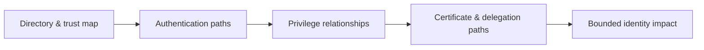

# Active Directory & Identity Exploitation

> [!warning] Authorized enterprise testing
> Identity attacks can affect every trusted system. Use canary principals, explicit lockout limits, bounded proofs, and immediate cleanup.

## 🗺️ Zero-to-Mastery Learning Path

1. [[Active Directory Architecture & Enumeration]]
2. [[Kerberos & NTLM Attacks]]
3. [[Active Directory Privilege Escalation]]
4. [[NTLM Relay & Authentication Coercion]]
5. [[Active Directory Certificate Services Security]]
6. [[Domain Persistence & Trust Abuse]]

---
> 🔼 Up: [[Penetration Testing]]
