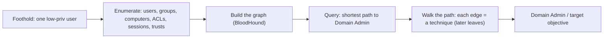

# 🏛️ Active Directory Architecture & Enumeration

> [!warning] Authorized Active Directory simulation only
> Enumeration queries a live directory and is logged. Run only against a domain you own or are explicitly authorized to assess — ideally a purpose-built lab (a DC plus a domain-joined workstation, or a GOAD-style range). Use canary accounts and synchronized-UTC evidence.

## Parent Learning Order
Active Directory Architecture & Enumeration -> Kerberos & NTLM Attacks -> Active Directory Privilege Escalation -> NTLM Relay & Authentication Coercion -> Active Directory Certificate Services Security -> Domain Persistence & Trust Abuse

## The Directory Is a Graph of Trust

**Active Directory (AD)** is the identity backbone of most enterprises: a central database of users, computers, and groups, plus the policies that govern them, served by **Domain Controllers (DCs)**. Every workstation and server in the domain trusts the DC to say who someone is and what they may do. For an attacker with a single foothold, AD is the map to everything, because AD is fundamentally a **graph**: users belong to groups, groups have rights over objects, computers trust the domain, and domains trust each other. The attacker's job is to find a *path* through that graph from where they are (a low-privileged user) to where they want to be (Domain Admin or a specific target).

This reframing — **AD is a graph, and attacks are paths through it** — is the single most important mental model in enterprise pentesting. Enumeration is how you draw the map; everything after is walking a path on it.

> [!tip] The analogy, and where it breaks
> AD is like a large corporation's org chart *plus* every "who can approve what" relationship — who reports to whom, who can reset whose password, who can unlock which door. The analogy breaks because the edges are often *unintended*: nobody drew "the helpdesk group can reset the domain admin's password," yet a decade of ad-hoc permission grants created exactly such edges, and the attacker finds them by *computing* the graph, not reading a chart anyone maintains.

**Prerequisites:** the OS Internals Windows Active Directory leaf (how AD works), LDAP, and Kerberos/NTLM basics.

**The deliberate break:** Active Directory is a directory — a database of users, computers and groups — so compromising it means finding a vulnerability in it.

Almost no AD compromise involves a vulnerability. AD is a **graph of permissions**, and the attack path is a chain of rights that were each granted deliberately: this helpdesk group can reset that user's password, that user is a local admin on this server, an admin has a live session on that server. Every edge is a legitimate configuration someone approved. The compromise is the *composition* — five sanctioned permissions that add up to Domain Admin, which nobody designed and nobody reviewed, because each was reviewed alone.

That is why enumeration is the phase that matters here rather than exploitation, and why the defender's job is auditing **relationships** rather than patching.

**How you'd spot the risk:** count the edges, not the CVEs. A group with more members than it has business reasons, a service account that is a local admin everywhere, or an admin who logs into workstations — each is a normal setting and a path segment.

## The Objects and Structure You Enumerate

AD's structure defines what enumeration collects:

| Object | What it is | Why it matters to an attacker |
| --- | --- | --- |
| **User** | An account | Credentials, group memberships, rights |
| **Group** | A collection of principals | Group rights cascade to members |
| **Computer** | A domain-joined machine | A computer account is also a principal with rights |
| **OU** | Organizational Unit (container) | GPOs apply here; delegation is set here |
| **GPO** | Group Policy Object | Configures many machines — a mass-control lever |
| **Domain / Forest** | The trust boundary(ies) | Trusts define cross-domain reach |

The high-value groups are the built-in privileged ones (Domain Admins, Enterprise Admins, and the often-overlooked ones like Account Operators, Backup Operators, DnsAdmins) — membership in any of them, direct or *nested*, is effectively domain control. Enumeration must resolve **nested** membership, because "who is really a Domain Admin" includes members of groups that are members of groups that are Domain Admins.

## Enumeration: Drawing the Graph

Enumeration reads the directory — mostly over LDAP — to collect the objects and relationships. It ranges from a single query to a full graph:

```bash
# enumerate domain users over LDAP with an authenticated low-priv account (from a Linux attacker box)
# against your own lab DC; ldapsearch is read-only
ldapsearch -x -H ldap://10.10.20.10 -D "canary@corp.lab" -w 'CanaryPass1' \
  -b "dc=corp,dc=lab" "(objectClass=user)" sAMAccountName memberOf | grep -E 'sAMAccountName|memberOf' | head -6
```

```text
sAMAccountName: canary
sAMAccountName: jsmith
memberOf: CN=IT Staff,OU=Groups,DC=corp,DC=lab
sAMAccountName: svc_sql
memberOf: CN=SQL Admins,OU=Groups,DC=corp,DC=lab
```

Each user's `memberOf` is an edge in the graph. `svc_sql` in `SQL Admins` is exactly the kind of service account whose group membership an attacker examines for a path. Manual LDAP is fine for a targeted question; for the *whole graph*, a tool that collects every object and relationship and computes paths is the standard.

## BloodHound: Computing the Attack Path

The defining AD-enumeration tool is **BloodHound**: a collector gathers users, groups, computers, sessions, ACLs, and trusts, and a graph database lets you *query for paths* — "shortest path from any user I control to Domain Admin." It turns thousands of individual permissions into a visible route.

```bash
# collect graph data with a Python collector against the lab DC (read-only LDAP + SMB)
bloodhound-python -u canary -p 'CanaryPass1' -d corp.lab -ns 10.10.20.10 -c All 2>&1 | tail -3
```

```text
INFO: Found 42 users, 31 groups, 8 computers
INFO: Compressing output into 20260806_bloodhound.zip
INFO: Done! Ingest the zip into the BloodHound UI to compute attack paths.
```

Ingesting that data and running the built-in "Shortest Path to Domain Admins" query reveals the route — e.g. *canary → (member of) IT Staff → (GenericAll on) svc_backup → (member of) Backup Operators → Domain Admin*. That computed path is the finding; each edge is a specific misconfiguration to fix. BloodHound's power is turning enumeration into *prioritized* attack paths rather than a flat list.



## Enumeration that announces itself

- **Enumeration is noisy.** Large LDAP pulls and BloodHound collection are visible in DC logs and to identity-monitoring tools. A real red team paces collection; an authorized assessment coordinates it.
- **A graph edge is not proof.** BloodHound shows *potential* edges; each must be validated (deny ACEs, protected objects, inheritance, current state) before it is a real path. "BloodHound said so" is a hypothesis, not a finding.
- **Nested groups hide reach.** "Who is Domain Admin" must resolve nesting — a user three groups deep is still a Domain Admin. Flat membership checks miss this.
- **Stale data.** Sessions and memberships change; a path computed yesterday may be gone (or a new one appeared). Collection is a snapshot.
- **Service accounts are the prize.** Their memberships, SPNs, and delegation settings are disproportionately dangerous — enumerate them specifically.

## Security Implications — Detection & Defense

- **AD attacks are graph problems, so defense is graph hygiene.** Defenders run BloodHound *against themselves* to find and cut the dangerous edges (the helpdesk-can-reset-DA path) before an attacker walks them — attack-path management is the mirror control.
- **Tiered administration** (Tier 0 = DCs/identity, Tier 1 = servers, Tier 2 = workstations) prevents credential exposure that creates cross-tier edges — a DA should never log into a workstation, because that seeds an edge from workstation-compromise to DA.
- **Least privilege and group hygiene:** remove nested and stale privileged memberships, and audit who *really* has privileged rights (resolving nesting).
- **Detection:** heavy LDAP enumeration, BloodHound collection patterns, and unusual directory queries from a workstation are the signals — the DC's directory-service and 4662 (object access) logs are the source.
- **Protect the crown jewels:** DCs, the `krbtgt` account, and Tier 0 assets are the graph's center; monitoring and restricting access to them is disproportionately valuable.

## Summary

You should now be able to:

- Explain why AD is a graph and why attacks are paths through it, and name the high-value objects and groups.
- Enumerate the directory over LDAP, resolve nested Domain Admin membership, and collect a BloodHound graph to compute a path to Domain Admin.
- Explain why a graph edge is a hypothesis until validated, why defenders run BloodHound against themselves (attack-path management), and how tiered administration prevents the cross-tier edges that create paths.

---
> 🔼 Up: [[Active Directory & Identity Exploitation]]
