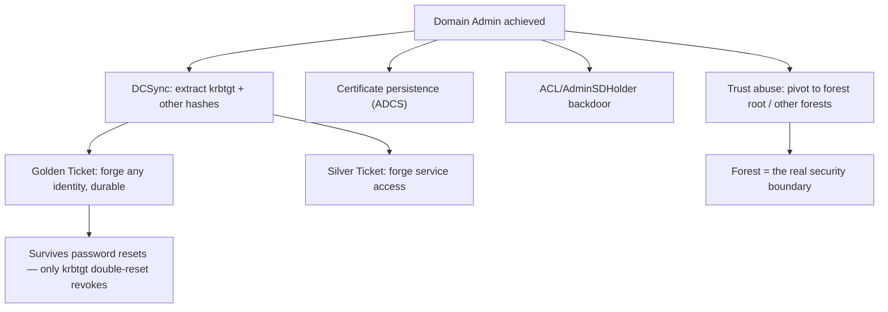

# 🏰 Domain Persistence & Trust Abuse

> [!warning] Authorized Active Directory simulation only
> These techniques create durable domain control and cross-domain reach. They are the most destructive AD actions — run only in a lab domain you own, act on canary identities, and prove with benign markers. A real Golden Ticket or krbtgt extraction is catastrophic; never perform these outside an isolated lab.

## Parent Learning Order
Active Directory Architecture & Enumeration -> Kerberos & NTLM Attacks -> Active Directory Privilege Escalation -> NTLM Relay & Authentication Coercion -> Active Directory Certificate Services Security -> Domain Persistence & Trust Abuse

## Keeping Control, and Spreading It

> *Defenders reset every user password in the domain. Are you out?*
>
> Hold your answer — the section below is the response.

The earlier leaves reached Domain Admin. This leaf covers what an attacker does *after*: **persistence** (staying in control even if defenders reset passwords and clean up) and **trust abuse** (spreading from one domain to others in the forest, or across forest trusts). Both exploit the same deep truth about AD: **the domain's trust ultimately rests on a small number of secrets and relationships**, and an attacker who captures those can forge control that survives ordinary remediation and reaches beyond the initial domain.

The defining property of good persistence is that it *survives the obvious cleanup*. Resetting the compromised user's password does nothing if the attacker holds the `krbtgt` key (Golden Ticket), a durable certificate (previous leaf), or a hidden ACL backdoor. This is why AD incident response is so hard — and why understanding persistence is essential for both attacker and defender.

> [!tip] The analogy, and where it breaks
> Domain persistence is like copying the master key that cuts *all other keys* (the `krbtgt` secret) — you can forge any key you want, forever, and changing the locks (user passwords) does nothing. The analogy breaks on detectability: a copied physical master key leaves no trace, whereas a Golden Ticket has subtle telltales (odd ticket lifetimes, tickets for nonexistent accounts) — the forgery is powerful but not perfectly invisible to a defender who knows what to look for.

**Prerequisites:** Kerberos (TGT/krbtgt), the privilege-escalation and ADCS leaves, and AD trusts from the OS Internals Windows AD leaf.

## The Persistence Techniques

Persistence ranges from subtle to total:

| Technique | What it captures | Why it survives cleanup |
| --- | --- | --- |
| **DCSync** | Replicates password hashes from the DC (including `krbtgt`) | You now hold the keys to forge tickets |
| **Golden Ticket** | Forge a TGT with the `krbtgt` hash | Valid for *any* user until krbtgt is reset **twice** |
| **Silver Ticket** | Forge a service ticket with a service's hash | Access a specific service, no DC contact |
| **Certificate persistence** | A durable auth certificate (ADCS leaf) | Survives password changes until revoked |
| **ACL/AdminSDHolder backdoor** | A hidden permission grant | Re-grants access after cleanup |

**DCSync** is the linchpin: with the right (which Domain Admin has), you ask a DC to *replicate* account data to you — including the `krbtgt` account's hash. That hash is the domain's master key.

```bash
# DCSync the krbtgt hash from the lab DC (requires DA-equivalent rights, obtained earlier)
impacket-secretsdump -just-dc-user krbtgt corp.lab/canaryadmin@10.10.20.10 -hashes :<canaryadmin_hash> 2>&1 | grep -i krbtgt | head -1
```

```text
krbtgt:502:aad3b435b51404eeaad3b435b51404ee:<krbtgt_nt_hash>:::
```

That `krbtgt` hash is the entire domain's trust anchor. With it, the attacker can forge a **Golden Ticket** — a TGT for any user (real or invented) with any group membership, valid for years. Resetting user passwords is irrelevant; only resetting `krbtgt` *twice* (it keeps two key versions) invalidates existing Golden Tickets.

## Golden Ticket: Forging Domain Control

```bash
# forge a Golden Ticket as a CANARY admin using the krbtgt hash (lab only)
impacket-ticketer -nthash <krbtgt_nt_hash> -domain-sid S-1-5-21-... -domain corp.lab canaryimpersonate 2>&1 | grep -iE 'Saving|golden' | head -1
```

```text
[*] Saving ticket in canaryimpersonate.ccache
```

The forged ticket authenticates as `canaryimpersonate` with Domain Admin rights, without the DC ever having issued it. The proof stops at forging a *canary* identity and using it for a benign action (listing a test share); a real Golden Ticket is total, durable domain compromise.

## Trust Abuse: Spreading Across Boundaries

AD **trusts** let one domain's users access another's resources. Attackers abuse them to spread:

- **Intra-forest** — all domains in a forest share the forest as a security boundary; compromising a child domain can reach the forest root via the **SID History** / inter-realm trust key (a forest is *not* a security boundary between its domains — the forest root is the real boundary).
- **Cross-forest** — a trust to another forest can be abused if the trust is configured without SID filtering, allowing a forged SID to claim privileges in the trusting forest.

The key defensive concept: **the forest, not the domain, is the security boundary.** Attackers who understand this pivot from a compromised child domain to the entire forest via the trust relationship.



## The most destructive actions in this domain

- **These are the most destructive AD actions.** Golden Tickets and krbtgt extraction give total, durable control; lab-only, canary identities, benign proof. A real Golden Ticket in production is a catastrophic, hard-to-eradicate compromise.
- **Cleanup is uniquely hard.** Persistence *is designed* to survive password resets. Proving persistence means demonstrating access *after* a simulated cleanup (reset the canary password, show the ticket still works) — that is the whole point.
- **krbtgt double-reset.** A Golden Ticket is only invalidated by resetting `krbtgt` **twice** (it retains the previous key). A single reset is a common IR mistake that leaves the attacker in control.
- **Golden Ticket telltales.** Forged tickets can have anomalous lifetimes (default 10 years), reference nonexistent accounts, or use unusual encryption — not perfectly invisible.
- **Trust nuance.** SID filtering, selective authentication, and trust direction determine what is abusable; misreading the trust config leads to wrong conclusions.

**The deliberate break:** after a domain compromise, resetting passwords reads as evicting the attacker.

Domain trust rests on **a small number of secrets**, and the `krbtgt` key is the one that matters most: possession of it mints valid tickets for any principal, indefinitely, with no reference to any password. A golden ticket survives resetting every user account in the domain, and clearing it requires resetting `krbtgt` **twice** with a replication interval between the two — a step that is easy to omit and completely invisible if you do.

**How you'd spot it:** read the eviction checklist rather than the reset count. A domain-compromise response that did not include a double `krbtgt` reset, certificate revocation, and a review of trust relationships did not reach the persistence, whatever it did to user credentials. In telemetry, the shapes worth hunting are tickets with implausible lifetimes and authentications with no corresponding logon event to explain them.

## Security Implications — Detection & Defense

- **Protect the `krbtgt` account and Tier 0.** DCSync and Golden Tickets require Tier 0 access; the whole defense upstream (tiered admin, protecting DCs, limiting who can replicate) is what prevents reaching this stage. Restrict the replication (DCSync) right to actual DCs.
- **Assume-breach recovery planning:** a domain that *was* fully compromised needs a structured recovery (double krbtgt reset, certificate revocation, ACL/AdminSDHolder audit, and potentially rebuild) — a password reset is not eradication.
- **The forest is the security boundary** — design trusts with SID filtering and selective authentication, and treat the forest root as the crown jewel; never assume a domain boundary contains an attacker.
- **Detection:** DCSync generates replication events (4662 with replication GUIDs) from a *non-DC* — a strong signal; Golden/Silver tickets show anomalous ticket properties (lifetime, encryption, nonexistent accounts) in 4769/4624 correlation; AdminSDHolder changes and unexpected ACLs are persistence tells.
- **Regularly audit persistence footholds** — AdminSDHolder ACLs, certificate issuance, and privileged group membership — because persistence hides in legitimate-looking configuration.

## Summary

You should now be able to:

- Explain why domain persistence rests on a few master secrets, and why resetting a user's password does not evict an attacker with the krbtgt key.
- DCSync the krbtgt hash, forge a Golden Ticket for a canary identity, and demonstrate that it survives a password reset.
- Explain why eradication requires a double krbtgt reset plus certificate revocation and ACL audit, why the forest (not the domain) is the security boundary, and how DCSync-from-a-non-DC and anomalous ticket properties are the detection signals.

---
> 🔼 Up: [[Active Directory & Identity Exploitation]]
