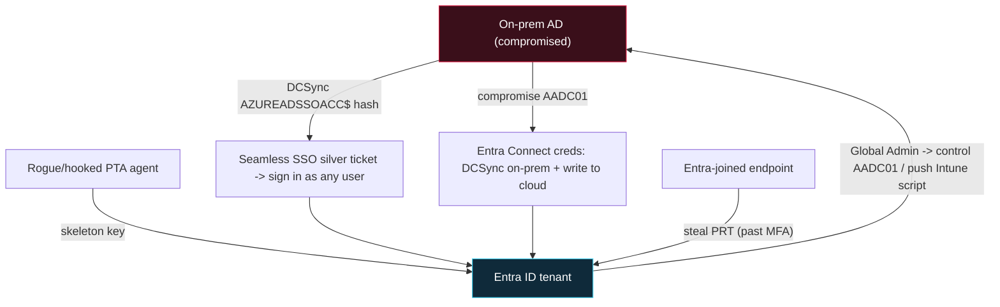

# ☁️ Hybrid Identity & Entra ID Attacks

> [!warning] Authorized enterprise testing only
> Hybrid attacks cross the boundary between on-prem AD and a live cloud tenant, where blast radius is hard to contain and actions are billed and logged to a real subscription. Run only against a lab tenant you own, act on canary principals, and prove with a benign sign-in. A mistake here reaches production identity for the whole organisation.

## Parent Learning Order
Active Directory Architecture & Enumeration -> Kerberos & NTLM Attacks -> Active Directory Privilege Escalation -> NTLM Relay & Authentication Coercion -> Active Directory Certificate Services Security -> SCCM & Configuration Manager Attacks -> Hybrid Identity & Entra ID Attacks -> Domain Persistence & Trust Abuse

## The Directory Is No Longer Just On-Prem

> *You are Domain Admin on-prem. The company's email, files and admin portals are all in the cloud tenant. Does your on-prem control reach them?*
>
> Hold your answer — the section below is the response.

Almost every organisation now runs **two** directories: the on-prem Active
Directory this branch has been attacking, and **Entra ID** (formerly Azure AD),
the cloud directory behind Microsoft 365, the Azure portal, and any app that
signs in "with your work account." They are kept in step by a synchronisation
service — **Entra Connect** (Azure AD Connect) — running on a member server. That
server is the seam, and the seam is the attack surface: it holds credentials
that can write to *both* directories, and the mechanisms that make single
sign-on feel seamless are the mechanisms an attacker rides from one side to the
other.

The strategic point is that on-prem compromise and cloud compromise are no
longer separate engagements. A foothold in one is frequently a foothold in the
other, because the sync server, the sync account, and the SSO plumbing were
built to bridge them on purpose.

> [!tip] The analogy, and where it breaks
> Entra Connect is like a company that keeps two offices in perfect sync by
> employing one courier who has the keys to both buildings. The analogy breaks on
> what the courier *is*: it is not a person you can fire, it is a service account
> with directory-replication rights on-prem and sync rights in the cloud, sitting
> on one Windows server. Compromise that one server and you are not robbing the
> courier — you have become the courier, with both sets of keys.

**Prerequisites:** on-prem AD (this branch), Kerberos silver tickets ([[Kerberos & NTLM Attacks]]), and the idea of a bearer token from the Cryptography domain's JWT work.

## The sync server holds keys to both directories

Entra Connect on `AADC01` runs a highly privileged on-prem account (the
`MSOL_...` / `ADSync` account) that, to synchronise password hashes, is granted
**directory-replication rights** — the same rights [[Domain Persistence & Trust Abuse]]
uses for DCSync. It also holds credentials that let it write to the cloud tenant.
Both sets sit in the Entra Connect database on that one server, encrypted with
keys that also live on the server, so an attacker who reaches `AADC01` as admin
can decrypt them.

```bash
# on AADC01 (compromised), recover the sync account credentials from the Connect DB (lab)
# AADInternals reads the localdb and decrypts the stored on-prem + cloud creds
PS> Get-AADIntSyncCredentials
```

```text
Name                 : MSOL_a1b2c3d4e5f6
Password             : <cleartext on-prem sync-account password>
AADUser              : Sync_AADC01_a1b2c3d4@meridian.onmicrosoft.com
AADUserPassword      : <cleartext cloud sync-account password>
```

That single output is both directions at once. The on-prem credential DCSyncs
the whole domain (it has the replication right); the cloud credential can write
to the tenant. **This is why Entra Connect is a Tier 0 asset** — it is not a
management convenience, it is a domain controller and a cloud admin sharing one
box.

## Three SSO mechanisms, three attacks

The features that let a user sign in once and reach everything are each a path:

**Password Hash Sync (PHS).** On-prem NT hashes are synchronised (as a hash of
the hash) into Entra so cloud sign-in works without contacting on-prem. An
attacker on `AADC01` — or anyone who can DCSync — can also *inject* a hash the
other way, or dump synced material. PHS turns the on-prem hash into a cloud
credential.

**Pass-Through Authentication (PTA).** Instead of syncing hashes, a lightweight
agent on-prem validates each cloud sign-in against on-prem AD in real time. If an
attacker installs a rogue PTA agent, or hooks the real one, they see **every
cloud sign-in in cleartext** and can force the agent to *accept any password* —
a skeleton key for the whole tenant that never touches a hash.

**Seamless SSO.** To sign domain-joined users into the cloud silently, Entra
creates a computer account in on-prem AD, `AZUREADSSOACC$`, and uses its Kerberos
key to validate SSO. That key forges cloud access: with the `AZUREADSSOACC$` hash
(via DCSync), an attacker mints a **silver ticket** for the SSO service and signs
in as *any synced user* — the Seamless SSO silver-ticket attack. Worse, the
`AZUREADSSOACC$` password **does not rotate** unless an admin deliberately rolls
it, so a hash captured once can be valid for years.

```bash
# forge a Seamless SSO ticket for a canary user with the AZUREADSSOACC$ hash (lab, DCSync'd)
PS> $kerbTicket = New-AADIntKerberosTicket -SidToUser r.okonkwo -Hash <AZUREADSSOACC_nt_hash>
PS> Get-AADIntAccessTokenForEXO -KerberosTicket $kerbTicket -Domain meridian.test
```

```text
[*] Access token acquired for r.okonkwo@meridian.test  (no password, no MFA prompt)
```

## Primary Refresh Tokens: SSO you can steal off an endpoint

On an Entra-joined or hybrid-joined workstation the **Primary Refresh Token
(PRT)** is the master SSO artifact — a long-lived token, bound to the device and
protected by the TPM where present, that silently obtains access tokens for every
cloud app. It is the cloud equivalent of a TGT sitting in LSASS, and it is a
prime theft target because **it carries the device's MFA claim**: a stolen PRT
(with the session key and a nonce) yields cloud access *as the user, already past
MFA*. That is the property that makes it dangerous — it is not a password to
crack, it is a bearer token that has already satisfied the strong-auth check.



## The pivot runs both ways

The diagram's bottom edge is the point most on-prem testers miss: **cloud
compromise reaches back on-prem.** A Global Admin in the tenant controls the
devices Intune manages — pushing a script to a hybrid-joined server runs code on
it as SYSTEM — and controls the cloud side of the sync relationship. The two
directories are not an on-prem castle with a cloud annex; they are one identity
fabric with two control planes, and standing in either one is often a short step
from the other.

**How you'd spot it:** the exposures are configuration facts you can read before
touching anything. Is Entra Connect (`AADC01`) treated as Tier 0, or is it a
domain-joined member server any workstation admin can reach? Has `AZUREADSSOACC$`
ever had its password rolled (check `pwdLastSet`)? Is PTA in use, and who can
register an agent? On the cloud side, the sign-in logs are the ground truth — a
Seamless SSO forgery and a stolen PRT both produce a sign-in with no
corresponding on-prem logon and often an impossible-travel or unfamiliar-device
signal.

## Security Implications — Detection & Defense

- **Treat Entra Connect as Tier 0.** `AADC01` is a domain controller and a cloud
  admin on one box; it deserves DC-grade isolation, no browsing, no general
  admin logins, and dedicated PAWs. Compromise of it is compromise of both
  directories.
- **Roll `AZUREADSSOACC$` regularly.** Its key forges cloud sign-in for every
  user and does not rotate on its own; scheduled rotation is the direct fix for
  the Seamless SSO silver ticket.
- **Prefer phishing-resistant, cloud-native auth.** FIDO2 / Windows Hello for
  Business and Conditional Access with device compliance blunt PRT theft and
  password-based skeleton keys; a stolen PRT is far less useful when Conditional
  Access also demands a compliant device it can revoke.
- **Watch the sync and SSO plane.** Alert on new or unexpected PTA agent
  registrations, changes to Entra Connect, `AZUREADSSOACC$` ticket requests, and
  sign-ins with no matching on-prem logon. The cloud sign-in log sees forgeries
  the on-prem log cannot.
- **Segment the control planes.** Global Admins should be cloud-only accounts,
  not synced from on-prem, so an on-prem compromise cannot simply DCSync its way
  to a cloud administrator — and on-prem Tier 0 should not be reachable from
  cloud-managed devices without a break-glass path.

## Summary

You should now be able to:

- Explain why on-prem and cloud identity are one fabric with two control planes, and why Entra Connect on `AADC01` is a Tier 0 asset holding keys to both.
- Describe the three SSO mechanisms — PHS, PTA and Seamless SSO — and the attack each enables, and forge a Seamless SSO silver ticket with the `AZUREADSSOACC$` hash against a canary user.
- Explain why a stolen Primary Refresh Token is cloud SSO already past MFA, how cloud compromise pivots back on-prem through Intune and the sync relationship, and why rolling `AZUREADSSOACC$`, isolating Entra Connect, and cloud-only Global Admins are the load-bearing controls.

---
> 🔼 Up: [[Active Directory & Identity Exploitation]]
