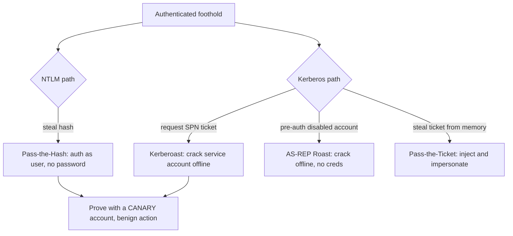

# 🎫 Kerberos & NTLM Attacks

> [!warning] Authorized Active Directory simulation only
> These attacks manipulate authentication material. Use synthetic canary accounts in a lab domain you own, prove with a benign marker (a cracked *canary* password, a ticket used to list a test share), and never touch real credentials. Test only in-scope domains.

## Parent Learning Order
Active Directory Architecture & Enumeration -> Kerberos & NTLM Attacks -> Active Directory Privilege Escalation -> NTLM Relay & Authentication Coercion -> Active Directory Certificate Services Security -> SCCM & Configuration Manager Attacks -> Hybrid Identity & Entra ID Attacks -> Domain Persistence & Trust Abuse

## The Two Ways Windows Proves Who You Are

> *Your environment uses Kerberos, not NTLM. Which patch stops Kerberoasting?*
>
> Hold your answer — the section below is the response.

Active Directory authenticates with two protocols, and both are attacker targets. **NTLM** is the older challenge-response scheme based on a hash of the password. **Kerberos** is the modern ticket-based scheme where a Domain Controller issues time-limited tickets. The crucial insight for an attacker is that in both, **the password itself is rarely sent — a derivative is** (an NTLM hash, or a Kerberos ticket/key). And because Windows *reuses* those derivatives to avoid re-prompting, an attacker who steals the *derivative* can often authenticate without ever knowing the password.

This is the heart of AD credential attacks: you do not need the password if you have the hash (NTLM) or the ticket (Kerberos). The whole family — Pass-the-Hash, Pass-the-Ticket, Kerberoasting, AS-REP Roasting — exploits that Windows treats these derivatives as good as the password.

> [!tip] The analogy, and where it breaks
> A Kerberos ticket is like a festival wristband: you prove your identity once at the gate (password → the DC), get a wristband (ticket), and flash it everywhere without re-proving. The analogy breaks because the wristband can be *copied and worn by anyone* — Windows accepts a stolen ticket or hash with no check that the presenter is the real person, so the "wristband" is a bearer token, and stealing it *is* becoming the user.

**Prerequisites:** the OS Internals Windows Identity leaf (LSASS, tickets, hashes), and AD enumeration.

**The deliberate break:** NTLM is the old broken one and Kerberos is the modern secure one, so an environment that has moved to Kerberos has moved past this class of attack.

Kerberoasting works because Kerberos is working **exactly as designed**. Any authenticated user may request a service ticket for any service principal — that is the protocol, not a flaw — and the ticket comes back encrypted with a key derived from the service account's password. Nothing is exploited. The attacker asks a legitimate question, receives a legitimate answer, and takes it away to crack offline at their own pace.

There is no patch for this, because there is no bug. The defence is entirely about the **password**: a service account with a long random password or a gMSA yields a ticket nobody can crack, and the identical request becomes harmless. That is a very different remediation conversation from "apply the update."

**How you'd spot the exposure:** enumerate accounts with a Service Principal Name set, then ask which of those have human-chosen passwords and no rotation. Every one of them is roastable by any domain user, today.

## NTLM Attacks: The Hash Is the Password

NTLM authentication proves you know the password by using its hash in a challenge-response. Because the *hash* is what proves identity, an attacker with the hash can authenticate directly — **Pass-the-Hash (PtH)**:

- Steal an NTLM hash from memory (LSASS) or a database (SAM, NTDS.dit).
- Present that hash to authenticate to any service accepting NTLM — no password, no cracking needed.

```bash
# Pass-the-Hash to list shares on a lab host, using a canary account's hash (from a Linux box)
# the hash was obtained from a lab machine you compromised; target is your lab
impacket-smbclient -hashes :aad3b435b51404eeaad3b435b51404ee:<canary_nt_hash> meridian.test/canary@10.10.20.20 <<< 'shares; exit' 2>&1 | grep -A3 Shares
```

```text
Type help for list of commands
Shares:
  ADMIN$
  C$
  CanaryShare
```

The hash authenticated to SMB and listed shares — **no password was known or cracked**. That is Pass-the-Hash: the hash *is* the credential. This is why stealing a hash (not just cracking it) is the goal, and why NTLM's reuse of hashes is its core weakness.

## Kerberos Attacks: Roasting and Ticket Theft

Kerberos has its own signature attacks, all exploiting how tickets are issued and encrypted:

**Kerberoasting** — any authenticated user can request a *service ticket* (TGS) for any service account with a Service Principal Name (SPN). That ticket is encrypted with the service account's password hash, so an attacker requests it and cracks it *offline* to recover the service account's password. It is devastating because it needs only a low-priv account and targets often-over-privileged service accounts with weak passwords.

```bash
# request service tickets for SPN accounts and get crackable hashes (against your lab DC)
impacket-GetUserSPNs meridian.test/canary:'CanaryPass1' -dc-ip 10.10.20.10 -request 2>&1 | grep -E '\$krb5tgs\$|ServicePrincipalName' | head -2
```

```text
ServicePrincipalName   Name      MemberOf
$krb5tgs$23$*svc_sql$CORP.LAB$MSSQLSvc/sql01.meridian.test*$a1b2...  (crackable offline)
```

The `$krb5tgs$` blob is the service ticket, crackable offline with a wordlist. If `svc_sql` has a weak password, you recover it — and service accounts are frequently in privileged groups. The proof stops at cracking a *canary* service account's known-weak password, never a real one.

**AS-REP Roasting** targets accounts with "Kerberos pre-authentication disabled" — the DC returns an encrypted blob (AS-REP) crackable offline, *without any credentials at all*, just a username. It is the pre-auth-disabled misconfiguration turned into an offline password attack.

**Pass-the-Ticket** is Kerberos's Pass-the-Hash: steal a ticket (TGT or TGS) from memory and inject it into your session to become that user. The **Golden Ticket** (forging a TGT with the `krbtgt` hash) and **Silver Ticket** (forging a service ticket with a service's hash) are the persistence extremes, covered in the persistence leaf.



## Cracking only what you are allowed to crack

- **Cracking real passwords.** Kerberoasting/AS-REP roasting yield crackable hashes; crack only *canary* accounts with known weak passwords to prove the flaw, never real service accounts.
- **Kerberoast without weak passwords.** If the service account has a strong, long password (or is a Group Managed Service Account), the ticket is not crackable — the *finding* is still "kerberoastable SPN accounts exist," but the impact depends on password strength.
- **Encryption downgrade.** RC4-encrypted tickets crack far faster than AES; the presence of RC4 support is itself a weakness to report.
- **PtH is NTLM-only.** Pass-the-Hash works against NTLM authentication; a service requiring Kerberos or with SMB signing may resist it. Match the technique to what the target accepts.
- **Detection.** TGS requests (event 4769), especially bursts or RC4 requests, and NTLM authentication from unexpected hosts are the signals — these attacks are visible to a monitored DC.

## Security Implications — Detection & Defense

- **Strong service-account passwords / gMSA** defeat Kerberoasting — a 25+ character random password makes the offline crack infeasible, and Group Managed Service Accounts rotate automatically. This is the single most impactful control against roasting.
- **Enable Kerberos pre-authentication** everywhere (disable the "do not require pre-auth" flag) to kill AS-REP roasting.
- **Disable RC4, require AES** for Kerberos — removes the fast-crack path.
- **Credential Guard, LSASS protection, and tiered admin** stop hash/ticket theft from memory (the PtH/PtT source) — you cannot pass what you cannot steal.
- **Detection:** monitor 4769 (TGS requests) for volume and RC4, 4768 (TGT), and NTLM auth patterns; a single account requesting many service tickets is the Kerberoasting signature, and NTLM auth for an account that should use Kerberos is a PtH tell.

## Summary

You should now be able to:

- Explain why NTLM hashes and Kerberos tickets are bearer credentials, and why stealing the derivative means becoming the user.
- Perform Pass-the-Hash and Kerberoasting against canary accounts, crack a canary service ticket offline, and recognize AS-REP roasting and Pass-the-Ticket.
- Explain why strong/gMSA service-account passwords defeat Kerberoasting, why disabling RC4 and enabling pre-auth close fast-crack and AS-REP paths, and how Credential Guard/tiered admin stop the memory theft that PtH/PtT depend on.

---
> 🔼 Up: [[Active Directory & Identity Exploitation]]
