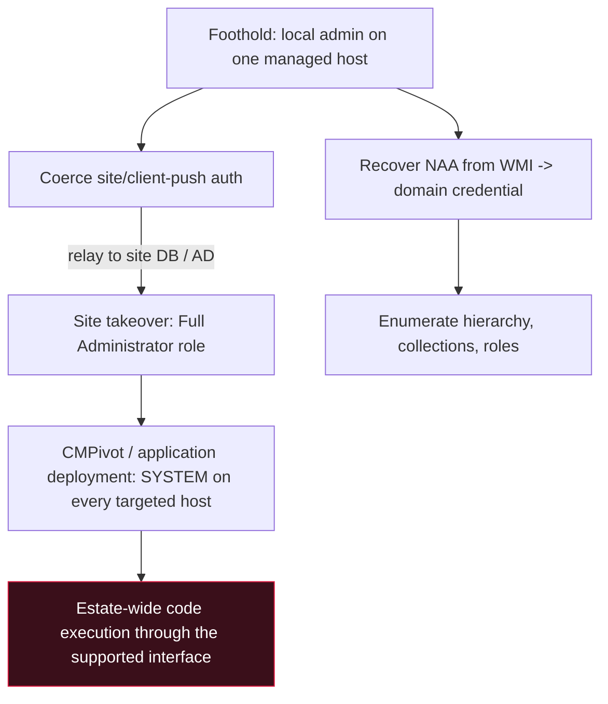

# 🛰️ SCCM & Configuration Manager Attacks

> [!warning] Authorized enterprise testing only
> Configuration Manager can execute code on every managed host in the estate. A mistaken deployment is estate-wide RCE. Run only in a lab hierarchy you own, target a canary device collection, and prove with a benign marker. Never deploy to a production collection.

## Parent Learning Order
Active Directory Architecture & Enumeration -> Kerberos & NTLM Attacks -> Active Directory Privilege Escalation -> NTLM Relay & Authentication Coercion -> Active Directory Certificate Services Security -> SCCM & Configuration Manager Attacks -> Hybrid Identity & Entra ID Attacks -> Domain Persistence & Trust Abuse

## The Thing That Can Install Software Everywhere

> *Which single system in most large AD environments is designed to run code as SYSTEM on every workstation and server at once — on command?*
>
> Hold your answer — the section below is the response.

**Microsoft Configuration Manager** — SCCM, now branded MECM — is how large
organisations deploy software, push patches, image machines and inventory the
estate. To do that job it must, by design, execute code as SYSTEM on every
device it manages, on command. That is an enormous standing capability, and it is
routinely deployed with weak defaults, treated as an operations tool rather than
a security-critical one, and administered from ordinary workstations. On
`MECM01`, the Meridian site server, it manages every host on the network.

For an attacker this is close to ideal: a legitimate, always-on system whose
*intended function* is estate-wide code execution and credential distribution.
You rarely need an exploit — you need the roles and secrets the platform hands
out, and it hands out more than most administrators realise.

> [!tip] The analogy, and where it breaks
> SCCM is the building's facilities department, with a master key and standing
> permission to enter any office to do maintenance. The analogy breaks on scale
> and speed: facilities visits one office at a time, but a single Configuration
> Manager deployment enters *every* office simultaneously and runs whatever it
> was told to run as the building's own maintenance staff. Compromising facilities
> is not a break-in; it is inheriting the master key and the standing permission.

**Prerequisites:** AD enumeration, NTLM relay and coercion ([[NTLM Relay & Authentication Coercion]]), and DPAPI from the OS Internals Windows leaf.

## Network Access Accounts: domain creds sitting on every client

The oldest and most reliable SCCM finding is the **Network Access Account
(NAA)** — a domain credential clients use to fetch deployment content before they
have a computer identity of their own. That credential is pushed to **every
client** and stored, DPAPI-encrypted, in WMI. Any attacker who is SYSTEM (or
local admin) on a single managed workstation can decrypt it, and older
configurations exposed it to any authenticated user through client policy.

```bash
# on any managed host (SYSTEM), recover the NAA from the local machine policy (lab)
PS> SharpSCCM.exe local secrets -m wmi
```

```text
[+] Retrieved NAA credential from WMI:
    Username : MERIDIAN\svc_sccm_naa
    Password : <cleartext domain password>
```

One workstation, one command, and a domain account falls out — frequently an
over-privileged one, because administrators grant the NAA more than the read
access it needs. This is why "we have SCCM" so often means "there is a domain
credential on every desk," and why the NAA is the first thing to pull and the
first thing to eliminate.

## Coercion, relay and site takeover

SCCM's server components authenticate to each other and to clients, which makes
them coercion targets that feed straight into [[NTLM Relay & Authentication Coercion]]:

- **Client push installation.** If automatic client push is enabled, the site
  server will authenticate to a host to install the client — using the
  **client push account**, which is typically a local admin *everywhere*. Coerce
  that authentication to your relay and you capture or relay a credential that is
  admin across the estate.
- **Site takeover.** The site server and its SQL site database trust each other
  over NTLM. Coerce the site server and relay it to the site database (or relay a
  site system to AD) and you can grant yourself a **Full Administrator** role in
  the hierarchy. From there SCCM does what it is built to do — on your behalf.

```bash
# coerce MECM01 and relay to the site database to add a rogue Full Admin (lab, canary)
# ntlmrelayx targets the MSSQL site DB; SharpSCCM triggers the site-server auth
impacket-ntlmrelayx -t mssql://10.10.20.35 -q "..." -smb2support 2>&1 | grep -iE 'started|SCCM' | head -1
```

```text
[*] Servers started, waiting for connections
```

## Deployment as lateral movement

Once you hold a management role, you do not drop malware — you use the product.
A **CMPivot** query runs a live command across a device collection for
"inventory," and an **application or script deployment** runs code as SYSTEM on
every device in a targeted collection. Point either at a canary collection and
you have SYSTEM execution on those hosts through the supported interface, logged
as an ordinary deployment.

```bash
# deploy a benign marker to a CANARY collection as SYSTEM (lab, Full Admin held)
PS> SharpSCCM.exe exec -collection "Canary-Test" -p "cmd /c echo C2R-SCCM-OK > C:\marker.txt"
```

```text
[+] Deployment created for collection 'Canary-Test' — runs as SYSTEM on member devices
```



## Where SCCM assessments go wrong

- **Deploying to the wrong collection.** A deployment is real code on real hosts;
  a fat-fingered collection is estate-wide RCE. Always target a canary
  collection with known membership, and confirm membership before deploying.
- **The NAA may be gone.** Enhanced HTTP and the boundary-group model let modern
  sites operate without an NAA; its absence is a *good* finding, not a dead end —
  pivot to client push and site-takeover paths.
- **PXE and OS deployment.** Where PXE boot is offered, the boot media and task
  sequences can carry credentials; an unauthenticated PXE response is its own
  finding, separate from the NAA.
- **Roles are the real target.** SCCM's own RBAC (Full Administrator vs a scoped
  role) decides blast radius; enumerate who holds what before assuming a foothold
  is game over.
- **Detection surface.** Site takeover and rogue deployments are loud *if anyone
  watches SCCM* — the problem is that few do.

**The deliberate break:** SCCM reads as an IT operations tool — patching and
software installs — so it is filed under operations, not security, and left off
the Tier 0 map.

Its function *is* estate-wide code execution as SYSTEM and estate-wide credential
distribution, which is precisely the capability an attacker most wants. The site
server is therefore a Tier 0 asset by its powers, whatever the org chart says,
and the NAA is a domain credential replicated to every endpoint by design. Both
facts follow from what the product does, not from any bug — which is why "it's
just our software-deployment system" is exactly the sentence that leaves it
unguarded.

**How you'd spot it:** answer three questions before any exploitation. Is there
an NAA configured, and how privileged is it? Is automatic client push enabled,
and is the push account a local admin across the estate? Is the site server
isolated and administered from PAWs, or is it a member server reachable and
administered from ordinary workstations? The answers describe the exposure before
a single credential is pulled.

## Security Implications — Detection & Defense

- **Eliminate the NAA.** Move to Enhanced HTTP / PKI so clients need no shared
  domain credential; where an NAA must exist, scope it to read-only and nothing
  more. This closes the most reliable SCCM finding at the source.
- **Harden the authentication plane.** Require SMB and LDAP signing and Extended
  Protection so the site server and site database cannot be relayed; disable
  automatic client push, or scope the push account so it is not a universal local
  admin.
- **Treat `MECM01` as Tier 0.** Isolate the site server and site database,
  administer them only from PAWs, and restrict the Full Administrator role — its
  powers are DC-equivalent in reach.
- **Watch deployments and role changes.** New Full Administrators, unexpected
  application or script deployments, and CMPivot queries against broad
  collections are the signals; SCCM logs them, but only if someone is reading.
- **Segment PXE.** Require a password for PXE boot and keep OS-deployment task
  sequences free of embedded credentials.

## Summary

You should now be able to:

- Explain why Configuration Manager is a Tier 0 asset by its powers, and why "it's just our software-deployment tool" is what leaves it unguarded.
- Recover a Network Access Account from a managed host, and describe the coercion-and-relay path to a site takeover and Full Administrator role.
- Use a deployment or CMPivot as SYSTEM-level lateral movement against a canary collection, and name the load-bearing defences: eliminate the NAA, enforce signing/EPA, disable or scope client push, and isolate the site server as Tier 0.

---
> 🔼 Up: [[Active Directory & Identity Exploitation]]
