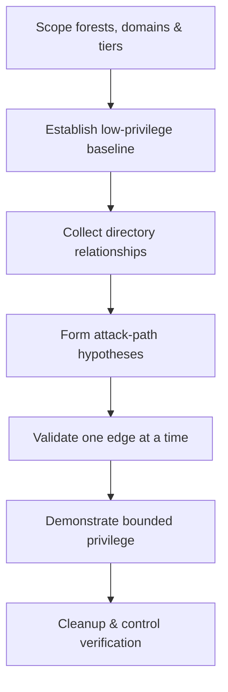

# Guided Active Directory Assessment

> [!warning] Authorized enterprise exercise
> Directory testing can affect authentication, replication, and account lockout. Use supplied test identities, approved collection methods, and explicit limits for coercion, relay, password auditing, and persistence simulation.

## Parent Learning Order
Guided Network Pentest Walkthrough -> Guided Active Directory Assessment -> Guided Web & API Assessment -> Guided Wireless Assessment -> Guided Cloud Security Assessment -> Guided Social Engineering Exercise -> Guided Red Team & Purple Team Operation -> Guided Retest & Closure

> [!tip] The analogy, and where it breaks
> Assessing Active Directory is like auditing who holds copies of every key in a huge corporate campus and which doors each key opens — the danger is rarely one bad lock, it is the chain of "this key opens a room that contains another key."
> 
> The analogy breaks on combination: physical keys are singular, whereas an AD permission edge can be inherited, delegated, and chained, so a safe-looking account reaches total control through relationships no single admin ever sees.

**Prerequisites:** the **Active Directory Architecture & Enumeration**, **Kerberos & NTLM Attacks**, and **AD Privilege Escalation** technique leaves — this note is how to run those as a coherent engagement.

## Objective

Determine whether ordinary enterprise access can be transformed into control of sensitive systems or directory tiers. The assessment models relationships among identities, endpoints, service accounts, trusts, certificates, delegation, policy, and administrative boundaries.



## 1. Define directory-specific controls

Document forests, domains, trust directions, privileged tiers, certificate authorities, identity providers, endpoint-management systems, domain controllers, and crown-jewel servers. Clarify whether password spraying, NTLM relay simulation, delegation changes, certificate enrollment, or ticket forgery simulation is prohibited.

```text
Test principal: CORP\assessment.user
Permitted: LDAP reads, one approved service-ticket request, ACL validation
Prohibited: production account lockout, DC exploitation, persistent directory objects
Canary group: CORP\Tier0-Test-Admins
Cleanup owner: Identity Engineering
```

## 2. Establish the baseline

Capture the test identity’s group memberships, logon rights, reachable systems, authentication protocols, and assigned workstation. Validate clock synchronization and DNS because Kerberos and directory discovery depend on both. Preserve a before-state for every object that might be changed.

## 3. Map relationships

Collect only the directory properties required to evaluate attack paths: group nesting, sessions where approved, local administrator relationships, service principal names, delegation flags, certificate templates, access-control entries, stale privileged accounts, and cross-domain trusts. Treat graph output as a hypothesis generator, not proof of exploitability.

```text
[edge] assessment.user -> Helpdesk-L1          type=MemberOf
[edge] Helpdesk-L1 -> Workstation-042          type=AdminTo
[edge] Workstation-042 -> svc.deploy           type=SessionCandidate
[edge] svc.deploy -> Server-Admins              type=WriteMember
```

## 4. Validate edges safely

For each path, test prerequisites and effective permissions without immediately exercising the final privilege. Confirm inheritance, deny entries, object protection, protocol availability, endpoint hardening, and whether the supposed session is current. A stale relationship is not a finding.

| Edge class | Safe evidence | Key defensive question |
|---|---|---|
| Excessive ACL | Effective-rights calculation + reversible test object | Why can this role modify a privileged object? |
| Delegation | Account flags + service scope | Is delegation constrained to necessary services? |
| Certificate template | Enrollment rights + issuance settings | Can requesters choose an identity or dangerous purpose? |
| Local admin reuse | Approved endpoint proof | Are local credentials unique and protected? |

## 5. Demonstrate bounded impact

Use a canary group, synthetic service, or disposable test host. Stop at the first proof that establishes the privilege boundary failure. Do not dump unrelated credentials or modify production policy merely to strengthen a finding. Capture event logs and identity-provider telemetry alongside offensive evidence so detections can be evaluated.

## 6. Analyze control layers

Assess tiering, privileged access workstations, local administrator password management, service-account lifecycle, NTLM restrictions, LDAP signing and channel binding, certificate-template governance, delegation review, endpoint credential isolation, and alert coverage. Explain which layer should have prevented each validated edge.

## 7. Restore and retest

Remove test memberships, certificates, tickets, scheduled actions, and temporary objects. Compare the after-state to the baseline. Retesting should show the path is severed at a durable control point and that the intended administrative workflow still works.

## Summary

You should now be able to:

- Explain why AD assessment models a *graph* of principals/permissions, and why the goal is proving trust-failures, not "domain admin at any cost."
- Baseline a test identity, collect directory relationships, validate one edge at a time with reversible canary proofs, and demonstrate bounded privilege.
- Map each validated edge to the control layer that should have stopped it (tiering, LAPS, delegation review, LDAP signing, cert-template governance) and retest that the path is severed durably.

---
> 🔼 Up: [[Guided Assessments]]
