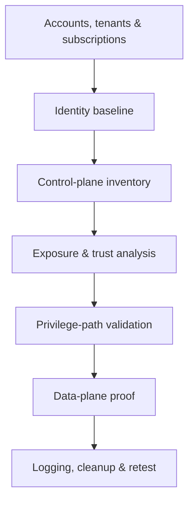

# Guided Cloud Security Assessment

> [!warning] Shared-responsibility scope
> Confirm the cloud provider’s penetration-testing policy, tenant and subscription identifiers, regions, approved identities, managed-service restrictions, and third-party boundaries before testing.

## Parent Learning Order
Guided Network Pentest Walkthrough -> Guided Active Directory Assessment -> Guided Web & API Assessment -> Guided Wireless Assessment -> Guided Cloud Security Assessment -> Guided Social Engineering Exercise -> Guided Red Team & Purple Team Operation -> Guided Retest & Closure

> [!tip] The analogy, and where it breaks
> A cloud assessment is like inspecting a serviced office where the landlord secures the building (the provider) but you configure your own suite's locks, safes, and guest passes (the customer) — most breaches are a tenant leaving the safe open, not the landlord failing.
> 
> The analogy breaks on walls: a physical suite has visible boundaries, whereas cloud privilege leaks through invisible relationships (a role that can update a function that can read a secret), so the real boundary is identity policy, not geography.

**Prerequisites:** the **Cloud & Internet Exposure Discovery** and **SSRF** leaves (metadata endpoints), and identity/IAM fundamentals; confirm the provider's testing policy first.

## Objective

Assess whether cloud identities, control-plane policy, network exposure, workload identity, data services, automation, and logging prevent an initial low-privilege principal from reaching protected resources.



## 1. Define the cloud boundary

Record organizations, management groups, accounts, projects, subscriptions, regions, virtual networks, clusters, identity tenants, CI/CD systems, SaaS integrations, and data classifications. Distinguish provider-managed infrastructure from customer-controlled configuration.

```text
Provider: multi-cloud
Authorized tenants: tenant-sec-test, account 123456789012
Principal: assessment-reader@example.test
Allowed: read inventory, test synthetic role, inspect public exposure
Excluded: provider infrastructure, resource exhaustion, real secret retrieval
```

## 2. Establish identity truth

Capture the effective principal, federation source, token audience, claims, role assignments, policy boundaries, session duration, conditional access, and strong-authentication status. Test with supplied identities rather than creating unknown access paths.

## 3. Inventory the control plane

Enumerate authorized resource metadata and normalize it into identities, policies, networks, compute, containers, serverless functions, data stores, secrets, keys, logging, and automation. Review both direct permissions and trust relationships. Infrastructure-as-code is valuable evidence, but deployed state is authoritative.

## 4. Model attack paths

Look for privilege created through combinations: pass-role plus function update, instance profile plus metadata access, public workload plus overprivileged service identity, CI secret plus deployment rights, or cross-account trust plus weak external conditions. Prove each edge independently.

```text
Path hypothesis:
assessment-reader -> read function configuration
function role -> read synthetic secret
update permission -> absent
Result: visibility finding, not privilege escalation
```

## 5. Validate exposure and data controls

Check public endpoints, storage policies, database networking, security groups, firewall rules, private endpoints, encryption keys, snapshots, registries, and backup access. Use canary records and metadata-only proof. Verify that tenant boundaries hold across API, console, object URLs, and asynchronous jobs.

## 6. Evaluate workload identity

Assess metadata-service protections, pod or task identities, service-account binding, secret injection, build runners, deployment agents, and lateral trust between workloads. Determine whether workloads receive only task-specific privileges and whether short-lived credentials replace static secrets.

## 7. Verify detection and recovery

Correlate controlled policy denials, role assumptions, public-policy changes on a test resource, secret access, and unusual API calls with centralized audit telemetry. Confirm logs are organization-controlled, immutable, region-complete, and monitored.

## 8. Cleanup and retest

Remove test resources, policies, keys, snapshots, public rules, federated sessions, and automation artifacts. Compare inventory before and after. Retest the repaired policy and adjacent identities so closure demonstrates least privilege without breaking legitimate deployment flows.

## Summary

You should now be able to:

- Explain the shared-responsibility split and why cloud attack paths come from *combinations* of permissions, not single flaws.
- Establish identity truth, inventory the control plane, validate a privilege path edge-by-edge with metadata-only/canary proof, and check tenant isolation.
- Explain why deployed state (not IaC) is authoritative, how least privilege + short-lived workload identity + immutable org-level logging close the paths, and retest without breaking deployment flows.

---
> 🔼 Up: [[Guided Assessments]]
