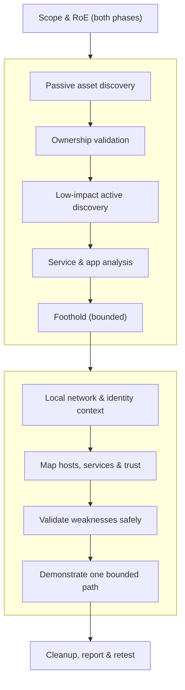
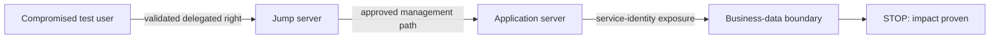

# 🧭 Guided Network Pentest Walkthrough

> [!warning] Authorized simulation only
> Run only against the assets and subnets in the signed scope. A *discovered* asset is not an *authorized* asset. Use test accounts, stop at the agreed impact boundary, and preserve every command, timestamp, and cleanup action.

## Parent Learning Order
Guided Network Pentest Walkthrough -> Guided Active Directory Assessment -> Guided Web & API Assessment -> Guided Wireless Assessment -> Guided Cloud Security Assessment -> Guided Social Engineering Exercise -> Guided Red Team & Purple Team Operation -> Guided Retest & Closure

## Start at Zero: The Two Vantage Points of a Network Test

A network penetration test is run from one of two vantage points, and a full engagement often does both in sequence. **External** testing asks: *can an unauthenticated actor on the internet identify the organization, cross its perimeter, and get a foothold?* **Internal** testing is an *assumed-breach* scenario: *given a foothold on the network, what can an attacker reach, escalate to, and impact?* This walkthrough is the capstone that stitches the recon, scanning, service-enumeration, and lateral-movement techniques (taught as separate leaves) into one disciplined, evidence-backed engagement — from scope to report — for both vantage points.

The deliverable is never a scanner export. It is an evidence-backed account of **reachable attack paths, their business consequences, and the controls that interrupted them.**

> [!tip] The analogy, and where it breaks
> An external test is like a locksmith hired to walk the outside of a building trying every door and window from the street; an internal test is like being dropped inside the lobby and seeing how far you can wander. The analogy breaks on *goal*: the locksmith wants in, whereas your value is the map you draw — which doors were open, where each led, and which alarms fired — because a network test proves *paths and consequences*, not just that a door opened.

**Prerequisites:** the **Active/Passive Reconnaissance**, **Service Enumeration**, **Layer 2 & 3 Network Attacks**, and **Internal Network Pentesting** technique leaves; **Rules of Engagement & Scoping**.

## The Engagement Arc



## Phase 1 — External: From the Internet to a Foothold

**1. Build a candidate asset inventory, then validate ownership.** Start with public records, certificate history, DNS metadata, ASN ownership, and archived paths. Keep every candidate in a *provenance ledger* and validate ownership **before** promoting it to the active queue — testing a look-alike asset you don't own is the classic scope violation.

| Candidate | Evidence | Ownership | Active testing |
|---|---|---|---|
| `vpn.example.test` | Current cert + scoped domain | High | Allowed |
| `legacy.example-cdn.test` | Historical DNS only | Low | Hold |
| `198.51.100.6` | Scoped CIDR + current PTR | High | Allowed |

**2. Discover the live perimeter safely.** Use staged discovery — reachability checks, conservative TCP discovery, selective UDP validation, then protocol-aware enumeration. Distinguish a *closed* port from a *silently dropped* probe, and rate-limit around fragile appliances.

```text
22:18:03Z host=198.51.100.6 tcp/443 state=open     confidence=high
22:18:04Z host=198.51.100.6 tcp/22  state=filtered confidence=medium
22:19:41Z host=198.51.100.7 udp/500 response=ike   confidence=high
```

**3. Hypothesize, then verify manually.** Prioritize externally exploitable identity systems, remote administration, forgotten dev endpoints, and vulnerable edge software. For each hypothesis state the *expected evidence* and a *safe falsification*. Reproduce each candidate with the smallest deterministic request; never use a destructive proof when a reversible marker shows the same control failure.

## Phase 2 — Internal: From a Foothold to Impact

**4. Establish context (low-impact first).** From the test host, read DHCP options, DNS suffixes, routes, the neighbor cache, and the identity privileges you were given — this reveals segmentation and naming without broad traffic.

```text
IPv4Address        : 10.40.18.77
IPv4DefaultGateway : 10.40.18.1
DNSServer          : 10.40.10.10, 10.40.10.11
User               : corp\assessment.user
```

**5. Build the attack-surface model.** Discover only approved ranges, paced to the environment. Group findings by *function* — identity infrastructure, management planes, file services, apps, databases, endpoints, security controls — not just "open ports." A host answering DNS+Kerberos+LDAP+SMB is almost certainly a domain controller: high value, high risk.

**6. Validate weaknesses with bounded proofs.** Prioritize paths with a plausible business consequence: excessive share access, local-admin reuse, weak service identities, delegated group-management rights, or management services reachable across trust boundaries. Use the *smallest* proof — reading a client-placed canary file beats copying production data; creating and deleting a benign scheduled task beats deploying persistence.

```text
Hypothesis: Helpdesk group can modify membership of Server Operators.
Safe proof: add the authorized canary account, query effective membership, then remove it.
Impact:     a compromised helpdesk identity gains admin control of tier-1 servers.
Cleanup:    membership before/after + replication confirmation.
```

**7. Demonstrate lateral movement as impact, not a collection race.** Pick *one* approved route, prefer native authenticated administration, and don't modify endpoint security. For a segmented network, establish only a documented temporary route and record the interface, permitted destinations, owner, and teardown command.



## Failure Modes and Interpretation

- **Testing an unowned look-alike asset.** The cardinal external error — validate ownership before *any* active traffic; a similar name or historical DNS record is not authorization.
- **Filtered ≠ closed.** A dropped probe is not the same as a rejected one; misreading it produces false "port closed" conclusions. Repeat ambiguous results from an approved second vantage point.
- **"Domain admin at any cost."** The internal goal is proving *which trust failures permit material impact*, not maximum privilege. Stop at the first proof.
- **Crashing fragile appliances.** Aggressive scanning can take down VPN concentrators, printers, or OT devices — pace and coordinate.
- **Stale relationships treated as findings.** An internal path is only real once every edge is manually validated (current session, effective permissions, no deny/inheritance blocking it).

## Security Implications — the Defender's View

- **External:** minimizing exposed attack surface (decommissioning forgotten assets, patching edge software, MFA on all remote access) removes most footholds; certificate-transparency and DNS monitoring catch the recon.
- **Internal:** the whole engagement measures **segmentation and least privilege** — tight segmentation means each foothold buys little, and unique local-admin credentials (LAPS), constrained service accounts, and SMB/LDAP signing sever the common lateral paths.
- **De-confliction** lets the SOC tell your traffic from a real attacker; the test also *validates their detection* — which scans, logons, and lateral moves were caught.
- **Cleanup verification** is a control too: a mature client audits their telemetry to confirm every test artifact is gone.

## Authorized Lab: Two-Segment Internal Pivot on One Machine

> [!info] Runs on one Linux machine with network namespaces — models an "assumed breach" foothold reaching a segmented internal service, then tests containment
> Reuses the netns technique from the technique leaves. Step 4 tears everything down.

### Step 1 — Build a foothold segment and an "internal" segment joined by a router

```bash
sudo ip netns add foothold; sudo ip netns add internal
sudo ip link add vf type veth peer name vf-r; sudo ip link add vi type veth peer name vi-r
sudo ip link set vf netns foothold; sudo ip link set vi netns internal
sudo ip addr add 10.50.1.1/24 dev vf-r; sudo ip addr add 10.50.2.1/24 dev vi-r
sudo ip link set vf-r up; sudo ip link set vi-r up
sudo ip netns exec foothold ip addr add 10.50.1.2/24 dev vf; sudo ip netns exec foothold ip link set vf up; sudo ip netns exec foothold ip route add default via 10.50.1.1
sudo ip netns exec internal ip addr add 10.50.2.2/24 dev vi; sudo ip netns exec internal ip link set vi up; sudo ip netns exec internal ip route add default via 10.50.2.1
sudo sysctl -qw net.ipv4.ip_forward=1
echo "foothold 10.50.1.2  ->  router  ->  internal 10.50.2.2"
```

```text
foothold 10.50.1.2  ->  router  ->  internal 10.50.2.2
```

### Step 2 — Internal service + reach it from the foothold (no segmentation yet)

```bash
sudo ip netns exec internal bash -c 'echo INTERNAL-CANARY > /tmp/i.html; cd /tmp && python3 -m http.server 80 --bind 10.50.2.2 &>/tmp/i.log &'
sleep 1
sudo ip netns exec foothold curl -s --max-time 3 http://10.50.2.2/ ; echo "(reachable: attack path exists)"
```

```text
INTERNAL-CANARY
(reachable: attack path exists)
```

### Step 3 — Apply segmentation (the fix) and prove containment

```bash
sudo iptables -I FORWARD -s 10.50.1.0/24 -d 10.50.2.0/24 -j DROP
sudo ip netns exec foothold curl -s --max-time 3 http://10.50.2.2/ ; echo "exit=$?  (non-zero/empty = blocked)"
echo "Finding: without segmentation a foothold reaches the internal service; the FORWARD DROP rule severs the path. Fix = segment + zero-trust internal auth."
```

```text

exit=28  (non-zero/empty = blocked)
Finding: without segmentation a foothold reaches the internal service; the FORWARD DROP rule severs the path. Fix = segment + zero-trust internal auth.
```

### Step 4 — Cleanup (teardown)

```bash
sudo iptables -D FORWARD -s 10.50.1.0/24 -d 10.50.2.0/24 -j DROP 2>/dev/null
for ns in foothold internal; do sudo ip netns pids $ns 2>/dev/null | xargs -r sudo kill 2>/dev/null; sudo ip netns del $ns 2>/dev/null; done
sudo ip link del vf-r 2>/dev/null; sudo ip link del vi-r 2>/dev/null
sudo ip netns list | grep -E 'foothold|internal' || echo "all lab namespaces removed"
```

```text
all lab namespaces removed
```

**What you should now be able to do:** run an external engagement from ownership-validated discovery to a bounded foothold, run an internal assumed-breach engagement from context to a single demonstrated attack path, choose the smallest safe proof, and show — with a real segmentation test — how the defender's controls sever the path.

## Crook → Operator → Root Checkpoint

- **Crook:** Explain the difference between external and internal (assumed-breach) testing and why the deliverable is *paths and consequences*, not a scanner export.
- **Operator:** Validate asset ownership before active testing, run staged discovery, and demonstrate one bounded internal attack path with reversible canary proofs.
- **Root:** Explain why segmentation + least privilege is what the internal test really measures, how de-confliction and cleanup verification serve the defender, and why "filtered ≠ closed" and "stale edge ≠ finding" matter for accurate reporting.

---
> 🔼 Up: [[Guided Assessments]]
