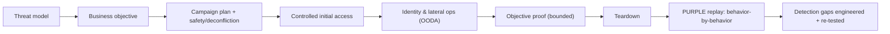

# 🟣 Guided Red Team & Purple Team Operation

> [!warning] Controlled adversary emulation
> A red team operation is objective-driven and threat-informed — never unlimited freedom. Every action stays bounded by the RoE, safety plan, deconfliction process, and data-handling agreement. The purple-team phase is a collaborative engineering loop, not a competition.

## Parent Learning Order
Guided Network Pentest Walkthrough -> Guided Active Directory Assessment -> Guided Web & API Assessment -> Guided Wireless Assessment -> Guided Cloud Security Assessment -> Guided Social Engineering Exercise -> Guided Red Team & Purple Team Operation -> Guided Retest & Closure

## Emulate an Adversary, Then Fix What It Beat

> *The red team finished and nothing was detected. What does a purple team session add that the report does not?*
>
> Hold your answer — the section below is the response.

A **red team operation** answers a business question by *emulating a specific, realistic adversary* end to end: initial access → identity/lateral operations → objective proof, while measuring whether the defenders detect and respond in time. A **purple team validation** is the natural follow-on: red and blue sit *together* and, behavior by behavior, confirm whether each attack technique is prevented, observed, alerted, investigated, and contained — then engineer the missing detections and re-run. This capstone pairs them because they are two halves of one loop: the red op *finds the gaps under realistic conditions*, and the purple phase *closes them measurably*. It is the highest-maturity engagement, and it sits at the top of this domain because it assumes every prior technique and methodology.

Unlike a pentest (find as many issues as possible), a red team op is **objective-led and stealth-aware**: success is measured against a defined goal *and* against the defenders' timeline.

> [!tip] The analogy, and where it breaks
> A red team op is like hiring a professional to attempt a specific heist — reach one particular vault — while the guards don't know it is a drill, to see whether the alarms and response actually work. The purple phase is then reviewing the security-camera footage *with* the guards to fix every blind spot. The analogy breaks on cooperation: a real heist crew never helps the guards improve, whereas the entire point here is the shared, honest replay — the value is not "we got in," it is "here is exactly which camera missed us, and here is the fix, now re-tested."

**Prerequisites:** the entire technique tree plus **Threat Modeling & MITRE ATT&CK** (adversary selection) and **Rules of Engagement & Scoping** (safety, deconfliction, data handling).

## The Two-Phase Arc



## Phase 1 — Red: Objective-Led Operation

**1. Translate an executive concern into a measurable objective.** Example: *can a threat actor holding contractor credentials reach the synthetic engineering repository, and do the defenders detect the path before the proof is accessed?*

```text
Objective       : access synthetic design record ENG-CANARY-07
Initial condition: approved contractor identity
Impact ceiling  : metadata proof only; NO source-code download
No-go           : persistence on domain controllers; production interruption
Deconfliction   : challenge/response phrase held by the white cell
```

**2. Build the operation cell.** Assign operation lead, operators, infrastructure owner, safety officer, white-cell controller, legal contact, and executive sponsor. Establish authenticated deconfliction, medical/operational stop conditions, incident-crossover rules, evidence encryption, daily check-ins, and infrastructure-takedown authority.

**3. Convert intelligence into hypotheses, not a script.** Select threat behaviors relevant to the org's sector and controls (map them to ATT&CK). Each hypothesis needs prerequisites, safety constraints, observable telemetry, fallbacks, and abort criteria — you do *not* pre-script the outcome.

**4. Prepare controlled infrastructure.** Registered test domains, isolated redirectors, unique certificates, dedicated identities, allow-listed callback ranges, complete ownership records, and pre-staged kill switches. No infrastructure may accidentally serve uncontrolled payloads or collect unrelated internet traffic.

**5. Execute in OODA decision cycles** (observe → orient → decide → act). Record *decisions*, not just commands. Use minimum-necessary access, validate a path incrementally, and **stop when the objective is proven**. If production instability, unexpected sensitive data, or third-party infrastructure appears, pause and call the white cell.

```text
14:02 OBSERVE contractor token accepted by collaboration portal
14:07 ORIENT  repository link exposed; authorization not yet tested
14:09 DECIDE  request synthetic canary metadata only
14:10 ACT     canary title returned; objective condition met
14:11 STOP    no content downloaded; evidence sealed
```

**6. Teardown.** Revoke test identities/tokens, remove artifacts, dismantle infrastructure, expire certificates, confirm DNS removal, close cloud resources, and inventory retained evidence — with system-owner confirmation for every reversible change.

## Phase 2 — Purple: Validate and Engineer Detection

Now red and blue examine the *same* behaviors together. **Preserve the blue team's independent timeline before revealing operator activity** — that comparison is the whole measurement.

**7. Select a behavior, not a tool.** Define it in platform-neutral language (e.g. "a process reads a synthetic credential file and initiates an outbound connection to an approved sink") with prerequisites, benign analogues, expected telemetry, and maximum impact.

**8. Write a telemetry contract *before* execution** — which events should exist, required fields, latency, retention, ownership. This prevents an alert-only view that ignores missing raw data.

| Stage | Evidence | Pass condition |
|---|---|---|
| Collection | Raw endpoint event | Required fields present |
| Transport | Central arrival timestamp | Within latency objective |
| Detection | Analytic match | Expected severity + entity |
| Triage | Case enrichment | Host, identity, lineage, context |
| Response | Approved action | Safe containment path available |

**9. Run a minimum-viable emulation** on a dedicated test endpoint with synchronized clocks; operator and defender independently record times.

```text
Operator : 13:00:05Z synthetic file read
Collector: 13:00:07Z endpoint event accepted
SIEM     : 13:00:19Z normalized event searchable
Alert    : 13:00:42Z analytic fired
Case     : 13:01:10Z analyst acknowledged
```

**10. Diagnose gaps by layer** (generation, collection, transport, parsing, enrichment, analytic logic, suppression, routing, triage, response) — never tune a rule when the underlying event is absent. **Tune with negative controls** (benign activity) around stable semantics, not filenames. Then **operationalize**: version the analytic, assign ownership, add investigation guidance, and schedule recurring validation. *A detection that fired once in a lab is not yet an operational control.*

## Why being inside doesn't retire the rules

- **Treating the RoE as gone once "inside."** Objective-led does not mean unbounded — every action still obeys scope, safety, and impact ceiling. Stop when the objective is proven.
- **Scripting the outcome.** A red op that only executes a pre-planned path stops testing the defenders; it must adapt via OODA while staying in bounds.
- **Revealing operator activity before capturing blue's timeline.** This destroys the measurement — the independent defender timeline is the deliverable.
- **Tuning detections on unstable strings.** Excluding by filename or an easily changed token creates brittle rules and false confidence; anchor on stable behavior.
- **"It alerted once" ≠ operational.** Without ownership, health monitoring, negative controls, and recurring validation, a detection silently rots.

## Security Implications — the Defender's View

- **The red op measures the *response*, not just the perimeter:** prevention rate, time-to-first-telemetry, time-to-triage, time-to-contain, and recovery for each emulated behavior — the metrics that actually predict breach outcomes.
- **Purple teaming is the improvement engine:** every gap becomes a versioned, owned, health-monitored analytic with investigation guidance — turning a one-time finding into durable coverage.
- **Threat-informed prioritization:** emulating the actors that realistically target the org's sector (via ATT&CK) focuses limited detection-engineering budget where it matters.
- **Deconfliction and immutable logging** protect both the exercise and the evidence — the SOC keeps hunting real threats, and the blue-team timeline can't be quietly edited after the reveal.

## Summary

You should now be able to:

- Explain how a red team op differs from a pentest (objective-led, stealth-aware, measures response) and why purple teaming is collaboration, not competition.
- Define a measurable objective with an impact ceiling, execute in OODA cycles within the RoE, and run a purple-team emulation that proves or disproves detection.
- Explain why the blue-team's independent timeline is the deliverable, why detections need negative controls + ownership + recurring validation to be operational, and how threat-informed emulation focuses detection-engineering effort.

---
> 🔼 Up: [[Guided Assessments]]
