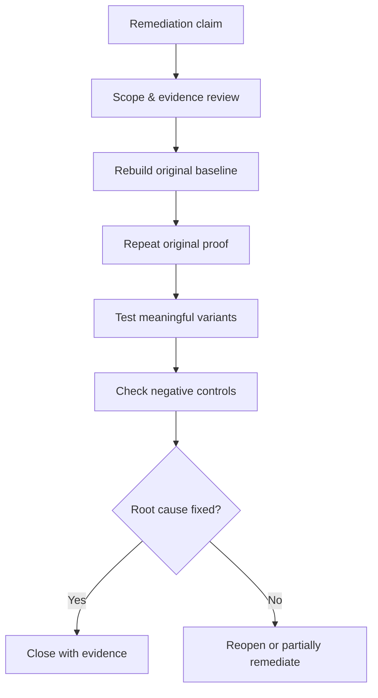

# Guided Retest & Closure

> [!abstract] Closure standard
> A finding is closed when the root cause is durably remediated, the original proof no longer works, realistic variants are controlled, legitimate functionality remains intact, and evidence supports the conclusion.

## Parent Learning Order
Guided Network Pentest Walkthrough -> Guided Active Directory Assessment -> Guided Web & API Assessment -> Guided Wireless Assessment -> Guided Cloud Security Assessment -> Guided Social Engineering Exercise -> Guided Red Team & Purple Team Operation -> Guided Retest & Closure

> [!tip] The analogy, and where it breaks
> A retest is like a building inspector returning after repairs: they do not just glance at the patched wall — they re-run the exact test that failed, poke nearby walls for the same weakness, and confirm the door still opens for residents.
> 
> The analogy breaks on completeness: a wall is visibly fixed or not, whereas a software fix can block one string while leaving the whole vulnerability class open, so "the original proof now returns 404" is necessary but never sufficient.

**Prerequisites:** every technique cluster (you retest their findings) and **Rules of Engagement & Scoping** (evidence and closure governance).

## Retest workflow

> *The client says the finding is fixed. What do you rebuild before you test anything?*
>
> Hold your answer — the section below is the response.



## 1. Validate readiness

Confirm deployment identifiers, affected assets, remediation owner, change ticket, environment parity, maintenance windows, new safety constraints, and the exact finding version. Do not retest a stale environment or accept a code change that has not reached the affected system.

```text
Finding: WEB-017 tenant authorization failure
Original build: 2026.06.118
Retest build: 2026.07.204
Claimed fix: centralized ownership predicate in service layer
Assets: api-01, api-02, worker-export
```

## 2. Reconstruct the original condition

Use the same role, object relationship, protocol, request shape, and preconditions with synthetic data. First verify the legitimate operation still works; then repeat the original unauthorized variant. Record request correlation IDs and server-side telemetry.

```http
GET /v2/accounts/acct-B-220 HTTP/1.1
Authorization: Bearer <TENANT_A_TEST_TOKEN>

HTTP/1.1 404 Not Found
X-Request-ID: retest-017-03
```

The status code alone is insufficient. Confirm no protected data appears in body, headers, timing, cache, logs exposed to the caller, asynchronous exports, or downstream events.

## 3. Test the remediation class

Derive variants from the root cause: alternate verbs, legacy versions, batch operations, nested objects, encoded identifiers, exports, mobile routes, background workers, and other services sharing the vulnerable component. The purpose is not endless fuzzing; it is proving the control is centralized and complete.

## 4. Verify negative controls

Ensure authorized users retain required access, error handling remains stable, performance is acceptable, audit events are produced, and monitoring does not flood. Security fixes that break business workflows create pressure for unsafe rollback.

## 5. Classify the result

| Status | Meaning |
|---|---|
| Remediated | Original and meaningful variants blocked; business flow intact |
| Partially remediated | Some assets or variants remain vulnerable |
| Not remediated | Original proof still succeeds |
| Risk accepted | Authorized owner accepts documented residual risk |
| Unable to verify | Required environment, identity, or evidence unavailable |

## 6. Close evidence and cleanup

Attach timestamps, asset/build identity, sanitized requests and responses, telemetry references, screenshots where necessary, variant matrix, and cleanup confirmation. Remove synthetic accounts, records, tokens, files, and infrastructure.

## 7. Feed lessons back

Convert systemic root causes into secure design standards, reusable tests, CI checks, detection content, developer education, and asset-wide review. A successful retest should reduce the probability of the entire vulnerability class, not merely one recurrence.

## Summary

You should now be able to:

- State the closure standard — root cause remediated, original proof dead, variants controlled, legitimate function intact, evidence supports it.
- Rebuild the baseline, repeat the original proof, test remediation-class variants, and verify negative controls (authorized use still works).
- Explain why status codes alone are insufficient, classify results (remediated / partial / not / risk-accepted / unable-to-verify), and feed systemic root causes back into design standards and CI checks.

---
> 🔼 Up: [[Guided Assessments]]
