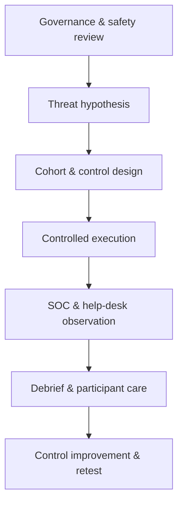

# Guided Social Engineering Exercise

> [!danger] Human safety is the primary control
> Obtain executive, legal, HR, privacy, communications, and security approval. Never target personal crises, protected characteristics, medical themes, payroll distress, or other coercive pretexts. Provide a rapid opt-out and do not shame participants.

## Parent Learning Order
Guided Network Pentest Walkthrough -> Guided Active Directory Assessment -> Guided Web & API Assessment -> Guided Wireless Assessment -> Guided Cloud Security Assessment -> Guided Social Engineering Exercise -> Guided Red Team & Purple Team Operation -> Guided Retest & Closure

> [!tip] The analogy, and where it breaks
> A social-engineering exercise is like a fire drill for human judgment: you simulate the smoke to see whether people follow the safe procedure and whether the alarms — help desk, reporting button, SOC — actually work.
> 
> The analogy breaks on people: a fire drill is impersonal, whereas this touches real trust, so ethics, consent, and participant care are controls of equal weight to the measurement — get them wrong and you harm the very people you are meant to protect.

**Prerequisites:** the **Phishing & Spear-Phishing Methodology** and **Enterprise Initial Access** leaves; and executive/legal/HR governance sign-off (mandatory).

## Objective

Measure whether people, identity procedures, messaging controls, help desks, physical controls, and incident reporting interrupt realistic influence attempts. The exercise evaluates systems and processes—not employee worth.



## 1. Establish governance

Define target population, exclusions, communication channels, data minimization, retention, success criteria, escalation paths, union or works-council obligations, and the maximum action a participant may take. Use synthetic documents, harmless landing pages, and reversible test identities.

```text
Exercise ID: SE-2026-Q3
Channels: corporate email + help-desk calls
Excluded: interns, leave-of-absence staff, executive assistants
Maximum action: click + synthetic form submission
Never collect: real passwords, MFA tokens, personal data
Immediate stop: distress report, media inquiry, safety concern
```

## 2. Form a threat hypothesis

Tie the scenario to observed enterprise risk, such as supplier impersonation, collaboration invitations, password-reset social pressure, or visitor tailgating. Define the defensive behaviors expected at each layer: mail filtering, link isolation, identity verification, user reporting, SOC triage, and containment.

## 3. Design controls and comparison groups

Use representative cohorts and avoid tiny groups that identify individuals. Establish a control baseline, randomize timing where appropriate, and separate delivery, view, click, data-entry, report, and help-desk escalation metrics. Raw click rate alone is an inadequate measure.

## 4. Execute safely

Launch in bounded waves so the team can stop quickly. Seed monitoring with known test indicators. Exercise messages should be plausible enough to test controls but contain no malware, credential relay, or uncontrolled external dependency. During voice exercises, operators follow a script and terminate on distress or disclosure of sensitive personal information.

```text
10:00 wave=pilot delivered=25 blocked=18 opened=5 reported=4
10:15 SOC case created; indicator correlated across mail gateway
10:22 help desk rejected synthetic recovery request; callback policy followed
```

## 5. Measure the system

Evaluate preventive control rate, median report time, report quality, analyst triage time, containment time, identity-verification adherence, repeat-reporting behavior, and false-positive burden. Segment results by process or control—not by naming individual participants.

## 6. Debrief and improve

Provide immediate reassurance, explain the observable cues, and give one clear reporting action. Share aggregate results. Convert findings into technical and procedural work: stronger sender controls, safer recovery flows, improved reporting buttons, help-desk scripts, and SOC playbooks.

## 7. Retest

Repeat the same threat hypothesis after remediation with changed wording and timing. Improvement means faster detection and safer process execution, not merely recognition of a familiar template.

## Crook → Operator → Root Checkpoint

- **Crook:** Explain why the exercise measures *systems and processes*, never employee worth, and why governance/safety approval comes first.
- **Operator:** Design cohorts with a control group, execute in bounded waves with test indicators, and measure delivery/click/report/help-desk/SOC metrics separately.
- **Root:** Explain why raw click-rate is an inadequate measure, how median-report-time and process adherence are the real signals, and how to debrief with participant care and convert findings into control fixes.

---
> 🔼 Up: [[Guided Assessments]]
