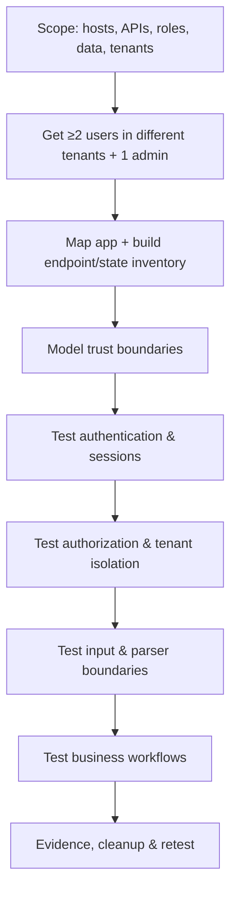
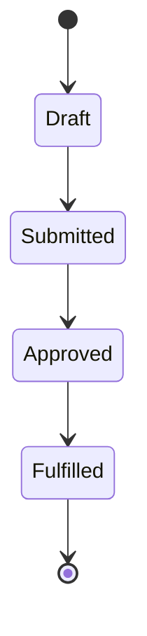

# 🌐 Guided Web & API Assessment

> [!warning] Authorized simulation only
> Use a staging environment or explicitly approved production scope. Never send destructive payloads, retrieve real customer records, or bypass availability controls unless the RoE authorizes the exact action. Rate-limit automation and coordinate anything that could trigger queues, notifications, billing, or irreversible workflows.

## Parent Learning Order
Guided Network Pentest Walkthrough -> Guided Active Directory Assessment -> Guided Web & API Assessment -> Guided Wireless Assessment -> Guided Cloud Security Assessment -> Guided Social Engineering Exercise -> Guided Red Team & Purple Team Operation -> Guided Retest & Closure

## One Application, Two Surfaces

> *The interface hides the delete button from ordinary users. Is delete protected?*
>
> Hold your answer — the section below is the response.

A modern application is tested through two surfaces that share one security model: the **browser-facing web app** (pages, sessions, forms, workflows) and the **API** underneath (REST/GraphQL/gRPC/WebSocket endpoints the client and mobile apps call). Assessing them together is correct because *the API is where authorization actually lives* — the UI merely hides buttons, while the API is what an attacker calls directly. This walkthrough converts a URL and a set of test identities into a defensible assessment of **architecture, authorization, session handling, input boundaries, and business workflows** across both surfaces.

The recurring theme, and the single most productive test: **does the server consistently enforce the business model, regardless of what the client sends?**

> [!tip] The analogy, and where it breaks
> The web UI is like a restaurant's printed menu and the API is the kitchen's order line — a careful attacker ignores the menu and shouts orders straight at the kitchen, ordering things the menu never listed. The analogy breaks on identity: a kitchen trusts whoever is at the pass, whereas every API call carries a token, so the real test is whether the kitchen *re-checks who you are and what you own on every single order* — not whether the menu looked locked down.

**Prerequisites:** the **Broken Access Control**, **Web Authentication Testing**, **Modern API Security Testing**, and **Business Logic Testing** technique leaves; **Rules of Engagement & Scoping**.

## The Engagement Arc



## 1. Freeze Scope and Identities

Authorization is impossible to assess with a single account. Insist on **at least two ordinary users in different tenants plus one privileged identity**:

```text
Tenant A user : alice.test  / role=user
Tenant B user : bob.test    / role=user
Tenant A admin: admin.test  / role=administrator
Forbidden     : payment capture, email delivery, bulk export, load testing
Test marker   : C2R-20260730
```

## 2. Map Both Surfaces and Build a Role-Action Matrix

Browse every role and capture methods, paths, parameters, cookies, anti-CSRF values, object identifiers, and state transitions — *plus* JS-discovered endpoints, API specs, GraphQL schemas, WebSocket channels, and async jobs. Compare *documented* routes with *observed* routes. Then write the matrix of who-should-do-what **before** testing:

| Capability | Anonymous | Tenant user | Tenant admin |
|---|---:|---:|---:|
| View own invoice | No | Yes | Yes |
| View another tenant | No | No | No |
| Invite user | No | No | Yes |
| Export all records | No | No | Approved admin only |

## 3. Model Trust Boundaries

Identify where the browser, CDN/WAF, API gateway, application, identity provider, queues, and data stores each make security decisions. **Client-side validation is not a trust boundary**, and a signed token proves only *what the verifier actually checks* — not every claim the developer intended to constrain. Treat a WAF response as evidence of *edge* behavior, never proof the origin is safe.

## 4. Test Authentication and Sessions

Review registration, recovery, MFA enrollment/reset, federation callbacks, session rotation, logout, remembered devices, and concurrent sessions. Change **one variable at a time**, and confirm that *server-side state* — not UI visibility — enforces each control.

```http
POST /api/v1/password-reset/confirm HTTP/1.1
Content-Type: application/json

{"token":"test-token","newPassword":"Approved-Test-Only-42!"}

HTTP/1.1 400 Bad Request
{"error":"token expired"}
```

Name what rejected it before moving on. The `400` came from the application's
reset handler, not from a WAF and not from routing: the request reached the
endpoint, the token was found and parsed, and it was its *expiry claim* that
failed the check. That is a working control, and recording it as such matters —
an expired-token rejection and a malformed-token rejection look identical from
outside but tell you completely different things about whether the reset flow
validates the token's contents or merely its shape.

## 5. Test Authorization and Tenant Isolation (the core)

Replay a known-valid request while substituting object IDs, parent IDs, tenant headers, HTTP methods, content types, and roles. Test list / read / update / delete / export / indirect actions **separately** — a `403` on `GET` does not prove `PUT` is protected.

```text
Control : Tenant A reads invoice A-7412  -> 200
Variant : Tenant B reads invoice A-7412  -> expected 403/404
Observed: 200 with test invoice metadata   <-- BROKEN OBJECT-LEVEL AUTH
Bounded : stop after the test record; do NOT enumerate adjacent identifiers
```

Also test **mass assignment** — add a server-controlled field to a synthetic update and confirm it is ignored:

```text
Invariant : client cannot set account.role
Variant   : {"displayName":"Test","role":"administrator"}
Secure    : role ignored or request rejected; audit event emitted
```

## 6. Test Input, Parser, and Workflow Boundaries

Trace input from source to sink (DB query, shell, template, file path, XML parser, deserializer, URL fetcher, log formatter). Start with harmless syntax probes and *differential responses*; escalate only enough to distinguish validation vs. parsing vs. execution.

```text
Baseline response      : 200, 842 bytes, 118 ms
Quoted-input response  : 500, 119 bytes, 121 ms
Time-control response  : 200, 842 bytes, 116 ms
Interpretation         : parser error likely; NO evidence of time-based execution
```

Then diagram the **business workflow** and attack its *logic*: skip steps, replay transitions, use stale objects, submit concurrently, and try negative values. Business impact — not payload novelty — sets severity.



If the server accepts an illegal `Draft -> Fulfilled` transition, capture **one** canary transaction and stop.

## The setup failure that makes authorization untestable

- **Testing with one account.** Horizontal/vertical authorization is unassessable without multiple tenants and roles — this is the most common setup failure.
- **Trusting a `403` on one verb/route.** Authorization must be tested per method, per nested resource, per API version, and per equivalent endpoint; fixes are frequently partial.
- **UI == security.** A hidden button is not a control; always call the API directly. The client only *hints* at what exists.
- **Payload theatre.** Chasing exotic payloads over business-logic and access-control flaws inflates noise and misses the high-impact findings.
- **Over-collection.** Prove access with a single canary record; enumerating adjacent IDs or exporting data turns a finding into a breach you caused.

**The deliberate break:** the web application and the API read as two surfaces, so testing them reads as two pieces of work that can be scoped separately.

They share **one security model, and the API is where authorisation actually lives**. The interface hides buttons, greys out fields and omits menu items; none of that is enforcement, and all of it is reproduced by anyone who calls the endpoint directly. Scoping an assessment to the browser therefore tests the decoration and leaves the enforcement point unexamined, which is how an application passes a web assessment and fails on its first day of API traffic.

**How you'd spot it:** for every action the interface hides or disables, call the underlying endpoint directly with a lower-privileged token. That single test separates a UI restriction from an authorisation check, and it is the finding most reliably missed by an assessment that stayed in the browser.

## Security Implications — the Defender's View

- **Centralized, server-side authorization** (an ownership predicate enforced in one place for every route, verb, and version) is the durable fix for the dominant findings (BOLA/IDOR/BFLA) — hiding IDs is not.
- **Verify-what-you-check on tokens:** the identity provider and services must validate audience, scope, signature, and object ownership — the API, not the UI, is the enforcement point.
- **Defense in depth at the edge and origin:** WAFs blunt generic input attacks, but parser/deserialization sinks must be fixed at the origin (parameterized queries, safe deserializers, allow-listed templates).
- **Observability:** request IDs surviving gateway→service, measurable authorization denials, and redaction of sensitive values let defenders distinguish ordinary validation errors from attack patterns.

## Summary

You should now be able to:

- Explain why the API (not the UI) is where authorization lives, and why you need multiple tenants/roles to test it.
- Build a role-action matrix, prove a BOLA/IDOR flaw with a single canary record, and test authentication, input sinks, and business-workflow logic safely.
- Explain why centralized server-side authorization (not ID hiding) is the durable fix, why `403` on one verb never generalizes, and how token verification, origin-side parser fixes, and observability defend both surfaces.

---
> 🔼 Up: [[Guided Assessments]]
