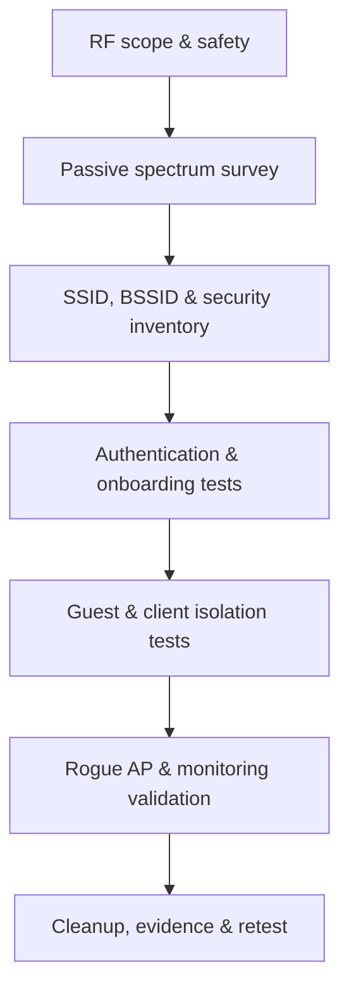

# Guided Wireless Assessment

> [!warning] Radio-frequency scope
> Wireless signals cross property boundaries. Specify authorized SSIDs, BSSIDs, physical zones, channels, test stations, deauthentication policy, rogue-access-point policy, and safety contacts before transmission.

## Parent Learning Order
Guided Network Pentest Walkthrough -> Guided Active Directory Assessment -> Guided Web & API Assessment -> Guided Wireless Assessment -> Guided Cloud Security Assessment -> Guided Social Engineering Exercise -> Guided Red Team & Purple Team Operation -> Guided Retest & Closure

> [!tip] The analogy, and where it breaks
> A wireless assessment is like checking whether the building's radio doorbells only open for residents — except the signal leaks into the street and the parking lot, so anyone nearby can quietly try the door.
> 
> The analogy breaks on visibility: a doorbell is one device you can see, whereas RF is invisible and crosses property lines, so a matching network name never proves ownership and "in range" silently includes attackers you will never physically spot.

**Prerequisites:** the Networking domain's **Wireless Security & WPA** and **Wireless Attacks** leaves; RF legal/authorization awareness (signals cross boundaries).

## Objective

> *Besides the corporate SSID, which networks belong in a wireless assessment scope?*
>
> Hold your answer — the section below is the response.

Evaluate whether wireless identity, encryption, segmentation, onboarding, roaming, management frames, and monitoring prevent unauthorized access and lateral movement. Include corporate, guest, IoT, warehouse, and building-control networks where explicitly authorized.



## Preparation

Map authorized spaces and record expected access points, channel plans, transmit power, security modes, RADIUS infrastructure, certificate authorities, mobile-device management, network access control, and wireless intrusion detection. Use a designated test client with a known MAC address and synthetic identity.

```text
Zone: Building A / floors 2-4
Authorized SSIDs: CORP-EAP, GUEST, IOT-TEST
Permitted: passive capture, test-client association, approved rogue-AP drill
Prohibited: broad deauthentication, neighboring networks, production credential capture
```

## Passive survey

Observe beacon and probe behavior without association. Inventory BSSID, SSID, band, channel width, security mode, protected management-frame status, vendor indicators, signal strength, and location. Look for legacy encryption, unexpected open networks, hidden-name leakage, inconsistent enterprise security, and unauthorized access points. A name match alone never proves ownership.

```text
time,bssid,ssid,band,channel,security,pmf,rssi
09:14:02,00:00:5E:00:53:C0,CORP-EAP,5GHz,44,WPA3-Enterprise,required,-48
09:15:31,00:00:5E:00:53:C1,CORP-EAP,2.4GHz,6,WPA2-PSK,optional,-61
```

## Authentication and onboarding

Validate certificate checking, server-name constraints, EAP method selection, machine/user authentication, device compliance, certificate renewal, employee offboarding, guest expiration, pre-shared-key rotation, and IoT enrollment. Determine whether a test client accepts an untrusted authentication server; do not collect real user credentials.

## Segmentation and isolation

After authorized association, test expected reachability from each role. Guest clients should not reach corporate address space or each other unless intentionally allowed. IoT networks should expose only required controllers and egress. Validate IPv4, IPv6, local discovery, DNS, and management interfaces because policy often differs by protocol.

| Source role | Expected destinations | Denied destinations |
|---|---|---|
| Guest | Internet, captive portal | Corporate, peer guests, management |
| IoT test | Controller, DNS, time | User VLANs, hypervisors, admin planes |
| Corporate test | Role-authorized services | Infrastructure management by default |

## Rogue AP and detection drill

With written approval, operate a low-power controlled access point using a clearly documented test identifier. Measure whether wireless monitoring, NAC, physical security, and SOC workflows identify the event. Stop if unintended clients attempt association; never solicit production credentials.

## Closure

Power down test radios, remove profiles and certificates, revoke temporary identities, restore access-point settings, and verify no rogue configuration remains. Report coverage gaps, weak identity validation, segmentation failures, and monitoring outcomes with RF location and timestamp evidence.

## Summary

You should now be able to:

- Explain why wireless scope must be defined by SSID/BSSID/zone/channel, and why RF crossing property lines makes authorization critical.
- Run a passive survey, inventory security modes, test onboarding/certificate validation and client isolation, and run an approved rogue-AP detection drill.
- Explain why a name match never proves ownership, how PMF/WPA3-Enterprise/server-cert validation defeat the common attacks, and how to measure whether wireless monitoring actually detected the drill.

---
> 🔼 Up: [[Guided Assessments]]
