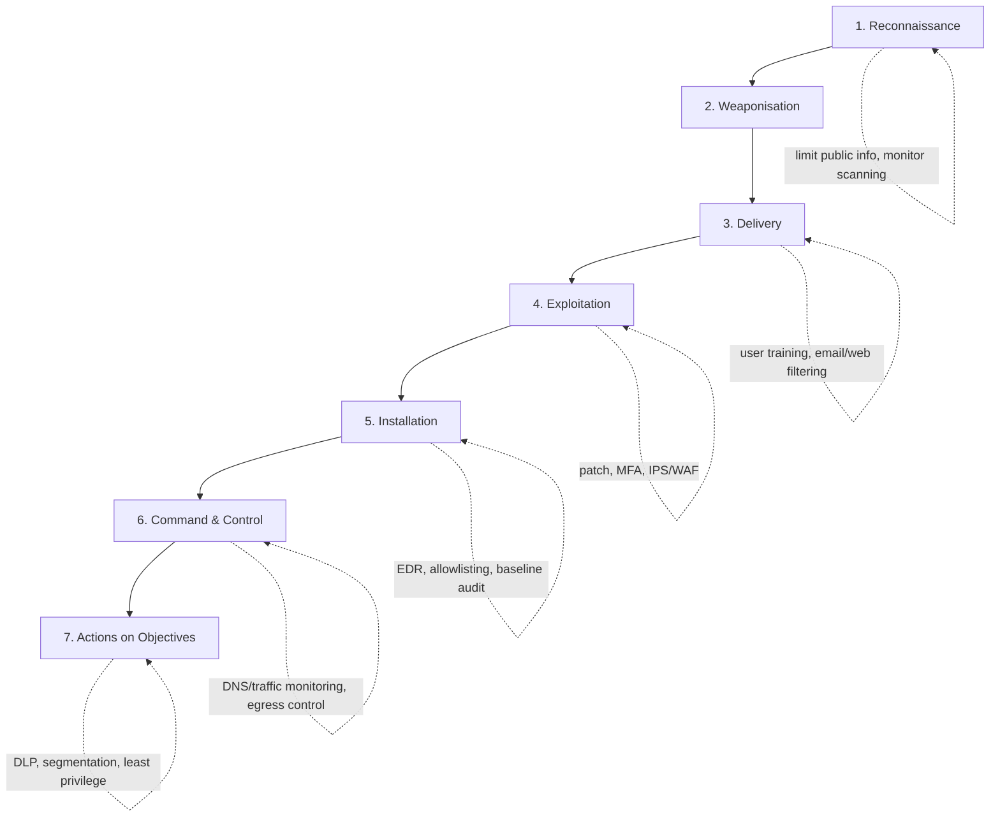

# ⛓️ Cyber Kill Chain

> [!warning] A model for understanding, used for authorized work
> The kill chain describes how real attacks unfold. You use it to *plan authorized engagements* and to *reason about defense* — every offensive stage below is paired with its countermeasure. Perform the offensive stages only within an authorized scope.

## Parent Learning Order
Penetration Testing Fundamentals -> Rules of Engagement & Scoping -> Penetration Testing Standards & Frameworks -> Cyber Kill Chain -> Threat Modeling & MITRE ATT&CK

## Why Attacks Have a Shape

Attacks are not single events — they are *sequences*. An intruder rarely goes from "outside" to "stealing data" in one move; they recon, build a weapon, deliver it, exploit, install a foothold, set up remote control, and only then act on their goal. The **Cyber Kill Chain**, introduced by Lockheed Martin in 2011, names those seven stages so both attackers and defenders share a map. Its power for defense is one insight: **the attacker must complete every link, but the defender only has to break one.**

> [!tip] The analogy, and where it breaks
> The kill chain is like a burglary broken into steps: case the neighborhood, make tools, get to the door, pick the lock, hide inside, arrange a way to come and go, then carry out the loot. Stop any step — a locked gate, a watching neighbor, an alarm — and the burglary fails. The analogy breaks on *parallelism and iteration*: a real intrusion loops (new recon after a foothold) and runs stages against many targets at once. The neat linear chain is a teaching simplification — **MITRE ATT&CK** (next leaf) captures the messier reality of interchangeable techniques.

**Prerequisites:** Penetration Testing Fundamentals (the vocabulary). This is the apprentice-level adversary model that **Threat Modeling & MITRE ATT&CK** builds on.

The seven stages:

1. **Reconnaissance** — gather information about the target (passive OSINT/WHOIS/DNS; active scanning/physical).
2. **Weaponisation** — build or modify a deliverable payload for the discovered weakness (e.g. a macro document, an exploit-kit bundle).
3. **Delivery** — transmit the payload (phishing, malicious links, file-sharing, malvertising, USB).
4. **Exploitation** — the payload triggers a vulnerability, weak password, or misconfiguration.
5. **Installation** — establish persistence (services, scheduled tasks, web shells, rootkits, LOLBins).
6. **Command & Control (C2)** — open a covert channel back to attacker infrastructure.
7. **Actions on Objectives** — exfiltration, ransomware, lateral movement, sabotage.

## Each Link, and the Control That Breaks It

Every stage is a chance for the defender to win. This table is the note's core reference — attacker techniques on the left, the control that severs *that* link on the right.

| # | Stage | Representative attacker techniques | Break the link |
|---|-------|-----------------------------------|----------------|
| 1 | **Reconnaissance** | WHOIS/DNS mining, web scraping, Google dorking, social-media OSINT; port & vulnerability scanning; physical surveillance | Minimise public info, WHOIS privacy, alert on scan patterns, monitor traffic/logs |
| 2 | **Weaponisation** | Exploit kits, malicious Office macros, trojanised PDFs/USBs | Disable/limit macros by GPO, remove unneeded features/plugins, user training |
| 3 | **Delivery** | Phishing/spear-phishing (`invoice.pdf.exe`), malicious links, malvertising, smishing, dropped USB | Email/web filtering, WAF, user awareness, patch management |
| 4 | **Exploitation** | Default/weak passwords, software CVEs, zero-days, SQLi/XSS/overflows | Patch management, MFA, IPS/WAF, vulnerability scanning |
| 5 | **Installation** | Backdoors, services/daemons, scheduled tasks/cron, web shells, rootkits, LOLBins | EDR, application allowlisting, baseline/config audit, new-process monitoring |
| 6 | **Command & Control** | HTTP(S)/DNS/SMTP blending, DNS tunnelling, cloud/social-media channels, DGA & Fast Flux | DNS/traffic analysis, egress filtering, TLS inspection, honeypots, block known-bad |
| 7 | **Actions on Objectives** | Data exfiltration, ransomware, wire fraud, lateral movement, ICS manipulation | DLP, tested backups, segmentation, least privilege, user-activity monitoring |

> [!note] Two resilience tricks worth naming
> **DGA (Domain Generation Algorithm):** malware and operator independently generate thousands of candidate domains; the operator registers ~1–2%, so seizing one domain barely dents the channel. **Fast Flux:** one domain rotates across hundreds of proxy IPs (often compromised IoT) every few minutes, so blocking an IP just advances to the next.

### Per-stage visuals

These authored diagrams illustrate each transition (reconnaissance → actions on objectives):

## The Whole Chain, and Where Each Link Breaks

The defender's advantage is structural: the attacker must complete **all seven** stages, so a control at *any* link — a scan alert, a blocked macro, an EDR catch on installation, an egress filter on C2 — collapses the chain. This is why layered defense works, and why mapping an engagement's findings onto the chain tells the client exactly *which links they can already break*.

**The deliberate break:** the kill chain reads as a description of how attacks proceed — a sequence an adversary moves through, stage by stage, in order.

It is a **defensive model**, and its value is the claim that breaking any single link prevents the outcome. Real intrusions skip stages entirely, revisit earlier ones, and run several in parallel; an attacker with valid credentials from a previous breach begins somewhere in the middle. Read as a literal timeline it teaches defenders to expect an order that attackers do not follow, and to look for a next stage that may already have happened.

**How you'd spot it:** use it to ask where you could intervene rather than to predict what comes next. The productive question at each stage is which control would break it and whether you actually have that control — and a stage with neither a control nor any telemetry is the gap, regardless of where a real intrusion happens to enter the model or in what order it moves.

## Worked Mapping: An Engagement Across the Chain

The kill chain earns its keep as a reporting language: it places every action of an
assessment on a shared timeline and names, for each, the control that would have
broken it. Here is a completed mapping for one authorized engagement — the artifact
a report delivers, not an exercise to attempt.

| Stage | What the assessment did / observed | Control that breaks this link | Client status |
|:--|:--|:--|:--|
| Reconnaissance | Employee emails found via OSINT; an admin panel exposed to the internet | Reduce public info; alert on scan patterns; remove the exposure | **gap** — panel was reachable |
| Weaponisation | Prepared a benign macro-bearing document (canary payload) | Block or restrict Office macros by policy | present — macros restricted |
| Delivery | Sent a simulated phish to 40 scoped users | Mail filtering; user reporting culture | partial — 6 delivered, 2 clicked |
| Exploitation | Macro would have run on click | Attack-surface reduction; least privilege | present — no admin on endpoints |
| Installation | Persistence would be attempted here | EDR; application allowlisting | present — EDR blocked the test binary |
| Command & Control | Beacon to an external redirector | Egress filtering; beacon-cadence detection | **gap** — outbound HTTPS unrestricted |
| Actions on Objectives | Scoped goal: reach a canary data store | Segmentation; least privilege; DLP | **gap** — flat internal network |

Read across the "client status" column and the finding writes itself in the language
an executive acts on: *the chain can already be broken at weaponisation, delivery and
installation, so the controls there are working; the exposures are the exposed panel
at recon, unrestricted C2 egress, and a flat internal network at the objective.* Three
named links to fix, each tied to a control the client either has or lacks.

That framing is the whole reason to map to the chain rather than list findings
severity-first. A severity list says "three highs, five mediums"; a kill-chain map
says "you stop the attacker in three places and miss them in three others, and here
is which." One is a scorecard; the other is a defensive plan, and the layered nature
of the chain is exactly what lets a defender who cannot fix everything choose the link
that costs the attacker the most.

## Summary

You should now be able to:

- Name the seven stages in order and explain why an attack is a sequence, not an event.
- Place real offensive actions into their kill-chain stages and pair each with the countermeasure that severs that link.
- Explain why "the defender only has to win once" makes layered defense effective, map an engagement onto the chain to show a client which links they can break, and articulate where the linear model over-simplifies (looping, parallelism → ATT&CK).

---
> 🔼 Up: [[Methodologies & Frameworks]]
