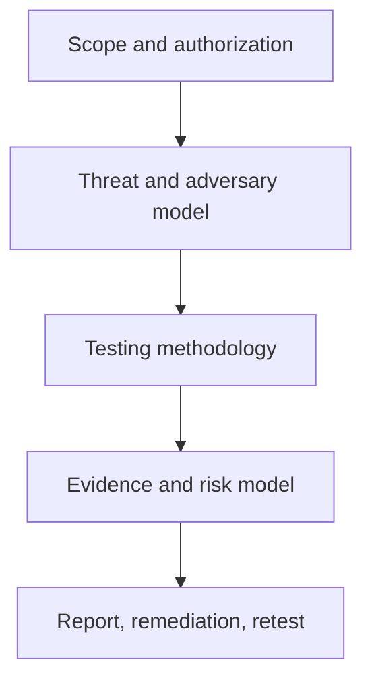

# Methodologies & Frameworks

> [!abstract] Lifecycle branch
> Governance and mental models that make an assessment repeatable, legal, measurable, and useful to defenders.



## 🗺️ Zero-to-Mastery Learning Path

1. [[Penetration Testing Fundamentals]]
2. [[Rules of Engagement & Scoping]]
3. [[Penetration Testing Standards & Frameworks]]
4. [[Cyber Kill Chain]]
5. [[Threat Modeling & MITRE ATT&CK]]

## Practical artifact

```text
Assessment ID: ENT-2026-042
Scope owner: Security Assurance
Method: PTES + NIST SP 800-115 controls
Threat model: External actor and compromised employee
Evidence clock: UTC
Stop authority: Engagement lead and SOC duty manager
```

---
> 🔼 Up: [[Penetration Testing]]
