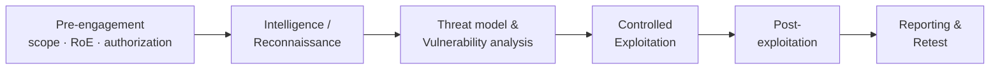

# 📚 Penetration Testing Standards & Frameworks

> [!warning] Frameworks scaffold work; they do not authorize it
> A methodology tells you *how to structure* an engagement — it is never permission to run every technique it lists. Authorization comes from the scope and RoE, not from "the standard says to test exploitation."

## Parent Learning Order
Penetration Testing Fundamentals -> Rules of Engagement & Scoping -> Penetration Testing Standards & Frameworks -> Cyber Kill Chain -> Threat Modeling & MITRE ATT&CK

## Why Not Just "Start Hacking"?

An unstructured test is unrepeatable and incomplete: you find whatever you happen to stumble into, miss whole categories, and cannot prove coverage to the client. **Methodologies** solve this — they are agreed *checklists and lifecycles* that make an assessment repeatable, comprehensive, and defensible. Instead of memorizing five competing standards as separate facts, learn them by their **shared shape** (nearly all follow pre-engagement → intelligence/recon → analysis → exploitation → post-exploitation → reporting) and by *what each one is actually best at*. That comparison — not the individual acronyms — is the operator skill. This note replaces five near-identical framework stubs with one comparison you can actually reason from.

> [!tip] The analogy, and where it breaks
> These frameworks are like recipes for the same dish written by different chefs: the steps rhyme (prep, cook, plate), but one is a strict health-inspector checklist (NIST), one is a granular ingredient list for one course (OWASP WSTG, web only), and one is a measurement science for the whole kitchen (OSSTMM). The analogy breaks on *choice*: you rarely follow one recipe end-to-end — a professional blends them (PTES lifecycle + OWASP for the web portion + NIST language for a government client), because the frameworks are complementary lenses, not mutually exclusive dishes.

**Prerequisites:** Penetration Testing Fundamentals (lifecycle vocabulary) and Rules of Engagement & Scoping (frameworks operate *inside* the authorized scope).

## The Shared Lifecycle

Almost every methodology maps onto the same backbone — learn this once and each framework becomes a variation on it:

The differences between frameworks are mostly *emphasis, granularity, and audience* — where they add rigor, how deep the checklist goes, and which client/regulator expects them.

## The Five, Compared

| Framework | Scope | Best at | Typical audience |
| --- | --- | --- | --- |
| **PTES** (Penetration Testing Execution Standard) | Full engagement lifecycle | A practical, technique-oriented end-to-end scaffold (7 phases) | Commercial pentest teams wanting a common structure |
| **NIST SP 800-115** | Technical assessment methodology | Formal, government-recognized process language (plan → discover → attack → report) | US federal, regulated industries, compliance |
| **OWASP WSTG** (Web Security Testing Guide) | Web applications only | Deep, granular *what-to-test* checklist per web category | Web app testers; the definitive web coverage reference |
| **OSSTMM** (Open Source Security Testing Methodology Manual) | Operational security *measurement* | Rigorous, metric-driven results ("attack surface" quantified via RAV) | Auditors who need repeatable, comparable measurements |
| **CREST** | Accredited engagement standard | Assurance of *tester competence and process quality* | Buyers (esp. UK/finance) requiring accredited providers |

**The mental model:** PTES and NIST 800-115 are *lifecycle* standards (how the whole engagement flows); OWASP WSTG is a *coverage* standard for one domain (the web checklist you actually work through); OSSTMM is a *measurement* standard (turn results into comparable metrics); CREST is an *assurance/accreditation* standard (proof the provider is competent). They answer different questions, so a mature engagement cites several: "PTES lifecycle, OWASP WSTG for the app, reported in NIST 800-115 terms, delivered by a CREST-accredited team."

## PTES in a Little More Depth (the common backbone)

Because PTES is the most technique-oriented lifecycle, it is the one most teams internalize as their default spine:

1. **Pre-engagement** — scope, RoE, contacts, evidence handling, stop conditions.
2. **Intelligence gathering** — build an asset/trust model of the target.
3. **Threat modeling** — pick plausible adversaries and crown jewels.
4. **Vulnerability analysis** — form hypotheses about weaknesses.
5. **Exploitation** — prove *only the minimum* impact.
6. **Post-exploitation** — measure trust paths under explicit authorization.
7. **Reporting** — translate evidence into prioritized remediation.

The recurring beginner mistake — treating any of these as a strict linear checklist — is why the next section matters.

## Why a framework is a loop, not a checklist

- **Treating a framework as a linear checklist.** Real engagements *loop*: a confirmed identity flaw changes the threat model; a new asset sends you back to intelligence; a stop condition interrupts exploitation. Keep a **decision log** explaining each transition, rather than marching through phases once.
- **Confusing the framework with authorization.** OWASP WSTG listing an exploitation test does not authorize you to exploit — the scope/RoE does. Frameworks describe *possible* work, not *permitted* work.
- **Wrong tool for the job.** Using OSSTMM's measurement rigor to structure a quick web test, or OWASP WSTG for a network-only engagement, wastes effort — match the framework to the target and audience.
- **"Checklist done" ≠ "testing done."** Completing every WSTG item does not prove security; creative, context-driven testing (chaining findings) lives *beyond* the checklist.
- **Ignoring the client's required standard.** A federal client may *require* NIST 800-115 language; a UK bank may *require* CREST accreditation — deliver in the standard the buyer expects, not just your favorite.

## Security Implications — the Defender's View

- **Frameworks make assessments comparable over time.** A defender who insists on a consistent methodology (and a measured one like OSSTMM where appropriate) can track whether the security posture is actually improving between annual tests, not just whether a different tester found different things.
- **Coverage standards double as defensive checklists.** OWASP WSTG is equally a *build/verify* guide for developers — mapping your own app against it before a test closes obvious gaps.
- **Accreditation (CREST) is a supply-chain control** — it gives the buyer assurance that the people touching their crown jewels are competent and follow a vetted process, reducing the risk of the *test itself* causing harm.
- **Reporting in a recognized standard** (NIST language, CVSS scoring) lets a security team feed findings straight into their existing risk-register and compliance workflows.

## Worked Mapping: Framework Selection for One Engagement

Frameworks are chosen and blended per engagement, not recited. Here is a completed
methodology decision for a concrete scope — an external and web assessment of a UK
fintech that stores payment data and must satisfy an auditor — as it would appear in
the statement of work.

| Decision | Choice for this engagement | Why |
|:--|:--|:--|
| Lifecycle spine | **NIST SP 800-115** | A regulated, audited client — the auditor recognises NIST language over PTES's |
| Web coverage | **OWASP WSTG** — auth, session, input validation, access control, configuration | Names the exact app categories the payment surface requires; maps cleanly to findings |
| Measurement | **OSSTMM-style metrics**, selectively | Makes next year's test comparable; accept the added time cost for a recurring regulated client |
| Assurance constraint | **CREST-accredited delivery**, recorded in the SOW | The client requires it; it is a delivery constraint, not a testing method |
| Decision log | A standing note recording every phase transition and its rationale | The auditor will ask *why* each choice was made, not merely *what* was tested |

The point of the blend is that no single framework covers a real engagement. NIST gives
the auditor-legible lifecycle; WSTG gives the web-specific depth NIST lacks; OSSTMM adds
comparability the others do not measure; CREST is an assurance requirement orthogonal to
all of them. Each is named for *what it is doing in this engagement* — a spine, a coverage
checklist, a metric, a constraint — rather than listed for completeness.

The mastery signal the note identifies is the ability to justify each choice to the
auditor: NIST because you are audited, WSTG because the risk is in the web tier, OSSTMM
because the test recurs. Naming all five frameworks proves nothing; explaining why this
engagement uses these three in these roles is the competence a methodology section
demonstrates.

## Summary

You should now be able to:

- Explain why structured methodology beats ad-hoc testing, and name the shared lifecycle (pre-engagement → recon → analysis → exploitation → post-ex → reporting).
- Compare PTES, NIST 800-115, OWASP WSTG, OSSTMM, and CREST by what each is *best at*, and select the right blend for a given target and audience.
- Explain why frameworks are lenses not checklists (loop with a decision log), why a framework never grants authorization, and how methodology consistency, coverage standards, and accreditation serve the defender and the buyer.

---
> 🔼 Up: [[Methodologies & Frameworks]]
