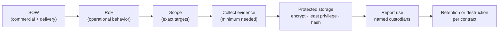

# ⚖️ Rules of Engagement & Scoping

> [!warning] This note is the authorization itself
> The single thing separating a penetration tester from a criminal is *authorization inside an agreed boundary*. This is the least glamorous and most important note in the offensive tree: the paperwork, scope, and evidence rules that make everything else legal. Skip it and your best exploit is a felony.

## Parent Learning Order
Penetration Testing Fundamentals -> Rules of Engagement & Scoping -> Penetration Testing Standards & Frameworks -> Cyber Kill Chain -> Threat Modeling & MITRE ATT&CK

## The Contract That Makes It Legal

> *What separates a penetration test from a crime?*
>
> Hold your answer — the section below is the response.

Before you touch a single target, a set of documents defines *what you may do, to what, when, and how the evidence is handled*. Getting this wrong is not a technical mistake — it is a legal and ethical one, and it can end careers and companies. This note covers the four things every operator must internalize: the **documents** that authorize an engagement, how to define **scope** precisely, the **rules of engagement** that govern behavior, and **evidence governance** (how you collect, protect, and dispose of the sensitive data you will inevitably see). It absorbs the commercial Statement of Work and evidence-governance material into one place because in practice they are one continuous chain: contract → scope → behavior → evidence → disposal.

> [!tip] The analogy, and where it breaks
> Scoping is like a locksmith's work order that lists exactly which doors of which building they may open, on which day, with the owner's signature attached — do a door not on the list and you are breaking in, however skilled you are. The analogy breaks on *evidence*: a locksmith leaves nothing behind, whereas you walk away holding photographs of the client's most sensitive rooms (credentials, PII, source code), so a huge part of the job is proving you handled and then destroyed that evidence responsibly — the work order alone is not enough.

**Prerequisites:** Penetration Testing Fundamentals (authorization, scope, risk vocabulary).

## The Documents That Authorize an Engagement

| Document | Purpose |
| --- | --- |
| **Statement of Work (SOW)** | Master contract — objectives, deliverables, timeline, cost, assessment type (black/grey/white-box), acceptance criteria, liability. |
| **Rules of Engagement (RoE)** | Operational rulebook — *what* you may do, *when*, *how*, and *what is forbidden*. |
| **Scope document** | The exact targets — IP ranges, domains, apps, accounts — that are **in** vs **out** of bounds. |
| **Authorization letter ("get-out-of-jail")** | Signed proof from someone empowered to grant it, carried during the test. |
| **NDA** | Protects the confidential data you will inevitably see. |

The **SOW** defines commercial and delivery obligations; the **RoE** defines operational behavior; the **scope** defines the targets. Ambiguity about subsidiaries, cloud tenants, third parties, or production testing is a **stop condition** — you resolve it in writing *before* testing, never mid-engagement.

**The deliberate break:** "scope" sounds like a project-management preference — the agreed area of work, the bit the client wants looked at, negotiable if something interesting turns up next door.

Scope is a **legal boundary**. Inside it you have authorisation and the same actions are a professional service; outside it the identical packet is unauthorised access to a computer system, which is a criminal offence under the Computer Fraud and Abuse Act in the US, the Computer Misuse Act in the UK, and equivalents nearly everywhere. There is no "I was only looking" defence, and a scope document is the only thing standing between the two readings of your traffic.

There is a second, quieter trap inside the first: **the person who says "go ahead" may not have the authority to say it**. A client can only authorise testing of assets they actually control. A domain that resolves to a SaaS platform, an application on shared hosting, a cloud service with its own provider policy, an API belonging to a partner — the client's sign-off does not extend to any of them, however sincerely it is given, because it was never theirs to grant.

**How you'd spot an asset you are not authorised for:** resolve it and look at who owns the address, not the name. A CDN or provider netblock, a shared-hosting IP answering for dozens of unrelated names, or a cloud address drawn from a pool are all signals that the target belongs to somebody who never signed anything. Confirm ownership before a single active packet, and record how you confirmed it.

## Defining Scope Precisely

Scope is defined by **explicit inclusion** — everything not listed is out:

- **Targets:** specific `CIDR` ranges, hostnames, URLs, mobile apps, API endpoints, wireless SSIDs, physical locations.
- **Depth:** may you exploit, or only identify? Pivot? Escalate? Exfiltrate (and if so, *dummy* data only)?
- **Accounts:** provided test credentials vs. must-obtain-your-own.
- **Assessment type:** external vs internal, authenticated vs unauthenticated, assumed-breach.

> [!danger] Out-of-scope risks — where testers get into real trouble
> - **Third-party & cloud assets.** A target's app may run on AWS/Azure/Cloudflare — attacking it can violate the *provider's* terms and needs their authorization too.
> - **Scope creep via pivoting.** A foothold may reach a host that is *not* in scope. Stop at the boundary; document the *path*, don't cross it.
> - **Shared infrastructure.** Hitting one virtual host on shared hosting can take down unrelated tenants.
> - **DoS & destructive tests.** Usually explicitly forbidden unless contracted; even a heavy scan can crash fragile production.
> - **Data handling.** Real PII/PHI you access must be handled per the RoE — often "prove access, don't extract."

## Rules of Engagement Essentials

A solid RoE nails down:

- **Testing window** (business hours, or a maintenance window) and **timezone**.
- **Emergency contacts** on both sides + an **abort procedure** ("if X, stop and call").
- **De-confliction:** how the blue team distinguishes *your* traffic from a real attacker (source IPs, a header, a keyword).
- **Evidence & OPSEC:** what you log, how findings are stored/encrypted, and clean-up (remove shells, test accounts, uploaded files).
- **Explicitly forbidden:** social-engineering *these* people, physical entry, DoS, modifying/deleting data, phishing personal accounts.

## Evidence Governance & Chain of Custody

The data you collect is often more sensitive than the vulnerability itself. Evidence governance controls its whole lifecycle: **collection → protected storage → report use → retention or destruction.**



- **Classify** each artifact: credentials, personal data, production records, vulnerability details, packet captures, source code, exploit artifacts.
- **Protect:** least privilege, encryption at rest, immutable hashes, transfer logging, named custodians.
- **Chain of custody:** record collector, UTC timestamp, source, method, original hash, storage location, transformations, access, and disposition — every working copy must trace back to a hashed original.

## Worked Example: Evidence That Survives a Challenge

An engagement's findings are only as defensible as the evidence behind them, and
defensibility comes from a chain of custody that can prove a piece of evidence is
unaltered. Hashing an artifact on collection and verifying it later turns "trust
us" into "here is the proof."

**Register the evidence with its hash at collection time:**

```shell-session
analyst@lab:/tmp/engagement$ sha256sum evidence/F-07-request.txt | awk '{print $1}'
9c1f...4ab2
analyst@lab:/tmp/engagement$ cat evidence-register.csv
id,collector,utc,source,method,sha256,classification,custodians,disposition
F-07,analyst,2026-08-09T14:22:07Z,api.example.test,manual-request,9c1f...4ab2,restricted,lead+reviewer,delete+30d
```

The register binds the artifact to who collected it, when, from where, by what
method, and — the anchor — its hash at the moment of collection. Everything else in
the row is context; the hash is what makes the record provable.

**An untampered working copy verifies against the register:**

```shell-session
analyst@lab:/tmp/engagement$ echo "9c1f...4ab2  evidence/F-07-working.txt" | sha256sum -c -
evidence/F-07-working.txt: OK
```

`OK` means the working copy is byte-for-byte the evidence that was registered — so
analysis, redaction and reporting can proceed from it while the original stays
sealed.

**Any alteration is detectable:**

```shell-session
analyst@lab:/tmp/engagement$ echo "TAMPERED" >> evidence/F-07-working.txt
analyst@lab:/tmp/engagement$ echo "9c1f...4ab2  evidence/F-07-working.txt" | sha256sum -c -
evidence/F-07-working.txt: FAILED
```

`FAILED` is the property that makes the chain worth maintaining. A single appended
line breaks the hash, so any modification — accidental or malicious, by the tester
or by anyone who later handles the file — is caught against the collection-time
anchor. This is what lets a finding withstand a client disputing it: the evidence
is provably the same as when it was gathered.

The final link is disposition. The register's `delete+30d` field is a commitment,
and honouring it — destroying restricted evidence on schedule, logged before
deletion — is as much a part of the engagement's integrity as gathering it. Scope
defines what you were authorised to touch; chain of custody proves what you found
was real and that you handled it responsibly from collection to destruction.

## The one error that is also a crime

- **Testing out of scope.** The single most serious operational error — a pivot into an unlisted host, or scanning a range you misread, can be a crime and a contract breach. When in doubt, stop and confirm in writing.
- **Verbal-only authorization.** "The client said it was fine on a call" is not a defense; authorization must be signed by someone empowered to grant it, and carried during the test.
- **Evidence over-collection.** Copying real PII/PHI when a canary read or a screenshot would prove the finding creates a data-protection liability you now own.
- **Unhashed / untracked evidence.** Evidence with no original hash and no custody record can be challenged as tampered — worthless in a dispute.
- **No de-confliction plan.** Without it, the blue team may treat your test as a real incident (or worse, dismiss a *real* attack as your test).

## Security Implications — the Defender's View

- **A mature client drives this process, not the tester:** they define crown jewels, exclusions, and emergency contacts, and they *audit the environment against baseline after the test* to confirm cleanup — accounts, shells, and test artifacts all removed.
- **De-confliction protects detection:** agreeing on source IPs/headers/keywords lets the SOC keep hunting real threats while ignoring authorized traffic — and lets both sides tell the difference in the logs.
- **Evidence handling *is* a security control:** encrypting, hashing, and destroying evidence on schedule means a compromised tester or lost laptop does not become the client's breach.
- **Legal hold vs. destruction:** if an assessment uncovers a real active compromise, evidence may shift to a legal hold — governance defines who decides and how the handoff to IR/legal happens.

## Summary

You should now be able to:

- Explain why authorization + scope is what makes offensive work legal, and name the core documents (SOW, RoE, scope, authorization letter, NDA).
- Define a precise scope, write the essential RoE terms (window, contacts, de-confliction, forbidden actions), and maintain a hash-anchored chain-of-custody register.
- Explain the evidence lifecycle (collect → protect → use → destroy), why out-of-scope pivoting and unhashed evidence are the cardinal failures, and how de-confliction and post-test baseline audits protect both sides.

---
> 🔼 Up: [[Methodologies & Frameworks]]
