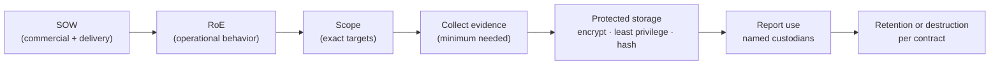

# ⚖️ Rules of Engagement & Scoping

> [!warning] This note is the authorization itself
> The single thing separating a penetration tester from a criminal is *authorization inside an agreed boundary*. This is the least glamorous and most important note in the offensive tree: the paperwork, scope, and evidence rules that make everything else legal. Skip it and your best exploit is a felony.

## Parent Learning Order
Penetration Testing Fundamentals -> Rules of Engagement & Scoping -> Penetration Testing Standards & Frameworks -> Cyber Kill Chain -> Threat Modeling & MITRE ATT&CK

## Start at Zero: The Contract That Makes It Legal

Before you touch a single target, a set of documents defines *what you may do, to what, when, and how the evidence is handled*. Getting this wrong is not a technical mistake — it is a legal and ethical one, and it can end careers and companies. This note covers the four things every operator must internalize: the **documents** that authorize an engagement, how to define **scope** precisely, the **rules of engagement** that govern behavior, and **evidence governance** (how you collect, protect, and dispose of the sensitive data you will inevitably see). It absorbs the commercial Statement of Work and evidence-governance material into one place because in practice they are one continuous chain: contract → scope → behavior → evidence → disposal.

> [!tip] The analogy, and where it breaks
> Scoping is like a locksmith's work order that lists exactly which doors of which building they may open, on which day, with the owner's signature attached — do a door not on the list and you are breaking in, however skilled you are. The analogy breaks on *evidence*: a locksmith leaves nothing behind, whereas you walk away holding photographs of the client's most sensitive rooms (credentials, PII, source code), so a huge part of the job is proving you handled and then destroyed that evidence responsibly — the work order alone is not enough.

**Prerequisites:** Penetration Testing Fundamentals (authorization, scope, risk vocabulary).

## The Documents That Authorize an Engagement

| Document | Purpose |
| --- | --- |
| **Statement of Work (SOW)** | Master contract — objectives, deliverables, timeline, cost, assessment type (black/grey/white-box), acceptance criteria, liability. |
| **Rules of Engagement (RoE)** | Operational rulebook — *what* you may do, *when*, *how*, and *what is forbidden*. |
| **Scope document** | The exact targets — IP ranges, domains, apps, accounts — that are **in** vs **out** of bounds. |
| **Authorization letter ("get-out-of-jail")** | Signed proof from someone empowered to grant it, carried during the test. |
| **NDA** | Protects the confidential data you will inevitably see. |

The **SOW** defines commercial and delivery obligations; the **RoE** defines operational behavior; the **scope** defines the targets. Ambiguity about subsidiaries, cloud tenants, third parties, or production testing is a **stop condition** — you resolve it in writing *before* testing, never mid-engagement.

## Defining Scope Precisely

Scope is defined by **explicit inclusion** — everything not listed is out:

- **Targets:** specific `CIDR` ranges, hostnames, URLs, mobile apps, API endpoints, wireless SSIDs, physical locations.
- **Depth:** may you exploit, or only identify? Pivot? Escalate? Exfiltrate (and if so, *dummy* data only)?
- **Accounts:** provided test credentials vs. must-obtain-your-own.
- **Assessment type:** external vs internal, authenticated vs unauthenticated, assumed-breach.

> [!danger] Out-of-scope risks — where testers get into real trouble
> - **Third-party & cloud assets.** A target's app may run on AWS/Azure/Cloudflare — attacking it can violate the *provider's* terms and needs their authorization too.
> - **Scope creep via pivoting.** A foothold may reach a host that is *not* in scope. Stop at the boundary; document the *path*, don't cross it.
> - **Shared infrastructure.** Hitting one virtual host on shared hosting can take down unrelated tenants.
> - **DoS & destructive tests.** Usually explicitly forbidden unless contracted; even a heavy scan can crash fragile production.
> - **Data handling.** Real PII/PHI you access must be handled per the RoE — often "prove access, don't extract."

## Rules of Engagement Essentials

A solid RoE nails down:

- **Testing window** (business hours, or a maintenance window) and **timezone**.
- **Emergency contacts** on both sides + an **abort procedure** ("if X, stop and call").
- **De-confliction:** how the blue team distinguishes *your* traffic from a real attacker (source IPs, a header, a keyword).
- **Evidence & OPSEC:** what you log, how findings are stored/encrypted, and clean-up (remove shells, test accounts, uploaded files).
- **Explicitly forbidden:** social-engineering *these* people, physical entry, DoS, modifying/deleting data, phishing personal accounts.

## Evidence Governance & Chain of Custody

The data you collect is often more sensitive than the vulnerability itself. Evidence governance controls its whole lifecycle: **collection → protected storage → report use → retention or destruction.**



- **Classify** each artifact: credentials, personal data, production records, vulnerability details, packet captures, source code, exploit artifacts.
- **Protect:** least privilege, encryption at rest, immutable hashes, transfer logging, named custodians.
- **Chain of custody:** record collector, UTC timestamp, source, method, original hash, storage location, transformations, access, and disposition — every working copy must trace back to a hashed original.

## Failure Modes and Interpretation

- **Testing out of scope.** The single most serious operational error — a pivot into an unlisted host, or scanning a range you misread, can be a crime and a contract breach. When in doubt, stop and confirm in writing.
- **Verbal-only authorization.** "The client said it was fine on a call" is not a defense; authorization must be signed by someone empowered to grant it, and carried during the test.
- **Evidence over-collection.** Copying real PII/PHI when a canary read or a screenshot would prove the finding creates a data-protection liability you now own.
- **Unhashed / untracked evidence.** Evidence with no original hash and no custody record can be challenged as tampered — worthless in a dispute.
- **No de-confliction plan.** Without it, the blue team may treat your test as a real incident (or worse, dismiss a *real* attack as your test).

## Security Implications — the Defender's View

- **A mature client drives this process, not the tester:** they define crown jewels, exclusions, and emergency contacts, and they *audit the environment against baseline after the test* to confirm cleanup — accounts, shells, and test artifacts all removed.
- **De-confliction protects detection:** agreeing on source IPs/headers/keywords lets the SOC keep hunting real threats while ignoring authorized traffic — and lets both sides tell the difference in the logs.
- **Evidence handling *is* a security control:** encrypting, hashing, and destroying evidence on schedule means a compromised tester or lost laptop does not become the client's breach.
- **Legal hold vs. destruction:** if an assessment uncovers a real active compromise, evidence may shift to a legal hold — governance defines who decides and how the handoff to IR/legal happens.

## Authorized Lab: Build a Chain-of-Custody Register

> [!info] Runs on one machine — this is the real evidence-integrity workflow, and it genuinely runs
> You hash a piece of evidence, register it with custody metadata, then prove tampering is detectable. Step 5 disposes of it on schedule.

### Step 1 — Collect a piece of evidence (a canary finding artifact)

```bash
mkdir -p /tmp/engagement/evidence
echo "GET /api/invoice/1002 -> 200 OK (belongs to another user) :: FINDING F-07 IDOR proof (canary)" > /tmp/engagement/evidence/F-07-request.txt
echo "collected F-07 evidence artifact"
```

```text
collected F-07 evidence artifact
```

### Step 2 — Hash the original (integrity anchor) and register custody

```bash
cd /tmp/engagement
H=$(sha256sum evidence/F-07-request.txt | awk '{print $1}')
printf 'id,collector,utc,source,method,sha256,classification,custodians,disposition\n' > evidence-register.csv
printf 'F-07,%s,%s,api.example.test,manual-request,%s,restricted,lead+reviewer,delete+30d\n' "$USER" "$(date -u +%FT%TZ)" "$H" >> evidence-register.csv
cat evidence-register.csv
```

```text
id,collector,utc,source,method,sha256,classification,custodians,disposition
F-07,<user>,<utc>,api.example.test,manual-request,<sha256>,restricted,lead+reviewer,delete+30d
```

The register ties the artifact to a collector, a UTC time, a method, and — crucially — the original hash. This is what makes the evidence defensible.

### Step 3 — Prove integrity: an untampered copy verifies

```bash
cd /tmp/engagement
cp evidence/F-07-request.txt evidence/F-07-working.txt   # working copy
REG=$(grep '^F-07,' evidence-register.csv | cut -d, -f6)
echo "$REG  evidence/F-07-working.txt" | sha256sum -c -
```

```text
evidence/F-07-working.txt: OK
```

The working copy matches the registered hash — provably the same evidence.

### Step 4 — Prove tampering is detectable (the deliberate break)

```bash
cd /tmp/engagement
echo "TAMPERED: changed the invoice id" >> evidence/F-07-working.txt
REG=$(grep '^F-07,' evidence-register.csv | cut -d, -f6)
echo "$REG  evidence/F-07-working.txt" | sha256sum -c - 2>&1 | tail -1
echo "Finding: any modification breaks the hash match -> chain of custody catches tampering. This is why originals are hashed on collection."
```

```text
evidence/F-07-working.txt: FAILED
Finding: any modification breaks the hash match -> chain of custody catches tampering. This is why originals are hashed on collection.
```

### Step 5 — Disposition (scheduled destruction)

```bash
rm -rf /tmp/engagement
ls -d /tmp/engagement 2>&1 | tail -1
echo "Evidence destroyed per 'delete+30d' disposition. In a real engagement this is logged in the register before deletion."
```

```text
ls: cannot access '/tmp/engagement': No such file or directory
Evidence destroyed per 'delete+30d' disposition. In a real engagement this is logged in the register before deletion.
```

**What you should now be able to do:** name the documents that authorize an engagement, define scope by explicit inclusion, list the out-of-scope traps, specify the essential RoE terms, and run a real hash-anchored chain-of-custody workflow that detects tampering and disposes of evidence on schedule.

## Crook → Operator → Root Checkpoint

- **Crook:** Explain why authorization + scope is what makes offensive work legal, and name the core documents (SOW, RoE, scope, authorization letter, NDA).
- **Operator:** Define a precise scope, write the essential RoE terms (window, contacts, de-confliction, forbidden actions), and maintain a hash-anchored chain-of-custody register.
- **Root:** Explain the evidence lifecycle (collect → protect → use → destroy), why out-of-scope pivoting and unhashed evidence are the cardinal failures, and how de-confliction and post-test baseline audits protect both sides.

---
> 🔼 Up: [[Methodologies & Frameworks]]
