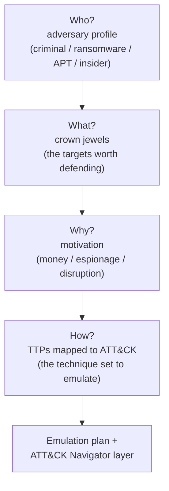

# 🎭 Threat Modeling & MITRE ATT&CK

> [!warning] Authorized simulation only
> Threat modeling decides *which adversary you emulate* on a scoped engagement. Emulate the agreed threat profile against in-scope systems only; ATT&CK is a shared vocabulary, not a license to run every technique it catalogues.

## Parent Learning Order
Penetration Testing Fundamentals -> Rules of Engagement & Scoping -> Penetration Testing Standards & Frameworks -> Cyber Kill Chain -> Threat Modeling & MITRE ATT&CK

## Deciding Which Attacker to Be

The kill chain (previous leaf) told you attacks have a *shape*. **Threat modeling** answers a sharper question before an engagement: *which attacker are we simulating, going after what, and how would they actually operate?* You cannot test against "everything" — a bored script kiddie, a ransomware crew, and a nation-state behave completely differently, so a good engagement picks a **realistic adversary profile** and emulates it. **MITRE ATT&CK** is the shared catalogue that makes this concrete: a giant, curated matrix of the real **tactics** (the attacker's goals — the *why*) and **techniques** (the *how*) observed in actual intrusions, each with a stable ID (e.g. `T1566` Phishing). Together they turn "we did some hacking" into "we emulated a ransomware operator's TTPs — here are the exact techniques, mapped to ATT&CK, and which ones your controls caught."

> [!tip] The analogy, and where it breaks
> ATT&CK is like a periodic table of attacker moves: every known technique has a fixed symbol and box, so a defender in Tokyo and an operator in Berlin mean the *same thing* by "T1055 Process Injection." Threat modeling is then choosing *which reactions to run* for this experiment. The analogy breaks on completeness: the periodic table is finite and closed, whereas ATT&CK is *observed* behavior — it grows as new techniques are seen and it omits ones nobody has caught yet, so "not in ATT&CK" never means "impossible."

**Prerequisites:** the Cyber Kill Chain (attack stages) and Penetration Testing Fundamentals (threat vs. risk). ATT&CK's tactics are a more granular, non-linear cousin of the kill chain's stages.

## Tactics vs. Techniques: The Two Axes

ATT&CK is a matrix. Read it as two axes:

- **Tactics** (columns) = the adversary's *objective* at a moment: Initial Access, Execution, Persistence, Privilege Escalation, Defense Evasion, Credential Access, Discovery, Lateral Movement, Collection, Command & Control, Exfiltration, Impact.
- **Techniques** (cells) = *how* they achieve a tactic, each with an ID and often sub-techniques: e.g. under *Initial Access*, `T1566` Phishing (with `T1566.001` Spearphishing Attachment).

| Concept | Question it answers | Example |
| --- | --- | --- |
| **Tactic** | *Why* — the goal | Credential Access |
| **Technique** | *How* — the method | `T1003` OS Credential Dumping |
| **Sub-technique** | *How, specifically* | `T1003.001` LSASS Memory |
| **Procedure** | The concrete implementation | "used `secretsdump` to pull LSASS" |

Notice these map directly onto the post-exploitation leaves you already studied — credential access, privilege escalation, persistence, lateral movement, exfiltration are *ATT&CK tactics*. ATT&CK is the index that ties the whole offensive tree together into a common language.

## Threat Modeling: Picking the Adversary

A threat model for an engagement answers four questions, and ATT&CK supplies the vocabulary for the last one:



The output is an **adversary-emulation plan**: a chosen set of ATT&CK techniques that a realistic threat actor for *this* client would use, which you then execute (in scope) and report against. ATT&CK even publishes **Groups** (e.g. real-world actor profiles) with the technique sets they are known to use, so "emulate a threat like the ones targeting our sector" becomes a concrete, defensible technique list.

## Why This Is the Purple-Team Linchpin

ATT&CK's real power is that *both sides speak it*. When the red team reports "we succeeded with `T1550.002` Pass-the-Hash and `T1003.001` LSASS dumping," the blue team can answer "we have detection for LSASS access but missed the PtH — here's the gap." Mapping every finding to a technique ID turns an engagement into a **coverage map**: which techniques were attempted, which were detected, which were blocked. That coverage map is the single most useful artifact you can hand a defender.

## Worked Example: Turning Findings Into a Coverage Heatmap

Mapping findings to MITRE ATT&CK is not documentation for its own sake — it turns
a list of things that worked into a measurement of what the defender's controls
caught, in a format the blue team can act on directly. Five findings, each tagged
with a technique and an outcome, make the workflow concrete.

**Findings recorded as technique procedures**, not prose:

```text
finding,tactic,technique_id,technique,detected
F-01,Initial Access,T1566.001,Spearphishing Attachment,blocked
F-02,Credential Access,T1003.001,LSASS Memory,detected
F-03,Lateral Movement,T1550.002,Pass-the-Hash,missed
F-04,Persistence,T1053.003,Cron Job,detected
F-05,Exfiltration,T1048,Exfil Over Alternative Protocol,missed
```

Each row carries the technique ID and — the column that makes this an assessment
rather than a diary — whether the client's controls caught it.

**Scoring the coverage** reduces five rows to the number that matters:

```shell-session
analyst@lab:/tmp/attack-lab$ python3 score.py
techniques emulated : 5
blocked/detected    : 3  (60% coverage)
MISSED (gaps)       : 2
--- gaps to fix ---
  T1550.002  Pass-the-Hash  (Lateral Movement)
  T1048      Exfil Over Alternative Protocol  (Exfiltration)
```

Sixty percent coverage, and — more useful than the percentage — the two specific
techniques that went unseen, named by ID and tactic. That is a remediation backlog,
not a grade: the blue team knows exactly which two detections to write.

**Emitting a Navigator layer** puts it in the tool the defenders already use:

```shell-session
analyst@lab:/tmp/attack-lab$ python3 layer.py
wrote coverage.layer.json -> 5 techniques (importable into ATT&CK Navigator)
```

The JSON colours each technique green or red on the standard ATT&CK matrix, so a
defender sees the engagement as a heatmap over the same framework their detections
are organised around. This is what makes the finding durable: not "the pentest
found some gaps" but a technique-by-technique coverage map that the blue team
imports, closes two cells on, and re-tests against next quarter — the whole purpose
of framing offensive results in ATT&CK rather than in an ad-hoc list.

## Modeling an adversary the client will never face

- **Modeling an unrealistic adversary.** Emulating a nation-state for a small business wastes the engagement; the threat model must fit the client's actual risk (their sector, data, and who really targets it).
- **Treating ATT&CK as exhaustive.** It is *observed* behavior. Novel or unpublished techniques exist; "not in ATT&CK" is not "safe." Use it as a shared map, not a boundary of what attackers can do.
- **Mapping theatre.** Slapping technique IDs onto findings *after the fact* without accuracy is worse than none — a mismapped `T`-number misleads the defender's gap analysis. Map precisely, at the sub-technique level where possible.
- **Confusing tactic and technique.** "We did Credential Access" (a tactic) is not a finding; "we dumped LSASS (`T1003.001`)" (a technique/procedure) is. Report at technique granularity.
- **Ignoring the client's controls in the plan.** A good emulation deliberately includes techniques you *expect* to be caught, to validate detection — not only the ones you expect to succeed.

## Security Implications — the Defender's View

- **ATT&CK is a defensive coverage framework first.** Blue teams map their detections onto the matrix (via the **ATT&CK Navigator** heatmap) to see *which techniques they can and cannot see* — the red team's job is to validate that heatmap against reality.
- **Detection engineering is technique-driven:** writing analytics per technique (e.g. LSASS access, `alg:none` JWTs, unusual DNS volume) and tracking coverage on the matrix turns ad-hoc alerting into measurable defense.
- **Threat-informed defense:** by modeling *which* actors target their sector and prioritizing detections for *those* actors' known techniques, a defender spends limited budget where it matters — the same threat model, used defensively.
- **Purple teaming operationalizes all of this:** red emulates a technique, blue confirms detection or finds the gap, a detection is written, and the technique is re-tested — a loop that measurably improves the coverage map over time.

## Summary

You should now be able to:

- Explain why you emulate a *chosen* adversary rather than "everything," and what ATT&CK tactics and techniques are.
- Build a threat model for a client, select a realistic technique set, and map findings to precise ATT&CK IDs at sub-technique granularity.
- Explain why ATT&CK is a shared red/blue language that turns an engagement into a coverage map, why it is observed-not-exhaustive, and how threat-informed defense and purple-team loops operationalize it.

---
> 🔼 Up: [[Methodologies & Frameworks]]
