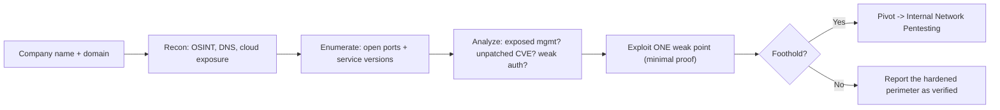

# 🌍 External Network Pentesting

> [!warning] Authorized simulation only
> External testing hits internet-facing assets that are live production systems. Scan and probe only IPs and hostnames in a written scope, confirm ownership before touching anything (shared cloud IPs change hands), and respect rate limits so you do not cause an outage.

## Parent Learning Order
External Network Pentesting -> Service Enumeration -> Layer 2 & 3 Network Attacks -> Remote Access Security Testing -> Internal Network Pentesting

## Testing the Front Door

> *You are handed a company name and a domain, and nothing else. Where do you start?*
>
> Hold your answer — the section below is the response.

An **external network penetration test** assesses everything an attacker can reach from the internet with no prior access — the organization's perimeter. The goal is to answer one question: *can an outsider get in?* You start where a real attacker starts (a company name and a domain) and work through discovery, enumeration, and controlled exploitation of exposed services, staying outside until you find a way through.

The defining constraint is **you are outside**. You see only what the perimeter exposes: some open ports, some web apps, a VPN portal, a mail server. Most of the organization is invisible behind the firewall. That constraint shapes the whole methodology — external testing is about finding the *few* exposed weaknesses among a small, hardened surface, unlike internal testing where everything is reachable.

> [!tip] The analogy, and where it breaks
> External testing is like a burglar casing a building from the street — checking every door and window from outside, without entering. The analogy breaks because a building has a fixed, visible facade, whereas an organization's internet perimeter is sprawling and partly *unknown to the organization itself* — the forgotten cloud instance, the shadow-IT SaaS. Much of external testing is discovering doors the owner forgot they had.

**Prerequisites:** the reconnaissance leaves (passive OSINT, DNS, active scanning, cloud exposure), which feed directly into this.

**The deliberate break:** the external perimeter sounds like a known quantity — the firewall, the web servers, the VPN concentrator. The client has a diagram of it, and the diagram is where you start.

The perimeter is **whatever answers from the internet**, and that set is reliably larger than the diagram. A staging host somebody spun up for a demo in 2023 and never turned off. A cloud bucket a team created with their own credentials. A forgotten subdomain still pointing at a provider. A management interface that was supposed to be behind the VPN and is not. In practice the highest-value external findings are almost always assets **the client did not know they had** — which is the entire reason the discovery phase exists, and why a test that only examines the documented estate has tested the wrong thing.

That cuts both ways, and it is why attribution is the first discipline rather than an afterthought: an asset nobody documented is equally likely to be shadow IT *or* not theirs at all.

**How you'd spot the difference:** an address in a cloud provider's pool, or a shared-hosting IP answering for unrelated names, belongs to the provider and only sometimes to your client. Confirm ownership by something the client controls — a certificate subject, a registrar record, a DNS entry in a zone they own — never by the fact that a name resembles theirs.

## The External Methodology

External testing follows the assessment lifecycle, scoped to the perimeter:

| Phase | Activity | Output |
| --- | --- | --- |
| **Scope & attribution** | Confirm which IPs/domains are truly the target's | An authorized, owned target list |
| **Discovery** | Passive recon + host discovery (earlier leaves) | Live hosts and their subdomains |
| **Enumeration** | Port scan + service/version detection | Open services with versions |
| **Vulnerability analysis** | Map versions → CVEs; test for misconfig | Prioritized candidate weaknesses |
| **Exploitation** | Controlled, minimal proof against a weakness | Confirmed entry point |
| **Post-access** | If in, what does the foothold reach? | Impact, pivot to internal testing |

The critical discipline is **attribution** at the start: a cloud IP that answers today may belong to the target or to whoever the provider assigned it last week. Confirming ownership (via reverse DNS, certificate CN, content, or the client's asset list) before probing is what keeps you legal and in scope — testing a stranger's server is the cardinal external-testing sin.

## The Perimeter's Typical Weak Points

External findings cluster in predictable places, because the internet-facing surface is small and its failure modes are well-known:

- **Exposed management interfaces** — an admin panel, database, or RDP port that should never face the internet. The highest-value external finding, often trivially exploitable.
- **Unpatched internet-facing services** — a VPN gateway or web server with a known CVE (the EPSS-high, actively-exploited kind). These are how most real perimeter breaches happen.
- **Weak authentication** — a login portal without MFA, vulnerable to credential-stuffing using the identities from OSINT.
- **Web application flaws** — the largest external surface; covered in depth by the web-testing leaves.
- **Misconfiguration** — default credentials, verbose error pages, open cloud storage, information disclosure.

The pattern: the perimeter is small, so an attacker (and you) look for the *one* thing that is exposed, unpatched, or misconfigured — not a broad sweep, but a hunt for the single weak point.



## Worked Example: Separating the Routine From the Finding

An external test's hardest skill is not discovery — nmap does that — but judgment:
of everything exposed to the internet, which items are supposed to be there and
which are the report. A perimeter with a legitimate web service and one
accidentally-exposed admin panel makes the distinction concrete.

**Discovery and enumeration** in one pass:

```shell-session
attacker@ext:~$ sudo nmap -sS -sV -p 443,8080,3389 203.0.113.10 | grep -E '^[0-9]'
443/tcp  open   https      SimpleHTTPServer 0.6 (Python 3.11.2)
3389/tcp closed ms-wbt-server
8080/tcp open   http-proxy SimpleHTTPServer 0.6 (Python 3.11.2)
```

Read all three lines, because two of them are good news. `3389 closed` means RDP
is not exposed — a thing to confirm and move past, not ignore. `443 open` is a web
service on a web perimeter, which is expected. `8080 open` is the one that does
not belong: a second HTTP service on a non-standard port, which on a real
perimeter is very often a management console, a staging app, or a forgotten tool.

**Analysis** is the step that turns three open ports into one finding:

```shell-session
attacker@ext:~$ for p in 443 8080; do
>   printf ":%s -> " $p; curl -s "http://203.0.113.10:$p/" | grep -oiE '<title>[^<]*' | head -1 || echo "directory listing"
> done
:443 -> directory listing
:8080 -> directory listing
```

Fingerprinting both distinguishes the routine service from the exposed one by
what each actually is, rather than by port number alone — a discipline that
matters because attackers hide admin surfaces on port 443 precisely to survive a
lazy triage.

**The proof** is one benign request from the external vantage point:

```shell-session
attacker@ext:~$ curl -s -o /dev/null -w "admin panel from 'internet': HTTP %{http_code}\n" http://203.0.113.10:8080/
admin panel from 'internet': HTTP 200
```

`200` from outside is the finding stated in the smallest possible form: a
management interface is reachable from the internet. No exploitation is needed or
appropriate — reachability *is* the vulnerability, and the remediation writes
itself. Note the restraint: the proof stops at demonstrating access, and does not
probe the panel's functions, because the scope of an external test is the exposure,
not what could be done after it.

## Attribution errors and what they cost

- **Attribution errors** are the worst-case failure: scanning or exploiting an out-of-scope host is an authorization breach with legal consequences. Confirm ownership relentlessly.
- **Causing an outage.** A fragile internet-facing service (an old appliance, a rate-limited API) can be knocked over by aggressive testing, taking down a production system. Match intrusiveness to fragility and coordinate with the client.
- **The invisible surface.** You cannot test what you did not discover; a missed subdomain or forgotten cloud asset is exactly where the real breach happens. Discovery quality caps test quality.
- **"Clean perimeter" complacency.** A hardened perimeter with nothing exploitable is a *result*, not a failure — but it must be paired with the reminder that phishing bypasses the perimeter entirely, which is why external testing alone is never a complete assessment.
- **Rate-limit and lockout traps.** Credential testing can lock out real accounts (denial of service) and trigger alerts. Throttle and coordinate.

## Security Implications — Detection & Defense

- **The perimeter is loud to defend and loud to attack.** External scanning and exploitation are highly visible in perimeter logs and IDS — a well-monitored organization sees the test. The defense is *minimizing exposure* (the ASM discipline from the cloud-exposure leaf), because you cannot patch what you do not know you expose.
- **Attack-surface management is the mirror control.** The organization should continuously run the same discovery against itself, finding the exposed management port before the attacker does.
- **The two highest-value hardenings** are: remove internet-facing management interfaces (put them behind a VPN), and patch internet-facing services fast (the exposure window from the continuous-validation leaf). These close the two most common breach paths.
- **MFA everywhere on the perimeter** neutralizes the credential-stuffing that OSINT enables — the single control that most reduces external risk from stolen/guessed credentials.
- **External testing validates the perimeter, not the whole org** — because social engineering and supply-chain paths bypass it, so it must be paired with those assessments for a true picture.

## Summary

You should now be able to:

- Explain what "external" means for the tester's vantage point, and why the perimeter is a small, hardened surface where you hunt for one weak point.
- Run discovery → enumeration → analysis → minimal-proof against a perimeter, confirm attribution before probing, and identify an exposed management interface as a high-value finding.
- Explain why attack-surface management is the mirror defense, why MFA and removing internet-facing management interfaces close the two commonest breach paths, and why external testing alone is never a complete assessment.

---
> 🔼 Up: [[Network Penetration Testing]]
