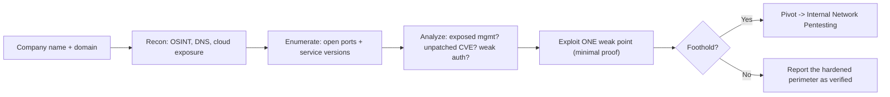

# 🌍 External Network Pentesting

> [!warning] Authorized simulation only
> External testing hits internet-facing assets that are live production systems. Scan and probe only IPs and hostnames in a written scope, confirm ownership before touching anything (shared cloud IPs change hands), and respect rate limits so you do not cause an outage.

## Parent Learning Order
External Network Pentesting -> Service Enumeration -> Layer 2 & 3 Network Attacks -> Remote Access Security Testing -> Internal Network Pentesting

## Start at Zero: Testing the Front Door

An **external network penetration test** assesses everything an attacker can reach from the internet with no prior access — the organization's perimeter. The goal is to answer one question: *can an outsider get in?* You start where a real attacker starts (a company name and a domain) and work through discovery, enumeration, and controlled exploitation of exposed services, staying outside until you find a way through.

The defining constraint is **you are outside**. You see only what the perimeter exposes: some open ports, some web apps, a VPN portal, a mail server. Most of the organization is invisible behind the firewall. That constraint shapes the whole methodology — external testing is about finding the *few* exposed weaknesses among a small, hardened surface, unlike internal testing where everything is reachable.

> [!tip] The analogy, and where it breaks
> External testing is like a burglar casing a building from the street — checking every door and window from outside, without entering. The analogy breaks because a building has a fixed, visible facade, whereas an organization's internet perimeter is sprawling and partly *unknown to the organization itself* — the forgotten cloud instance, the shadow-IT SaaS. Much of external testing is discovering doors the owner forgot they had.

**Prerequisites:** the reconnaissance leaves (passive OSINT, DNS, active scanning, cloud exposure), which feed directly into this.

## The External Methodology

External testing follows the assessment lifecycle, scoped to the perimeter:

| Phase | Activity | Output |
| --- | --- | --- |
| **Scope & attribution** | Confirm which IPs/domains are truly the target's | An authorized, owned target list |
| **Discovery** | Passive recon + host discovery (earlier leaves) | Live hosts and their subdomains |
| **Enumeration** | Port scan + service/version detection | Open services with versions |
| **Vulnerability analysis** | Map versions → CVEs; test for misconfig | Prioritized candidate weaknesses |
| **Exploitation** | Controlled, minimal proof against a weakness | Confirmed entry point |
| **Post-access** | If in, what does the foothold reach? | Impact, pivot to internal testing |

The critical discipline is **attribution** at the start: a cloud IP that answers today may belong to the target or to whoever the provider assigned it last week. Confirming ownership (via reverse DNS, certificate CN, content, or the client's asset list) before probing is what keeps you legal and in scope — testing a stranger's server is the cardinal external-testing sin.

## The Perimeter's Typical Weak Points

External findings cluster in predictable places, because the internet-facing surface is small and its failure modes are well-known:

- **Exposed management interfaces** — an admin panel, database, or RDP port that should never face the internet. The highest-value external finding, often trivially exploitable.
- **Unpatched internet-facing services** — a VPN gateway or web server with a known CVE (the EPSS-high, actively-exploited kind). These are how most real perimeter breaches happen.
- **Weak authentication** — a login portal without MFA, vulnerable to credential-stuffing using the identities from OSINT.
- **Web application flaws** — the largest external surface; covered in depth by the web-testing leaves.
- **Misconfiguration** — default credentials, verbose error pages, open cloud storage, information disclosure.

The pattern: the perimeter is small, so an attacker (and you) look for the *one* thing that is exposed, unpatched, or misconfigured — not a broad sweep, but a hunt for the single weak point.



## Failure Modes and Interpretation

- **Attribution errors** are the worst-case failure: scanning or exploiting an out-of-scope host is an authorization breach with legal consequences. Confirm ownership relentlessly.
- **Causing an outage.** A fragile internet-facing service (an old appliance, a rate-limited API) can be knocked over by aggressive testing, taking down a production system. Match intrusiveness to fragility and coordinate with the client.
- **The invisible surface.** You cannot test what you did not discover; a missed subdomain or forgotten cloud asset is exactly where the real breach happens. Discovery quality caps test quality.
- **"Clean perimeter" complacency.** A hardened perimeter with nothing exploitable is a *result*, not a failure — but it must be paired with the reminder that phishing bypasses the perimeter entirely, which is why external testing alone is never a complete assessment.
- **Rate-limit and lockout traps.** Credential testing can lock out real accounts (denial of service) and trigger alerts. Throttle and coordinate.

## Security Implications — Detection & Defense

- **The perimeter is loud to defend and loud to attack.** External scanning and exploitation are highly visible in perimeter logs and IDS — a well-monitored organization sees the test. The defense is *minimizing exposure* (the ASM discipline from the cloud-exposure leaf), because you cannot patch what you do not know you expose.
- **Attack-surface management is the mirror control.** The organization should continuously run the same discovery against itself, finding the exposed management port before the attacker does.
- **The two highest-value hardenings** are: remove internet-facing management interfaces (put them behind a VPN), and patch internet-facing services fast (the exposure window from the continuous-validation leaf). These close the two most common breach paths.
- **MFA everywhere on the perimeter** neutralizes the credential-stuffing that OSINT enables — the single control that most reduces external risk from stolen/guessed credentials.
- **External testing validates the perimeter, not the whole org** — because social engineering and supply-chain paths bypass it, so it must be paired with those assessments for a true picture.

## Authorized Lab: Run the External Methodology on a Target You Build

> [!info] Runs on one Linux machine — builds an "internet-facing" host in a netns with a mix of good and bad exposure
> Nothing external is contacted; the netns is your perimeter. Step 5 removes it.

### Step 1 — Build a perimeter with one thing that should not be exposed

```bash
sudo ip netns add perim
sudo ip link add veth-p type veth peer name veth-e
sudo ip link set veth-e netns perim
sudo ip addr add 10.9.0.1/24 dev veth-p && sudo ip link set veth-p up
sudo ip netns exec perim sh -c 'ip addr add 10.9.0.2/24 dev veth-e && ip link set veth-e up && ip link set lo up'
sudo ip netns exec perim python3 -m http.server 443 &>/dev/null &        # legit web
sudo ip netns exec perim python3 -m http.server 8080 &>/dev/null &        # EXPOSED admin panel (the finding)
sleep 1; echo "perimeter 10.9.0.2 up: :443 web, :8080 admin (should not be exposed)"
```

```text
perimeter 10.9.0.2 up: :443 web, :8080 admin (should not be exposed)
```

### Step 2 — Discovery + enumeration

```bash
sudo nmap -sS -sV -p 443,8080,3389 10.9.0.2 | grep -E '^[0-9]'
```

```text
443/tcp  open   https   SimpleHTTPServer 0.6 (Python 3.11.2)
3389/tcp closed ms-wbt-server
8080/tcp open   http-proxy SimpleHTTPServer 0.6 (Python 3.11.2)
```

Two open ports. `:3389` closed (good — no exposed RDP). But `:8080` is open — the enumeration surfaced the exposed admin surface.

### Step 3 — Analyze: which exposure is the finding?

```bash
for p in 443 8080; do
  title=$(curl -s "http://10.9.0.2:$p/" | grep -oiE '<title>[^<]*' | head -1)
  echo ":$p -> ${title:-directory listing} $([ $p = 8080 ] && echo '<- MANAGEMENT INTERFACE EXPOSED' )"
done
```

```text
:443 -> directory listing
:8080 -> directory listing <- MANAGEMENT INTERFACE EXPOSED
```

The analysis phase distinguishes the routine (`:443`, a web service that belongs on the perimeter) from the finding (`:8080`, a management surface that does not).

### Step 4 — Minimal proof of the exposure

```bash
curl -s -o /dev/null -w "admin panel reachable from 'internet': HTTP %{http_code}\n" "http://10.9.0.2:8080/"
```

```text
admin panel reachable from 'internet': HTTP 200
```

`200` from the "external" attacker proves the management interface is reachable from outside — the finding, demonstrated with a single benign request. The recommendation writes itself: put `:8080` behind the VPN.

### Step 5 — Cleanup

```bash
sudo ip netns del perim; ip link show veth-p 2>&1 | tail -1
```

```text
Device "veth-p" does not exist.
```

**What you should now be able to do:** run the external methodology from company-name to foothold, confirm target ownership before probing, distinguish a routine exposure from a finding, and prove an exposed management interface with minimal evidence.

## Crook → Operator → Root Checkpoint

- **Crook:** Explain what "external" means for the tester's vantage point, and why the perimeter is a small, hardened surface where you hunt for one weak point.
- **Operator:** Run discovery → enumeration → analysis → minimal-proof against a perimeter, confirm attribution before probing, and identify an exposed management interface as a high-value finding.
- **Root:** Explain why attack-surface management is the mirror defense, why MFA and removing internet-facing management interfaces close the two commonest breach paths, and why external testing alone is never a complete assessment.

---
> 🔼 Up: [[Network Penetration Testing]]
