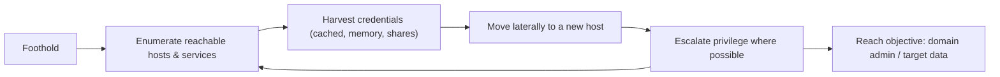

# 🏢 Internal Network Pentesting

> [!warning] Authorized simulation only
> Internal testing assumes a foothold and touches production internal systems. Work within a stated scope and blast-radius limit, avoid disrupting business services, and treat every credential and piece of data you encounter as sensitive and out of bounds beyond proving access.

## Parent Learning Order
External Network Pentesting -> Service Enumeration -> Layer 2 & 3 Network Attacks -> Remote Access Security Testing -> Internal Network Pentesting

## Start at Zero: Assume the Attacker Is Already In

An **internal network penetration test** starts from a foothold — a compromised workstation, a network jack, a phished credential — and asks: *now that an attacker is inside, how far can they get?* This is the "assume breach" premise made concrete. Where external testing hunts for the one exposed weakness, internal testing operates in a target-rich environment where almost everything is reachable, and the challenge inverts: not "can I find a way in?" but "how quickly can I go from one foothold to full domain control?"

The dominant theme is **lateral movement** — using access to one system to reach the next, harvesting credentials along the way, until reaching the crown jewels (typically domain admin, or a specific sensitive dataset). Internal testing is really a test of *containment*: does the network's segmentation and least-privilege limit how far one foothold spreads?

> [!tip] The analogy, and where it breaks
> Internal testing is like being dropped inside a building and seeing how many rooms you can reach — but with a twist: each room may contain a key to another. The analogy breaks because in a flat network the "keys" (cached credentials) reused across systems mean one room often opens *all* the others at once, a cascade no physical building has. Segmentation is the attempt to make each door need its own key.

**Prerequisites:** service enumeration and the L2/L3 attacks (your movement toolkit), plus the Networking domain's **Network Segmentation & Zero Trust** leaf.

## The Internal Methodology

Internal testing is a loop, not a line — each new access restarts enumeration:



Each cycle: enumerate what this foothold can reach, harvest any credentials it exposes, use them to move to a new host, escalate, and repeat. The engagement ends at the objective or when containment stops the spread. The detailed techniques live in the **Active Directory & Identity Exploitation** and **Post-Exploitation** leaves; this note is the *methodology and containment-testing* view.

## Segmentation Testing: The Containment Question

The most valuable internal finding is often not "I got domain admin" but "the segmentation does not work." **Segmentation testing** systematically checks whether network boundaries actually contain an attacker:

| Test | Question |
| --- | --- |
| **Reachability** | From this segment, what other segments can I reach at all? |
| **Port-level** | Which services cross the boundary that shouldn't? |
| **Credential blast radius** | Does one harvested credential work across segments? |
| **Flat-network check** | Is there really any boundary, or is it one broadcast domain? |

The test method: from a foothold in one segment, attempt to reach hosts and services in others. Every connection that succeeds where policy says it should fail is a segmentation finding. This directly measures **blast radius** — the containment metric from the Networking domain — and it survives the "we have VLANs" claim, because a permissive inter-VLAN rule makes segments behave as one flat network regardless of the diagram.

The critical test is whether segmentation **survives valid credentials**: an attacker with a phished credential is, to the network, a legitimate user. Segmentation that only blocks unauthenticated traffic does nothing against them — which is exactly why zero-trust adds per-resource authorization on top of network boundaries.

## Credential Reuse: Why Flat Networks Collapse

The engine of internal compromise is **credential reuse**. A local admin password shared across workstations, a service account cached on many hosts, a domain admin who logged into a compromised machine — each turns one foothold into many. The internal tester's core loop is: compromise a host, extract whatever credentials it holds, and test where else they work. In a poorly-segmented network with reused credentials, this cascades to full control in hours. Segmentation and unique credentials per system are what break the cascade — making each new host require *new* effort rather than a reused key.

## Failure Modes and Interpretation

- **Blast radius on the business.** Internal testing touches production; aggressive lateral movement or credential extraction can disrupt services or lock accounts. Coordinate closely and prefer read/prove over modify.
- **Scope creep across segments.** A successful pivot can lead into out-of-scope segments (a partner network, a regulated enclave). Confirm the scope covers where movement leads *before* moving.
- **"Got DA" tunnel vision.** Reaching domain admin is dramatic but the more actionable finding is often the *path* — which specific misconfiguration enabled each hop. Document the chain, not just the endpoint.
- **Detection blindness.** Internal networks are often less monitored than the perimeter, so a tester may move freely and wrongly conclude "undetectable" — when the real finding is "internal monitoring is absent."
- **Assuming the diagram.** Segmentation on paper is not segmentation in effect. Test reachability empirically; a permissive rule collapses a boundary the architecture claims exists.

## Security Implications — Detection & Defense

- **Segmentation is the primary containment control**, and internal testing is its audit. The finding "one foothold reaches the entire estate" is a segmentation failure whose fix is real network and identity boundaries, not just VLANs on a diagram.
- **Unique credentials per system** break the reuse cascade — a local admin password manager (randomizing per-host) is one of the highest-value defenses against lateral movement.
- **Internal detection is the common gap.** Because perimeter monitoring dominates, east-west (host-to-host) movement often goes unseen. Placing sensors on internal segments and monitoring for anomalous authentication is what turns free movement into a detected intrusion.
- **Zero trust is the strategic answer** — per-resource authentication and least privilege so that even a valid credential grants only what that identity needs, containing a breach by design rather than by network topology alone.
- **The path is the remediation map.** Each hop in the tester's chain is a specific control that failed; fixing the chain (not just the endpoint) is what prevents the next attacker.

## Authorized Lab: Test Segmentation You Build

> [!info] Runs on one Linux machine — builds two "segments" with a router between them and tests whether a boundary holds
> Everything is netns-based inside your kernel. Step 5 removes it.

### Step 1 — Build two segments joined by a router

```bash
sudo ip netns add seg-a; sudo ip netns add seg-b; sudo ip netns add router
# seg-a <-> router
sudo ip link add a-r type veth peer name r-a
sudo ip link set a-r netns seg-a; sudo ip link set r-a netns router
sudo ip netns exec seg-a  sh -c 'ip addr add 10.1.0.10/24 dev a-r; ip link set a-r up; ip route add default via 10.1.0.1'
sudo ip netns exec router sh -c 'ip addr add 10.1.0.1/24 dev r-a; ip link set r-a up'
# seg-b <-> router
sudo ip link add b-r type veth peer name r-b
sudo ip link set b-r netns seg-b; sudo ip link set r-b netns router
sudo ip netns exec seg-b  sh -c 'ip addr add 10.2.0.10/24 dev b-r; ip link set b-r up; ip route add default via 10.2.0.1'
sudo ip netns exec router sh -c 'ip addr add 10.2.0.1/24 dev r-b; ip link set r-b up; sysctl -w net.ipv4.ip_forward=1' >/dev/null
sudo ip netns exec seg-b python3 -m http.server 80 &>/dev/null &   # a service in segment B
sleep 1; echo "seg-a (10.1.0.10) and seg-b (10.2.0.10, :80) joined by a router"
```

```text
seg-a (10.1.0.10) and seg-b (10.2.0.10, :80) joined by a router
```

### Step 2 — Baseline: with no firewall, the segments are NOT contained

```bash
sudo ip netns exec seg-a sh -c 'curl -s -o /dev/null -w "seg-a -> seg-b:80 = HTTP %{http_code}\n" --max-time 3 http://10.2.0.10:80/'
```

```text
seg-a -> seg-b:80 = HTTP 200
```

A foothold in segment A reaches segment B's service freely — the segmentation is decorative. This is the finding on a flat network.

### Step 3 — Apply real segmentation and re-test

```bash
sudo ip netns exec router iptables -A FORWARD -s 10.1.0.0/24 -d 10.2.0.0/24 -j DROP
sudo ip netns exec seg-a sh -c 'curl -s -o /dev/null -w "seg-a -> seg-b:80 = HTTP %{http_code}\n" --max-time 3 http://10.2.0.10:80/ || echo "seg-a -> seg-b = BLOCKED (contained)"'
```

```text
seg-a -> seg-b = BLOCKED (contained)
```

The boundary now holds — the foothold in A cannot reach B. Testing this empirically (not trusting the diagram) is the segmentation-testing skill, and the before/after proves whether containment is real.

### Step 4 — The credential-reuse point

```bash
echo "Even with the block above, if a credential harvested in seg-a also works in seg-b,"
echo "and a management path exists, segmentation alone may not contain identity-based movement."
echo "Finding quality = the PATH: which boundary + which reused credential enabled each hop."
```

```text
Even with the block above, if a credential harvested in seg-a also works in seg-b,
and a management path exists, segmentation alone may not contain identity-based movement.
Finding quality = the PATH: which boundary + which reused credential enabled each hop.
```

### Step 5 — Cleanup

```bash
sudo ip netns del seg-a; sudo ip netns del seg-b; sudo ip netns del router
ip netns list | grep -c seg || echo "all lab namespaces removed"
```

```text
all lab namespaces removed
```

**What you should now be able to do:** run the internal assume-breach loop (enumerate → harvest → move → escalate), test segmentation empirically rather than trusting the diagram, prove the difference between a flat and a contained network, and document the path (not just the endpoint) as the remediation map.

## Crook → Operator → Root Checkpoint

- **Crook:** Explain the assume-breach premise, what lateral movement is, and why internal testing measures containment rather than "can I get in."
- **Operator:** Run the enumerate-harvest-move loop, test segmentation by attempting cross-boundary reachability, and demonstrate a flat vs. contained network with a before/after.
- **Root:** Explain why credential reuse collapses flat networks, why segmentation must survive valid credentials (motivating zero trust), and why the attack *path* is the actionable finding.

---
> 🔼 Up: [[Network Penetration Testing]]
