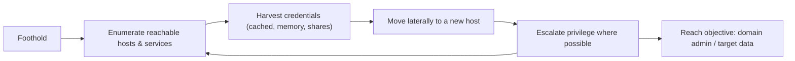

# 🏢 Internal Network Pentesting

> [!warning] Authorized simulation only
> Internal testing assumes a foothold and touches production internal systems. Work within a stated scope and blast-radius limit, avoid disrupting business services, and treat every credential and piece of data you encounter as sensitive and out of bounds beyond proving access.

## Parent Learning Order
External Network Pentesting -> Service Enumeration -> Layer 2 & 3 Network Attacks -> Remote Access Security Testing -> Internal Network Pentesting

## Assume the Attacker Is Already In

> *External testing hunts for the one exposed weakness. What changes once you are inside?*
>
> Hold your answer — the section below is the response.

An **internal network penetration test** starts from a foothold — a compromised workstation, a network jack, a phished credential — and asks: *now that an attacker is inside, how far can they get?* This is the "assume breach" premise made concrete. Where external testing hunts for the one exposed weakness, internal testing operates in a target-rich environment where almost everything is reachable, and the challenge inverts: not "can I find a way in?" but "how quickly can I go from one foothold to full domain control?"

The dominant theme is **lateral movement** — using access to one system to reach the next, harvesting credentials along the way, until reaching the crown jewels (typically domain admin, or a specific sensitive dataset). Internal testing is really a test of *containment*: does the network's segmentation and least-privilege limit how far one foothold spreads?

> [!tip] The analogy, and where it breaks
> Internal testing is like being dropped inside a building and seeing how many rooms you can reach — but with a twist: each room may contain a key to another. The analogy breaks because in a flat network the "keys" (cached credentials) reused across systems mean one room often opens *all* the others at once, a cascade no physical building has. Segmentation is the attempt to make each door need its own key.

**Prerequisites:** service enumeration and the L2/L3 attacks (your movement toolkit), plus the Networking domain's **Network Segmentation & Zero Trust** leaf.

## The Internal Methodology

Internal testing is a loop, not a line — each new access restarts enumeration:



Each cycle: enumerate what this foothold can reach, harvest any credentials it exposes, use them to move to a new host, escalate, and repeat. The engagement ends at the objective or when containment stops the spread. The detailed techniques live in the **Active Directory & Identity Exploitation** and **Post-Exploitation** leaves; this note is the *methodology and containment-testing* view.

## Segmentation Testing: The Containment Question

The most valuable internal finding is often not "I got domain admin" but "the segmentation does not work." **Segmentation testing** systematically checks whether network boundaries actually contain an attacker:

| Test | Question |
| --- | --- |
| **Reachability** | From this segment, what other segments can I reach at all? |
| **Port-level** | Which services cross the boundary that shouldn't? |
| **Credential blast radius** | Does one harvested credential work across segments? |
| **Flat-network check** | Is there really any boundary, or is it one broadcast domain? |

The test method: from a foothold in one segment, attempt to reach hosts and services in others. Every connection that succeeds where policy says it should fail is a segmentation finding. This directly measures **blast radius** — the containment metric from the Networking domain — and it survives the "we have VLANs" claim, because a permissive inter-VLAN rule makes segments behave as one flat network regardless of the diagram.

The critical test is whether segmentation **survives valid credentials**: an attacker with a phished credential is, to the network, a legitimate user. Segmentation that only blocks unauthenticated traffic does nothing against them — which is exactly why zero-trust adds per-resource authorization on top of network boundaries.

## Credential Reuse: Why Flat Networks Collapse

The engine of internal compromise is **credential reuse**. A local admin password shared across workstations, a service account cached on many hosts, a domain admin who logged into a compromised machine — each turns one foothold into many. The internal tester's core loop is: compromise a host, extract whatever credentials it holds, and test where else they work. In a poorly-segmented network with reused credentials, this cascades to full control in hours. Segmentation and unique credentials per system are what break the cascade — making each new host require *new* effort rather than a reused key.

## Worked Example: Testing Whether Segmentation Is Real or Decorative

A network diagram claims two segments are separated. Internal pentesting does not
trust the diagram — it puts a foothold in one segment and tries to reach the
other, before and after the control exists. Two namespaces joined by a forwarding
router stand in for the two segments.

**Before any control**, a foothold in segment A reaches a service in segment B:

```shell-session
root@lab:~$ ip netns exec seg-a curl -s -o /dev/null -w "seg-a -> seg-b:80 = HTTP %{http_code}\n" http://10.2.0.10:80/
seg-a -> seg-b:80 = HTTP 200
```

`HTTP 200`. The segments are routable to each other with nothing in between, so
the separation on the diagram is decorative — a foothold anywhere is a foothold
everywhere. On a flat network this one line is the whole finding.

**After a real boundary** is placed on the router:

```shell-session
root@lab:~$ ip netns exec router iptables -A FORWARD -s 10.1.0.0/24 -d 10.2.0.0/24 -j DROP
root@lab:~$ ip netns exec seg-a curl -s --max-time 3 http://10.2.0.10:80/ || echo "seg-a -> seg-b = BLOCKED"
seg-a -> seg-b = BLOCKED
```

The boundary holds. The value of testing it empirically — rather than reading the
firewall config and assuming — is that a rule can exist and still not apply: wrong
interface, wrong direction, shadowed by an earlier `ACCEPT`, or bypassed by a
route the config author forgot. The before/after pair is the evidence that
containment is real, and it is the single most useful artefact an internal test
produces about a segmentation claim.

**The caveat that makes findings good.** The block above stops packets from A to
B, and stops nothing about *identity*. If a credential harvested in segment A also
authenticates in segment B, and any management path reaches across — a jump host,
a shared admin console, a domain controller both segments trust — then the attacker
moves without ever sending a packet the firewall would see. That is why a strong
internal finding is never "the segments are flat" but a named path: *this*
boundary, crossed with *this* reused credential, over *this* service. The report's
value is the path, because the path is what the defender fixes.

## Blast radius inside a production network

- **Blast radius on the business.** Internal testing touches production; aggressive lateral movement or credential extraction can disrupt services or lock accounts. Coordinate closely and prefer read/prove over modify.
- **Scope creep across segments.** A successful pivot can lead into out-of-scope segments (a partner network, a regulated enclave). Confirm the scope covers where movement leads *before* moving.
- **"Got DA" tunnel vision.** Reaching domain admin is dramatic but the more actionable finding is often the *path* — which specific misconfiguration enabled each hop. Document the chain, not just the endpoint.
- **Detection blindness.** Internal networks are often less monitored than the perimeter, so a tester may move freely and wrongly conclude "undetectable" — when the real finding is "internal monitoring is absent."
- **Assuming the diagram.** Segmentation on paper is not segmentation in effect. Test reachability empirically; a permissive rule collapses a boundary the architecture claims exists.

## Security Implications — Detection & Defense

- **Segmentation is the primary containment control**, and internal testing is its audit. The finding "one foothold reaches the entire estate" is a segmentation failure whose fix is real network and identity boundaries, not just VLANs on a diagram.
- **Unique credentials per system** break the reuse cascade — a local admin password manager (randomizing per-host) is one of the highest-value defenses against lateral movement.
- **Internal detection is the common gap.** Because perimeter monitoring dominates, east-west (host-to-host) movement often goes unseen. Placing sensors on internal segments and monitoring for anomalous authentication is what turns free movement into a detected intrusion.
- **Zero trust is the strategic answer** — per-resource authentication and least privilege so that even a valid credential grants only what that identity needs, containing a breach by design rather than by network topology alone.
- **The path is the remediation map.** Each hop in the tester's chain is a specific control that failed; fixing the chain (not just the endpoint) is what prevents the next attacker.

## Summary

You should now be able to:

- Explain the assume-breach premise, what lateral movement is, and why internal testing measures containment rather than "can I get in."
- Run the enumerate-harvest-move loop, test segmentation by attempting cross-boundary reachability, and demonstrate a flat vs. contained network with a before/after.
- Explain why credential reuse collapses flat networks, why segmentation must survive valid credentials (motivating zero trust), and why the attack *path* is the actionable finding.

---
> 🔼 Up: [[Network Penetration Testing]]
