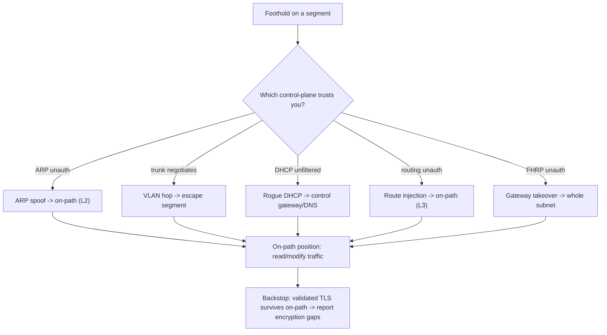

# 🔌 Layer 2 & 3 Network Attacks

> [!warning] Authorized simulation only
> These attacks manipulate the local network fabric and can disrupt connectivity for every host on a segment. Perform them only on an isolated lab you own or a segment explicitly in scope with a stated blast-radius limit. The lab here builds the whole network inside one Linux kernel.

## Parent Learning Order
External Network Pentesting -> Service Enumeration -> Layer 2 & 3 Network Attacks -> Remote Access Security Testing -> Internal Network Pentesting

## Attacking the Fabric, Not the Host

> *Most attacks target a service. What do you gain by attacking the network instead?*
>
> Hold your answer — the section below is the response.

Most attacks target a *service*. Layer 2 and Layer 3 attacks target the *network itself* — the switching and routing that move packets between hosts. Their power is position: succeed, and you become the path other hosts' traffic flows through, gaining an **on-path** position without ever touching those hosts directly. This is the pentester's route from "I have a foothold on one machine" to "I can read the segment's traffic."

The mechanisms — how ARP, VLANs, and routing actually work and fail — are covered in depth in the **Networking** domain's switching and routing branches. This note is the *offensive testing* view: on an engagement, how you test whether a network's Layer 2/3 controls hold, what a finding looks like, and how to prove it with minimal disruption.

> [!tip] The analogy, and where it breaks
> A Layer 2 attack is like a mail sorter quietly telling everyone "I'm the new front desk — give me your outgoing post." Everyone complies because nothing verifies the claim. The analogy breaks on scope: the sorter only sees mail, whereas an on-path attacker sees, and can *modify*, traffic in real time — the difference between eavesdropping and active tampering.

**Prerequisites:** the Networking domain's **ARP & Neighbor Discovery**, **VLANs & Trunking**, and **IP Forwarding** leaves — this note assumes you know the mechanisms and focuses on testing them.

## The Layer 2 Attack Surface

Layer 2 attacks exploit that switching protocols authenticate nothing. On an engagement you test for:

| Test | What it proves | Control that should stop it |
| --- | --- | --- |
| **ARP spoofing** | You can become on-path between two hosts | Dynamic ARP Inspection |
| **MAC flooding** | You can force the switch to flood (wiretap) | Port security |
| **VLAN hopping** | You can escape your assigned segment | Disabled trunk negotiation, tagged native VLAN |
| **Rogue DHCP** | You can hand victims a malicious gateway/DNS | DHCP snooping |
| **STP takeover** | You can become root bridge (network-wide on-path) | BPDU Guard |

The testing logic is uniform: attempt the attack, and the *result* is your finding. If ARP spoofing succeeds, the finding is "Dynamic ARP Inspection is absent"; if it fails, you have positively verified the control works — a valuable result in its own right.

## The Layer 3 Attack Surface

Layer 3 attacks target routing — the IP-layer decisions about where packets go:

- **Routing protocol injection** — if OSPF/RIP updates are unauthenticated, inject a route that draws traffic through you (on-path at the network layer, covered as a mechanism in **Routing Security & Path Validation**).
- **First-hop redundancy takeover** — win an HSRP/VRRP election to become the gateway for a whole subnet.
- **IP source spoofing** — test whether ingress filtering (BCP 38) drops packets with implausible source addresses.
- **ICMP redirect** — test whether hosts honor redirects that reroute their traffic.

The common thread with Layer 2: unauthenticated control-plane messages let you redirect traffic. The finding is always "this control-plane protocol is unauthenticated" plus the demonstrated consequence.



## The Ethical Boundary: On-Path Is the Finding, Not the Content

Once on-path, an attacker *could* read every unencrypted byte. The testing discipline (from **Manual Vulnerability Verification**) stops at proof of position: demonstrate that you intercepted a *canary* packet, not that you harvested credentials. The finding is "an attacker on this segment achieves an on-path position and can intercept unencrypted traffic" — proven with a single benign marker, not a capture of real user data.

This connects to the recurring backstop: an on-path position is defeated at the content level by properly validated TLS. So a complete finding pairs "you got on-path" with "and here is the plaintext protocol X that was exposed as a result" — turning the position into a specific, fixable recommendation (encrypt protocol X, enable DAI).

## Worked Example: Poisoning a Neighbour Table With One Forged Reply

A layer-2 on-path position does not require breaking anything. It requires the
switch and the victim to believe a claim that ARP was never designed to verify.
This walks a single forged reply on a real switched segment, built from Linux
bridges and namespaces.

**The baseline.** The victim has resolved the gateway to its genuine MAC:

```shell-session
root@lab:~$ ip netns exec victim ping -c1 10.20.0.1 >/dev/null
root@lab:~$ ip netns exec victim ip neigh show 10.20.0.1
10.20.0.1 dev in-victim lladdr 4a:1b:2c:3d:4e:5f REACHABLE
```

`REACHABLE`, and pointing at the gateway's real hardware address. This is the
entry the attack overwrites.

**The attack** is one gratuitous ARP reply announcing "10.20.0.1 is at my MAC",
sent from the attacker namespace:

```shell-session
root@lab:~$ ip netns exec attacker python3 forge_arp.py 8a:9b:ac:bd:ce:df
forged ARP sent: 10.20.0.1 -> attacker MAC 8a:9b:ac:bd:ce:df
```

The reply is unsolicited — the victim never asked. ARP has no state machine that
requires a reply to match a request, and no authentication on the reply's
contents, so an announcement arriving out of nowhere is accepted as readily as
one that answers a question.

**The finding:**

```shell-session
root@lab:~$ ip netns exec victim ip neigh show 10.20.0.1
10.20.0.1 dev in-victim lladdr 8a:9b:ac:bd:ce:df STALE
```

The gateway's address in the victim's table is now the attacker's MAC. Every
packet the victim sends to its default gateway will be framed to the attacker
instead — the on-path position, established with one packet and zero
interception so far.

Two points of discipline matter here. First, the finding is the *poisoned table*,
not captured traffic: proving the attacker now sits in the path is the deliverable,
and actually capturing a victim's data is a separate, higher-consent step. Second,
this is exactly what Dynamic ARP Inspection defeats — on a switch with DAI, the
forged reply in the attack step is dropped because it does not match a DHCP
snooping binding, and this final command would still show `4a:1b:2c:3d:4e:5f`.
Running the attack against a DAI-enabled switch and seeing the entry *not* change
is how you evidence that the control works.

## How a scoped test black-holes a whole VLAN

- **Blast radius.** ARP spoofing an entire segment, or winning an STP election, can black-hole traffic and take the network down. Scope to two specific hosts, not the whole VLAN, and get an explicit blast-radius limit.
- **False "success."** A switch that *looks* spoofable may have DAI that silently drops your forged replies while you believe you are on-path — verify you actually receive the victim's traffic, don't assume.
- **Detection.** These attacks are loud: ARP anomalies, DHCP conflicts, and BPDU events are exactly what wireless/wired IDS watches for. A real red team weighs the near-certain detection against the value.
- **Modern mitigations.** Many enterprises have DAI, DHCP snooping, and BPDU Guard deployed; a failed attempt is a *pass* for that control and should be reported as verified, not omitted.
- **Segment-local only.** All of these are confined to one broadcast domain — they cannot cross a router. That containment is both their limit and the reason segmentation matters.

**The deliberate break:** these read as attacks on the network, and therefore as the infrastructure team's problem rather than anyone else's.

What they produce is an **on-path position**, and what an attacker does from there is take credentials and data belonging to applications and identities. The vulnerability is in the fabric and the consequence lands somewhere else entirely, which is why the remediation is split across two owners: link-layer controls on the switching side, and end-to-end encryption on the application side, neither of which is sufficient alone.

**How you'd spot it:** the position is silent by construction — the attacker relays, everything keeps working, and no user reports anything — so detection is consistency checking rather than complaint handling: one MAC answering for two addresses, an unexpected gateway, a root bridge that is not yours. Then test whether the position would matter here: a segment where an on-path attacker sees only validated TLS is a materially different finding from one carrying cleartext LDAP or unsigned SMB.

## Security Implications — Detection & Defense

- **The controls are the Networking domain's Link Layer Security Controls**: DAI, DHCP snooping, port security, BPDU Guard, and 802.1X, plus authenticated routing/FHRP at Layer 3. A pentest of the fabric is really an audit of whether these are deployed.
- **Detection is straightforward because the attacks are anomalous**: two IPs sharing one MAC (ARP spoof), unexpected DHCP offers, BPDU on an access port. A monitored network catches all of them — the attacker's challenge is the loudness, not the technique.
- **Segmentation limits the blast radius**: because these attacks are segment-local, a well-segmented network confines any success to one small domain, which is exactly why flat networks are so dangerous here.
- **Encryption is the content backstop**: even a perfect on-path position yields only ciphertext against validated TLS, so the durable fix for "unencrypted protocol X was exposed" is to encrypt X, not only to stop the spoofing.

## Summary

You should now be able to:

- Explain why L2/L3 attacks target the network fabric rather than a host, and what an "on-path" position gives an attacker.
- Test for ARP spoofing / VLAN hopping / rogue DHCP as controls, forge an ARP reply and confirm poisoning, and stop at proof-of-position rather than capturing traffic.
- Map each attack to the Link Layer Security Control that stops it; explain why these attacks are segment-local and loud, and why "unencrypted protocol X exposed" — not the spoofing itself — is the fixable finding.

---
> 🔼 Up: [[Network Penetration Testing]]
