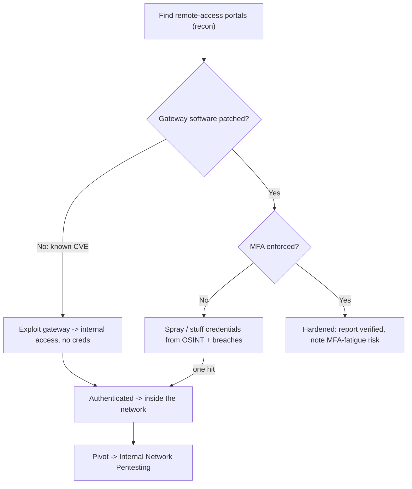

# 🚪 Remote Access Security Testing

> [!warning] Authorized simulation only
> Remote-access portals are authentication endpoints — testing them risks account lockout and can disrupt legitimate remote workers. Throttle authentication attempts, coordinate lockout thresholds with the client, and test only in-scope portals.

## Parent Learning Order
External Network Pentesting -> Service Enumeration -> Layer 2 & 3 Network Attacks -> Remote Access Security Testing -> Internal Network Pentesting

## Start at Zero: The Doors Meant to Let People In

Every organization needs to let remote employees in, so it deliberately exposes **remote-access services** — VPN gateways, RDP, SSH, Citrix, and remote-management portals. These are unique on the perimeter: unlike an accidentally-exposed database, they are *supposed* to be internet-facing, which means they must be extraordinarily well-authenticated, because a single credential that works here is a direct route from the internet into the internal network.

That makes remote access the highest-value external target: it bypasses the whole "find a vulnerability" game. If you can authenticate to the VPN, you are *inside* — no exploit needed. So remote-access testing is overwhelmingly about **authentication strength**: is there MFA, are credentials guessable, is the gateway itself patched?

> [!tip] The analogy, and where it breaks
> A VPN portal is the building's staff entrance — a real door, meant to open for the right people, guarded by a badge reader. The analogy breaks because the staff entrance is physically local, whereas a VPN portal is reachable by *the entire internet* simultaneously, so an attacker can try millions of badges from anywhere with no risk of being physically seen. The defense must therefore be cryptographic, not positional.

**Prerequisites:** the recon and enumeration leaves (to find the portals), and MFA/authentication concepts from the Networking security-architecture branch.

## What Remote-Access Testing Covers

Three attack surfaces, in order of impact:

| Surface | Test | Why it matters |
| --- | --- | --- |
| **Authentication** | MFA present? Credentials guessable? | A working credential = instant internal access |
| **The gateway software** | Known CVE on the appliance? | VPN/gateway CVEs are among the most-exploited flaws |
| **Configuration** | Default creds, weak ciphers, info disclosure | Low-effort footholds and downgrade paths |

The **authentication** surface dominates because of the payoff. The attacker's toolkit here is exactly the identities from OSINT: harvested email addresses become usernames, breach-corpus passwords become guesses, and a portal without MFA is vulnerable to **credential stuffing** (trying breached username/password pairs) and **password spraying** (trying one common password across many users, staying under lockout thresholds).

## Password Spraying: The Signature Technique

Spraying is the emblematic remote-access attack because it defeats lockout policy by design. Instead of many passwords against one account (which locks it), it tries **one password against many accounts**, then waits, then tries the next password:

```text
Attempt 1: Spring2026!  vs  [alice, bob, carol, dave, ...]   then wait
Attempt 2: Password123  vs  [alice, bob, carol, dave, ...]   then wait
```

Each account sees only one failed attempt per round, staying under the lockout threshold, while the attacker covers the whole user list with common passwords. Against a portal without MFA, one hit is a foothold. This is why MFA — not password policy — is the control that actually stops it: a correct password alone is no longer enough.

## The Gateway Itself as a Target

Remote-access appliances (VPN concentrators, gateways) are software, and their CVEs are catastrophic because a flaw in the *gateway* yields access without any credential at all. These have repeatedly been among the most-exploited vulnerabilities in real breaches, precisely because the payoff is direct internal access. Testing includes fingerprinting the appliance and version (enumeration) and checking it against known CVEs (vulnerability intelligence) — a high-priority external finding when the gateway is unpatched.



## Failure Modes and Interpretation

- **Account lockout = denial of service.** Aggressive spraying can lock out real employees, disrupting the business and burning the engagement's goodwill. Stay well under thresholds and coordinate.
- **Detection is near-certain for volume.** Spraying and stuffing produce a distinctive burst of failed logins across many accounts — modern identity providers alarm on exactly this. Slow, distributed spraying evades thresholds but not a patient analyst.
- **MFA is not absolute.** MFA-fatigue (push-bombing) and real-time phishing proxies can defeat weaker MFA; a portal *with* MFA is much stronger but not immune. Report MFA presence *and* its type.
- **The gateway CVE trumps everything.** If the appliance is unpatched with a known-exploited CVE, that is the finding — authentication strength is moot when the gateway itself is the way in.
- **Legitimate-looking access.** A successful credential attack produces a *valid* login, indistinguishable from a real user without behavioral analysis — which is why detection must look at context (impossible travel, new device), not just success/failure.

## Security Implications — Detection & Defense

- **MFA on every remote-access portal is the single highest-value control** — it neutralizes credential stuffing and spraying, the two commonest remote-access attacks, by making a stolen password insufficient.
- **Patch gateways fast.** Remote-access appliance CVEs are exploited within days of disclosure; the exposure window (from the continuous-validation leaf) is the metric that matters most here.
- **Detection is behavioral:** password-spray patterns (one password, many accounts, low per-account rate), impossible-travel logins, and new-device authentications are the signals. Identity-provider protection and conditional access enforce these automatically.
- **Reduce the exposed portal count.** Every internet-facing remote-access service is a target; consolidating to one well-hardened, MFA-enforced gateway shrinks the surface.
- **This is the perimeter breach that skips the exploit** — which is why remote-access hardening is disproportionately important: it closes the easiest path from internet to internal.

## Authorized Lab: Test an Auth Portal You Build

> [!info] Runs on one Linux machine — builds a login portal with a lockout policy locally, then sprays it
> The portal binds to loopback; all "accounts" are synthetic. Step 5 removes it.

### Step 1 — Build a portal with a lockout threshold (3 attempts)

```bash
cat > /tmp/portal.py << 'EOF'
import http.server, urllib.parse, json
users = {"alice":"S3cret!","bob":"Winter2026","carol":"Passw0rd"}   # synthetic
fails = {}
class H(http.server.BaseHTTPRequestHandler):
    def do_POST(self):
        n = int(self.headers.get("Content-Length",0)); body = self.rfile.read(n).decode()
        q = urllib.parse.parse_qs(body); u=q.get("u",[""])[0]; p=q.get("p",[""])[0]
        if fails.get(u,0) >= 3:
            self.send_response(423); self.end_headers(); self.wfile.write(b"LOCKED"); return
        if users.get(u)==p:
            fails[u]=0; self.send_response(200); self.end_headers(); self.wfile.write(b"AUTH OK")
        else:
            fails[u]=fails.get(u,0)+1; self.send_response(401); self.end_headers(); self.wfile.write(b"DENIED")
    def log_message(self,*a): pass
http.server.HTTPServer(("127.0.0.1",8090),H).serve_forever()
EOF
python3 /tmp/portal.py &>/dev/null &
sleep 1; echo "portal up on 127.0.0.1:8090 (lockout after 3 fails, no MFA)"
```

```text
portal up on 127.0.0.1:8090 (lockout after 3 fails, no MFA)
```

### Step 2 — Naive brute-force locks the account (the wrong approach)

```bash
for p in wrong1 wrong2 wrong3 wrong4; do
  echo "alice/$p -> $(curl -s -X POST -d "u=alice&p=$p" http://127.0.0.1:8090/)"
done
```

```text
alice/wrong1 -> DENIED
alice/wrong2 -> DENIED
alice/wrong3 -> DENIED
alice/wrong4 -> LOCKED
```

Four guesses against one account locked it — a denial of service, and the account is now unusable. This is exactly what you must *avoid*.

### Step 3 — Password spraying defeats the lockout by design

```bash
# one password across all users, so each account sees only ONE attempt
for u in bob carol dave; do
  r=$(curl -s -X POST -d "u=$u&p=Winter2026" http://127.0.0.1:8090/)
  echo "$u/Winter2026 -> $r"
done
```

```text
bob/Winter2026 -> AUTH OK
carol/Winter2026 -> DENIED
dave/Winter2026 -> DENIED
```

One common password sprayed across the user list hit `bob` — **authenticated, no lockout triggered**, because each account saw a single attempt. That single valid credential is a foothold into the network. This is why spraying, not brute-force, is the real technique.

### Step 4 — Show why MFA would stop it

```bash
echo "bob's password is now known. With MFA, 'AUTH OK' would still require a second factor bob controls."
echo "The finding: portal enforces lockout but NOT MFA -> spraying yields access. Recommendation: enforce MFA."
```

```text
bob's password is now known. With MFA, 'AUTH OK' would still require a second factor bob controls.
The finding: portal enforces lockout but NOT MFA -> spraying yields access. Recommendation: enforce MFA.
```

### Step 5 — Cleanup

```bash
kill %1 2>/dev/null; rm -f /tmp/portal.py; wait 2>/dev/null
curl -s -o /dev/null -w "portal gone: %{http_code}\n" --max-time 2 http://127.0.0.1:8090/ 2>&1 | grep -o 'gone.*' || echo "portal gone: connection refused"
```

```text
portal gone: connection refused
```

**What you should now be able to do:** identify remote-access portals as the highest-value external target, explain why spraying defeats lockout where brute-force triggers it, demonstrate a spray that yields a credential without locking accounts, and articulate why MFA — not password policy — is the control that stops it.

## Crook → Operator → Root Checkpoint

- **Crook:** Explain why remote-access portals are uniquely dangerous (a credential = internal access, no exploit needed) and what MFA protects against.
- **Operator:** Distinguish brute-force (locks accounts) from spraying (one password, many users), demonstrate a spray that authenticates without lockout, and report MFA presence and type.
- **Root:** Explain why gateway CVEs trump authentication strength, why detection must be behavioral (spray pattern, impossible travel) rather than success/failure, and why remote-access hardening closes the easiest internet-to-internal path.

---
> 🔼 Up: [[Network Penetration Testing]]
