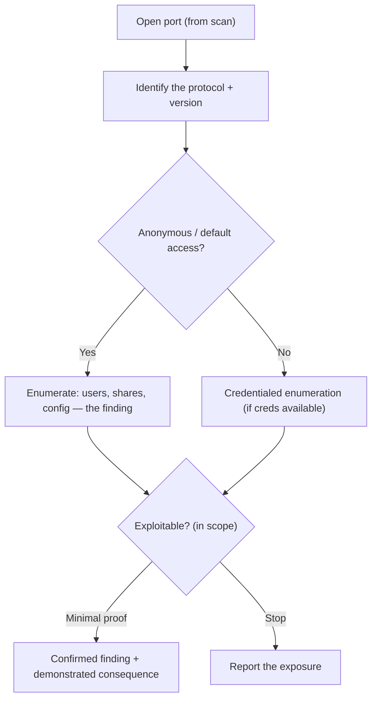

# 🛎️ Service Enumeration

> [!warning] Authorized simulation only
> Enumeration interrogates live services and can trigger lockouts or overload fragile ones. Enumerate only in-scope hosts, throttle authentication probes, and stop at proof — enumerating a share is a finding; exfiltrating its contents is exploitation.

## Parent Learning Order
External Network Pentesting -> Service Enumeration -> Layer 2 & 3 Network Attacks -> Remote Access Security Testing -> Internal Network Pentesting

## Start at Zero: An Open Port Is a Question, Not an Answer

Port scanning told you a port is *open*. **Service enumeration** is the deeper interrogation that turns "port 445 is open" into "this is Windows SMB, signing is disabled, and here are the shares and users it will tell me about." It is where most of a network pentest's actual findings come from, because services are chatty — designed to answer questions, and often willing to answer *too many* to an unauthenticated stranger.

The mindset: every open service is a small program with a protocol, and that protocol has queries that leak information — versions, users, shares, configuration, and sometimes credentials. Enumeration is the systematic asking of those queries. The best findings are not exploits at all; they are services misconfigured to reveal what they should not.

> [!tip] The analogy, and where it breaks
> Enumeration is like interviewing a receptionist who is trained to be helpful — you ask "who works here?", "which rooms are available?", and a well-meaning receptionist tells you far more than they should. The analogy breaks because a service never gets suspicious or tired: it answers the ten-thousandth query identically, so enumeration is exhaustive in a way no human interview could be.

**Prerequisites:** port scanning and version detection (the active-recon leaf), which produce the open-service list this leaf interrogates.

## The Enumeration Playbook by Service

Each common service has a characteristic set of "tell me about yourself" queries. The high-value ones:

| Service | Port | What enumeration reveals |
| --- | --- | --- |
| **SMB** | 445 | Shares, users, password policy, OS version, signing status |
| **LDAP / AD** | 389/636 | Users, groups, computers, domain policy (the AD goldmine) |
| **SNMP** | 161 | Full device config if the community string is default (`public`) |
| **DNS** | 53 | Records, zone transfer (from the DNS-recon leaf) |
| **SMTP** | 25 | Valid usernames (via `VRFY`/`RCPT`), mail server software |
| **NFS** | 2049 | Exported shares, often world-readable |
| **RPC** | 135 | Services, endpoints, and a path to further SMB/AD enumeration |

The universal pattern is **anonymous or default-credential access**. SMB null sessions, SNMP `public`, LDAP anonymous bind, NFS `no_root_squash` — each is a service configured to answer an unauthenticated attacker, and each is a finding on its own before any exploitation.

## SMB: The Enterprise Enumeration Workhorse

On an internal Windows network, SMB (445) is where enumeration begins because it leaks so much:

```bash
# enumerate a target's SMB: OS, signing, and shares (against your own lab host)
smbclient -L //10.20.0.10 -N 2>/dev/null | head -8 || echo "smbclient not installed; nmap smb-enum-shares is the equivalent"
```

```text
        Sharename       Type      Comment
        ---------       ----      -------
        ADMIN$          Disk      Remote Admin
        C$              Disk      Default share
        backups         Disk
        IPC$            IPC       Remote IPC
```

The `-N` (null session, no password) listed the shares anonymously — itself the finding: an unauthenticated user should not see the share list. `backups` as a non-default share is exactly what an attacker investigates next. **SMB signing status** is the other key SMB finding — if signing is disabled, the network is vulnerable to relay attacks (covered in the AD leaves).

## The Escalation From Enumeration to Exploitation

Enumeration flows naturally into exploitation, and the boundary is the ethical line:

- **Enumeration (safe):** listing shares, users, versions — reading what the service volunteers.
- **Exploitation (scope-gated):** reading a share's *contents*, cracking an enumerated user's password, triggering a version's CVE.

The finding is usually the enumeration result plus the *demonstrated but not fully exercised* consequence: "anonymous SMB access lists a `backups` share containing files named `*.bak`" — proven by listing, not by downloading and reading customer data. This is the minimal-evidence discipline applied to services.



## Failure Modes and Interpretation

- **Account lockout.** SMTP/SMB user enumeration that drifts into password guessing can lock out real users — a denial of service. Keep enumeration and authentication testing separate and throttled.
- **Fragile services.** SNMP walks and aggressive RPC enumeration can hang old devices. Match intrusiveness to the target.
- **Over-reading.** Listing a share is enumeration; downloading its files is exploitation and may expose real data. Stop at the listing unless content access is explicitly authorized and necessary.
- **False negatives from credentials.** Anonymous enumeration finds less than credentialed; a service that reveals nothing anonymously may be wide open with a low-privilege account. Report the difference, don't conclude "secure" from an anonymous null result.
- **Version-banner deception.** As with scanning, an enumerated version may be backported-patched. Enumeration identifies the *candidate*; verification confirms it.

## Security Implications — Detection & Defense

- **Anonymous access is the systemic control gap.** The single most impactful hardening is disabling anonymous/null access everywhere — SMB null sessions, SNMP default communities, LDAP anonymous bind, NFS world exports. Each closure removes a whole enumeration channel.
- **Enumeration is detectable.** A burst of SMB session setups, LDAP queries, or SNMP walks from one host is anomalous and logged — internal network monitoring catches it, which is why noisy enumeration is a red-team tradeoff.
- **Least information by default.** Services should be configured to reveal the minimum to unauthenticated users; verbose banners, full user lists, and world-readable shares are configuration choices, not necessities.
- **SMB signing and modern protocol versions** close the relay and downgrade paths that enumeration findings feed into — a key AD-security hardening.
- **The defender's enumeration is the audit.** Running these same anonymous queries against your own estate finds the world-readable share and the `public` SNMP string before an attacker does.

## Authorized Lab: Enumerate a Service You Build

> [!info] Runs on one Linux machine — builds an SMB server with an over-shared config in a container-free local Samba, or a netns HTTP stand-in
> The lab uses a loopback service so enumeration targets only you. Step 5 removes it.

### Step 1 — Build a service that leaks (a simple enumerable HTTP "service directory")

```bash
mkdir -p /tmp/enumlab/backups /tmp/enumlab/public
echo "customer-2026.bak" > /tmp/enumlab/backups/customer-2026.bak
echo "brochure.pdf" > /tmp/enumlab/public/brochure.pdf
cd /tmp/enumlab && python3 -m http.server 8099 --bind 127.0.0.1 &>/dev/null &
sleep 1; echo "enumerable service up on 127.0.0.1:8099 (directory listing enabled = the misconfig)"
```

```text
enumerable service up on 127.0.0.1:8099 (directory listing enabled = the misconfig)
```

### Step 2 — Anonymous enumeration: what does it volunteer?

```bash
curl -s "http://127.0.0.1:8099/" | grep -oE 'href="[^"]*"' | sed 's/href=//'
```

```text
"backups/"
"public/"
```

Unauthenticated, the service listed its directories — the enumeration finding. A `backups/` directory is exactly what an attacker investigates first.

### Step 3 — Follow the enumeration one level (still just listing)

```bash
curl -s "http://127.0.0.1:8099/backups/" | grep -oE 'href="[^"]*"' | sed 's/href=//'
```

```text
"customer-2026.bak"
```

Enumeration revealed a sensitively-named file *without downloading it*. The finding: "anonymous access lists a backups directory containing `customer-2026.bak`." Proven by listing — the minimal evidence.

### Step 4 — The ethical stop line

```bash
echo "Enumeration found: backups/customer-2026.bak exists and is listable anonymously."
echo "DOWNLOADING and reading it = exploitation (real data exposure). Stop here unless explicitly authorized."
echo "The finding is the exposure, proven by the listing above."
```

```text
Enumeration found: backups/customer-2026.bak exists and is listable anonymously.
DOWNLOADING and reading it = exploitation (real data exposure). Stop here unless explicitly authorized.
The finding is the exposure, proven by the listing above.
```

### Step 5 — Cleanup

```bash
kill %1 2>/dev/null; cd /tmp && rm -rf /tmp/enumlab; wait 2>/dev/null; ls -d /tmp/enumlab 2>&1
```

```text
ls: cannot access '/tmp/enumlab': No such file or directory
```

**What you should now be able to do:** interrogate a service beyond "open," recognize anonymous/default access as the systemic finding, enumerate to the point of proof without exploiting, and distinguish enumeration (listing) from exploitation (reading contents).

## Crook → Operator → Root Checkpoint

- **Crook:** Explain why an open port is a question, not an answer, and what enumeration adds beyond port scanning.
- **Operator:** Enumerate SMB/LDAP/SNMP for shares, users, and config; recognize anonymous access as a finding; and stop at listing rather than reading contents.
- **Root:** Explain why disabling anonymous/null access closes whole enumeration channels, how enumeration flows into exploitation and where the ethical line sits, and why SMB signing status is a relay-attack precursor.

---
> 🔼 Up: [[Network Penetration Testing]]
