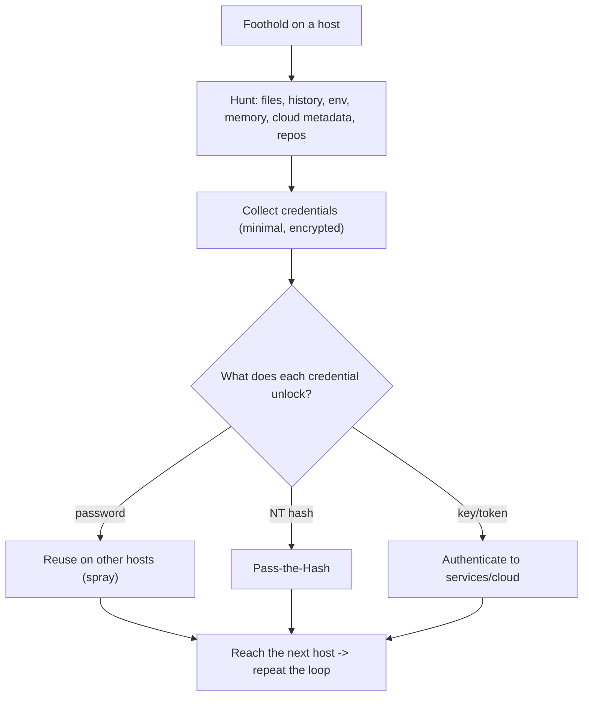

# 🔑 Credential Access & Secret Hunting

> [!warning] Authorized simulation only
> Harvesting credentials touches real secrets. On an engagement, collect only what proves the finding, store it encrypted, and destroy it at close. In the lab here, all secrets are canaries you plant. Test only in-scope systems.

## Parent Learning Order
Credential Access & Secret Hunting -> Local Privilege Escalation -> Persistence Techniques -> Pivoting & Tunneling -> Data Collection & Post-Exploitation Cleanup

## The First Thing You Do After Landing

> *You have a foothold and want credentials. Where do you look first?*
>
> Hold your answer — the section below is the response.

You have a foothold — one compromised host or account. **Credential access** is the first post-exploitation move, because credentials are the currency of lateral movement: every password, hash, token, or key you find is a potential key to *another* system. The whole internal-compromise cascade (from the internal-pentest leaf) runs on this loop — land, harvest credentials, use them to reach the next host, repeat. So a post-exploitation operator is, above all, a *secret hunter*.

Secrets hide everywhere because developers and admins store them for convenience: config files, environment variables, memory, browser stores, cloud metadata, command history, and code. The skill is knowing the dozen predictable places and checking them systematically — most credential access is not exotic memory magic, it is reading files that should never have contained a password.

> [!tip] The analogy, and where it breaks
> Secret hunting is like searching a house for spare keys — under the mat, in the drawer, taped under the desk — because people hide keys where they are convenient, not where they are safe. The analogy breaks on copies: a physical key is one object, whereas a found credential can be *reused across thousands of doors simultaneously* and often unlocks systems its owner never imagined, because password reuse and over-scoped service accounts are rampant.

**Prerequisites:** the internal-pentest credential-reuse concept, and the OS Internals credential-storage leaves (LSASS, keychains, `/etc/shadow`).

**The deliberate break:** credential access means dumping LSASS. That is the technique everyone learns, the one EDR watches hardest, and the one most likely to end your engagement loudly.

Most credentials found on a real host were never in memory. They are in a deployment script, a `web.config`, a `.env` committed beside the code, a scheduled task's command line, PowerShell history, a saved RDP or WinSCP profile, an unattended install file, Group Policy Preferences, a CI job log, or the browser's own password store. None of that requires touching a protected process, and none of it generates the telemetry LSASS access does.

The ordering follows: **search the filesystem before you touch memory**. It is quieter, it is faster, and it is where the credential usually is — and if the finding is "the domain admin password is in a share-readable script," that is a better report entry than a memory dump anyway, because the fix is obvious and the client can verify it.

**How you'd spot the good targets:** anywhere a human had to write a password down for a machine to use it later — automation, deployment, backup, monitoring. Those four categories account for most of what you will find.

## Where Secrets Live: The Hunt Map

| Location | What you find |
| --- | --- |
| **Config files** | DB connection strings, API keys, hardcoded passwords |
| **Environment variables** | Injected secrets (`env`, `/proc/<pid>/environ`) |
| **Memory** | Cleartext creds and tokens (LSASS on Windows, process memory) |
| **Command history** | Passwords typed on the command line (`.bash_history`) |
| **Browser/credential stores** | Saved passwords, cookies, tokens |
| **Cloud metadata** | Temporary cloud credentials (the SSRF target, reachable locally on an instance) |
| **Code repos / CI** | Secrets in source, commit history, pipeline variables |
| **Files at rest** | `.pem`, `.ppk`, `id_rsa`, `.kdbx`, `*.config` |

The highest-yield are **config files and command history** — because they are plaintext and predictable. A grep for `password=` across a filesystem, or reading `.bash_history`, finds credentials on a startling fraction of real hosts.

```bash
# hunt for secrets in common file locations (on a foothold you control / your lab)
grep -rEi 'password|secret|api[_-]?key|token' /etc /opt /home 2>/dev/null | grep -vE '\.md:|#' | head -3
```

```text
/opt/app/config.ini:db_password=CANARY-DB-PASS
/home/deploy/.bash_history:mysql -u root -pCANARY-ROOT-PW
/etc/app/settings.env:API_KEY=CANARY-APIKEY-99
```

Three secrets from three predictable places — a config file, shell history, and an env file. Each is a candidate key to another system. This one grep is the backbone of secret hunting, and its yield on real hosts is the reason config hygiene matters so much.

## Memory and Token Access

Beyond files, live credentials sit in memory. On Windows, **LSASS** holds authentication material (the OS Internals Windows Identity leaf) — dumping it yields hashes and sometimes cleartext, feeding Pass-the-Hash. On Linux, process memory and environment (`/proc/<pid>/environ`) can leak secrets a service was started with. **Cloud instances** expose temporary credentials via the metadata endpoint, readable locally without any exploit — the same endpoint SSRF targets remotely.

The pattern across all of these: the operating system *keeps credentials usable* so users need not re-enter them, and that convenience is exactly what the attacker harvests. Defenses (Credential Guard, protected process light, not storing secrets in env) attack this convenience.



## Collecting enough to prove it, and no more

- **Over-collection.** Harvesting every secret and real data is exploitation and a privacy risk. Collect what proves the finding and the path; store encrypted; destroy at close.
- **Stale/decoy credentials.** A found credential may be expired or a honeytoken (a deliberate trap — see detection). Test carefully; a honeytoken login alerts the defender.
- **Scope of a credential.** A harvested credential may work far beyond its intended system (reuse) or be tightly scoped. Determine its reach before assuming domain-wide impact.
- **Memory access needs privilege.** Dumping LSASS or another process's memory usually requires elevated rights — often you must escalate first (next leaf), so credential access and privesc interleave.
- **Noise.** Broad filesystem greps and memory dumps generate telemetry (file access, process access to LSASS). A real red team is targeted; an assessment coordinates.

## Security Implications — Detection & Defense

- **Do not store secrets in files/env/history.** The dominant fix: use a secrets manager (vault) with short-lived, audited credentials, never plaintext config or hardcoded keys. This removes the hunt's highest-yield targets.
- **Protect memory credentials:** Credential Guard and LSASS protection (Windows), and not passing secrets via environment to child processes, close the memory channel.
- **Short-lived, scoped credentials** limit a harvested secret's value — a token that expires in an hour and is scoped to one service is far less useful than a static admin password.
- **Honeytokens** turn credential hunting against the attacker: a planted fake credential that alerts on use reveals the intruder the moment they try it — a high-signal detection.
- **Detection:** LSASS access by unusual processes, mass file reads matching secret patterns, and honeytoken use are the signals; disabling command-line password entry and auditing `.bash_history` reduce both exposure and forensic gaps.

## Summary

You should now be able to:

- Explain why credential access is the first post-exploitation move and why secrets hide in convenient-not-safe places.
- Hunt secrets across files/history/env/memory/cloud-metadata, and reason about each credential's reach for the lateral-movement loop.
- Explain why secrets managers and short-lived scoped credentials remove the hunt's highest-yield targets, how Credential Guard closes the memory channel, and how honeytokens turn credential hunting into a detection.

---
> 🔼 Up: [[Post-Exploitation & Persistence]]
