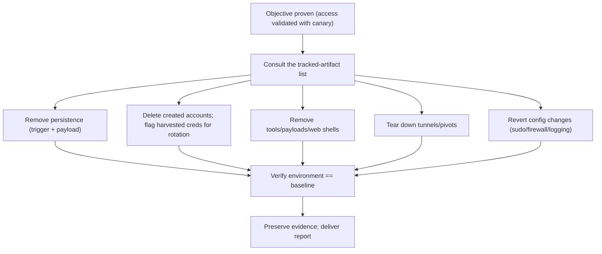

# 🧹 Data Collection & Post-Exploitation Cleanup

> [!warning] Authorized simulation only
> This leaf covers proving impact *without* exfiltrating real data, and the mandatory teardown that leaves the environment exactly as you found it. Access only canary data; never copy real sensitive data off a client system. Cleanup is not optional — it is part of the engagement.

## Parent Learning Order
Credential Access & Secret Hunting -> Local Privilege Escalation -> Persistence Techniques -> Pivoting & Tunneling -> Data Collection & Post-Exploitation Cleanup

## Start at Zero: Proving Impact, Then Erasing Your Footprint

The whole point of an engagement is to demonstrate *business impact*: "an attacker could reach and read your crown-jewel data." This leaf covers the final two post-exploitation responsibilities. First, **data collection / access validation** — proving you *could* access the sensitive data, without actually stealing it. Second, **cleanup and evidence handling** — removing every artifact you created (tools, accounts, persistence, tunnels) and preserving the evidence you need for the report, so the environment is left exactly as you found it.

These belong together because they are the *end* of the operation, and they share one principle: **prove and record, don't damage.** An assessment that dumps a real customer database has itself become a breach; an assessment that leaves a forgotten backdoor has made the client *less* secure. A professional operator demonstrates the impact with a benign marker and departs leaving no trace but the report.

> [!tip] The analogy, and where it breaks
> This is like a hired security tester who reaches the vault, photographs the open door to prove they got in, takes nothing, and then re-locks every door and removes their tools on the way out. The analogy breaks on evidence: unlike a physical tester, the operator must also carry out a careful *record* (timestamps, screenshots, hashes of artifacts) that stands up in a report and a possible dispute — proof of impact and proof of clean departure both have to be documented, not just performed.

**Prerequisites:** all prior post-exploitation leaves (you have escalated, harvested credentials, pivoted); the Reporting domain's evidence standards.

## Access Validation: Prove, Don't Steal

The skill is demonstrating access to sensitive data while collecting the *minimum* needed to prove it. Instead of exfiltrating a database, you show you could — by reading a single canary record, capturing a row count, or hashing a file — and documenting that. This proves impact to the client while respecting the boundary that real exfiltration is a breach, not a test.

| Do (proof) | Don't (real exfiltration) |
| --- | --- |
| Read one canary/marker record | Dump the whole table |
| Record a row count / schema | Copy the database off-host |
| Screenshot access to a file | Download real PII/financials |
| Hash a sensitive file to prove reach | Transfer real sensitive data externally |

```bash
# access validation: prove you can reach the "sensitive" store by reading ONLY a canary marker + a count
sqlite3 /tmp/crown.db "SELECT value FROM secrets WHERE label='CANARY'; SELECT 'rows_total='||count(*) FROM secrets;" 2>/dev/null
```

```text
CANARY-CROWN-JEWEL-PROOF
rows_total=5000
```

That output proves the point completely: you read a canary record *and* established the store holds 5000 rows — demonstrating full access — without copying a single real record. The row count and canary read are the evidence; the 5000 real rows stay untouched.

## Cleanup: Leave No Trace but the Report

Cleanup reverses everything the engagement created, in a disciplined sweep across every prior leaf:

1. **Persistence** — remove every mechanism planted (cron/services/tasks/run-keys/SSH keys), verifying both trigger and payload are gone.
2. **Accounts & credentials** — delete any accounts created; note (for rotation) any credentials harvested so the client can reset them.
3. **Tools & payloads** — remove uploaded binaries, scripts, web shells, and staged files.
4. **Tunnels & pivots** — tear down every forward/SOCKS proxy so no path remains open.
5. **Configuration** — revert any setting you changed (sudo rules, firewall exceptions, disabled logging).

The guiding rule is a **tracked artifact list**: you cannot clean up what you did not record, so disciplined operators log every change *as they make it*. The cleanup is then a checklist-driven reversal, and the report documents what was created, proven, and removed.



## Failure Modes and Interpretation

- **Real exfiltration.** Copying actual sensitive data is a breach you caused — the single worst engagement error. Always prove with a canary/count/hash, never the real data.
- **Incomplete cleanup.** A forgotten web shell, cron job, tunnel, or added account leaves the client *less secure than before*. Only a tracked-artifact list makes complete cleanup possible.
- **Untracked changes.** If you didn't record a change when you made it, you will forget it at cleanup. Discipline during the operation, not just at the end, is what enables clean departure.
- **Evidence gaps.** Cleaning up before capturing the evidence (screenshots, hashes, timestamps) destroys your ability to prove the finding — capture proof *before* you remove the artifact.
- **Destroying logs.** Deleting system logs to "clean up" is anti-forensic and usually out of scope — you remove *your artifacts*, not the client's evidence of what happened.

## Security Implications — Detection & Defense

- **Data-centric controls prove their worth here:** encryption at rest, tokenization, and strict access control on crown-jewel data mean that even full host compromise yields ciphertext or tokens, not usable records — the access-validation step becomes far less impactful.
- **Data-loss prevention (DLP) and egress monitoring** detect and block real exfiltration — large or unusual outbound data transfers are the signal, and they are exactly why proof-not-exfiltration is also the *stealthier* choice.
- **Honeytokens in data stores** (a canary record that alerts when read) turn access validation into a detection — the defender learns the crown jewels were reached.
- **Detection of cleanup gaps:** post-engagement, defenders should verify no new accounts, services, tasks, or keys remain — a good client audits the environment against baseline after a test, catching anything an operator missed.
- **Immutable/forwarded logs** ensure that even a careless or malicious actor cannot erase the record of what happened — logs shipped off-host in real time survive local cleanup.

## Authorized Lab: Validate Access to Canary Data, Then Clean Up

> [!info] Runs on one Linux machine — a canary "crown-jewel" store, an access-validation proof, and a full tracked cleanup
> The data store contains only synthetic rows plus one canary marker. Step 5 removes everything and verifies baseline.

### Step 1 — Create a canary crown-jewel data store and track it

```bash
echo "created: /tmp/crown.db" >> /tmp/artifact-list.txt
sqlite3 /tmp/crown.db "CREATE TABLE secrets(id INTEGER, label TEXT, value TEXT);
INSERT INTO secrets VALUES (0,'CANARY','CANARY-CROWN-JEWEL-PROOF');
WITH RECURSIVE c(x) AS (SELECT 1 UNION ALL SELECT x+1 FROM c WHERE x<4999) INSERT INTO secrets SELECT x,'record','synthetic-'||x FROM c;"
echo "canary store built with 1 canary + 4999 synthetic rows; artifact tracked"
```

```text
canary store built with 1 canary + 4999 synthetic rows; artifact tracked
```

### Step 2 — Validate access WITHOUT exfiltrating (proof only)

```bash
sqlite3 /tmp/crown.db "SELECT value FROM secrets WHERE label='CANARY'; SELECT 'rows_total='||count(*) FROM secrets;"
```

```text
CANARY-CROWN-JEWEL-PROOF
rows_total=5000
```

Full access demonstrated — a canary read plus a total count — while copying zero real records. This is the professional proof-of-impact.

### Step 3 — Capture evidence BEFORE cleanup

```bash
{ echo "PROOF $(date -u +%FT%TZ): read CANARY marker + counted 5000 rows in /tmp/crown.db (access validated, no exfiltration)"; } >> /tmp/evidence.txt
sha256sum /tmp/crown.db | awk '{print "store_hash="$1}' >> /tmp/evidence.txt
tail -2 /tmp/evidence.txt
```

```text
PROOF <timestamp>: read CANARY marker + counted 5000 rows in /tmp/crown.db (access validated, no exfiltration)
store_hash=<sha256>
```

Evidence (timestamp + hash) is recorded *first* — because Step 4 will destroy the artifact, and un-captured proof is lost proof.

### Step 4 — Clean up using the tracked-artifact list

```bash
echo "[cleanup] reversing tracked artifacts:"; cat /tmp/artifact-list.txt
rm -f /tmp/crown.db
echo "removed /tmp/crown.db"
```

```text
[cleanup] reversing tracked artifacts:
created: /tmp/crown.db
removed /tmp/crown.db
```

### Step 5 — Verify baseline restored (evidence preserved)

```bash
ls /tmp/crown.db 2>&1 | tail -1
rm -f /tmp/artifact-list.txt   # tracking file removed; evidence.txt is KEPT for the report
echo "evidence retained:"; ls /tmp/evidence.txt
rm -f /tmp/evidence.txt        # (lab teardown; in a real engagement this is delivered, not deleted)
```

```text
ls: cannot access '/tmp/crown.db': No such file or directory
evidence retained:
/tmp/evidence.txt
```

**What you should now be able to do:** validate access to sensitive data with a canary/count/hash instead of exfiltration, capture evidence before removing artifacts, drive a complete cleanup from a tracked-artifact list across persistence/accounts/tools/tunnels/config, and name encryption-at-rest, DLP, honeytokens, and post-engagement baseline audits as the defenses.

## Crook → Operator → Root Checkpoint

- **Crook:** Explain why proof-of-impact must not become real exfiltration, and why leaving artifacts behind makes a client less secure.
- **Operator:** Validate access to a canary data store without exfiltration, capture evidence first, then fully clean up from a tracked-artifact list.
- **Root:** Explain why encryption-at-rest/tokenization and DLP blunt data collection, how honeytokens and post-engagement baseline audits detect access and cleanup gaps, and why immutable/forwarded logs survive any local cleanup.

---
> 🔼 Up: [[Post-Exploitation & Persistence]]
