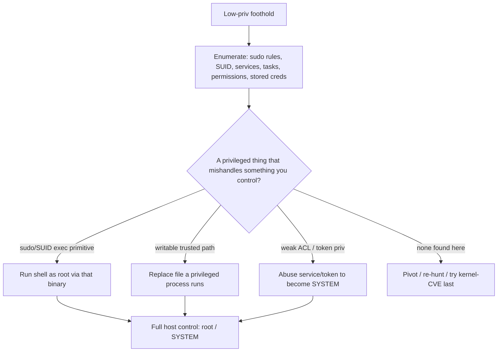

# ⬆️ Local Privilege Escalation

> [!warning] Authorized simulation only
> Escalation gives you control of the whole host. Test only on lab machines or systems in scope, prove with a benign marker (a canary root-only file), and restore any change. Never escalate on a system you are not authorized to fully control.

## Parent Learning Order
Credential Access & Secret Hunting -> Local Privilege Escalation -> Persistence Techniques -> Pivoting & Tunneling -> Data Collection & Post-Exploitation Cleanup

## From a User to an Owner of the Host

> *You need root on this host. Do you go looking for a kernel exploit?*
>
> Hold your answer — the section below is the response.

You landed as a low-privileged user — a web-app service account, a standard user, an unprivileged shell. **Local privilege escalation (privesc)** is turning that limited foothold into full control of the *same machine*: `root` on Linux, `SYSTEM`/Administrator on Windows. It matters because a low-priv foothold is fragile and limited — you cannot read other users' secrets, dump memory credentials (previous leaf needs privilege), install durable persistence, or fully control the host. Escalation removes those limits, and it is almost always a required step in the post-exploitation chain.

The core idea is identical on both operating systems even though the mechanisms differ: **find something privileged that mishandles something you control.** A program running as root that trusts a file you can write; a service running as SYSTEM whose binary path you can replace; a misconfigured permission that lets you act above your level. Privesc is the systematic hunt for these misconfigurations, and — like secret hunting — most of it is enumeration, not exotic exploits.

> [!tip] The analogy, and where it breaks
> Privesc is like being a store clerk who finds the manager's override card left in an unlocked drawer — you were given limited authority, but a mishandled privileged capability lets you act as the manager. The analogy breaks on breadth: a real override card does one thing, whereas host-level escalation gives you *everything at once* — every file, every user's session, the credential store, and the ability to make the takeover permanent.

**Prerequisites:** the OS Internals privilege-model leaves (Linux users/SUID/sudo, Windows tokens/services/UAC) — this leaf is the *pentest methodology* that exploits those mechanisms; the mechanisms themselves live in OS Internals.

**The deliberate break:** privilege escalation means finding a kernel exploit for the host's version. It is the first thing most people reach for and very close to the last thing they should.

The overwhelming majority of real escalations are **misconfigurations** — something on the box was set up to trust you more than intended. A SUID binary that will run a command of your choosing. A `sudo` rule that permits one program with a documented escape. A service running as SYSTEM whose executable path is writable, or unquoted. A scheduled task pointing at a directory you can write to. None of these are bugs in anything; they are decisions, and they are far more common than an unpatched kernel because they accumulate silently.

Kernel exploits also carry a cost the alternatives do not: they are **unstable**, and a failed one panics the host. On an engagement that is a production outage you caused, on an asset you were trusted with. Enumerate first, exploit the kernel last, and often never.

**How you'd spot the vector:** ask what runs with more privilege than you *and* takes input you control — a path, an argument, a file, a directory entry. That intersection is the whole search space, and it is small enough to enumerate by hand.

## The Two Escalation Surfaces

Escalation vectors sort into a small number of recurring categories, which map across both OSes:

| Category | Linux example | Windows example |
| --- | --- | --- |
| **Misconfigured privileged execution** | `sudo` rules, SUID binaries | Service running as SYSTEM you can influence |
| **Writable path a privileged process trusts** | Writable script run by root cron | Unquoted service path, writable service binary |
| **Weak permissions on privileged objects** | World-writable `/etc/passwd`-adjacent files | Weak service/registry ACLs (`AlwaysInstallElevated`) |
| **Credential reuse / stored secrets** | Password in root-owned config you can read | Cached creds, autologon in registry |
| **Kernel / software exploit** | Vulnerable kernel or setuid program | Vulnerable driver / unpatched local CVE |

The first two categories — **misconfigured privileged execution and writable trusted paths** — are by far the most common in real assessments, because they arise from ordinary admin convenience, not exotic bugs. This is why *enumeration* (systematically listing sudo rules, SUID binaries, service permissions, scheduled tasks) is the heart of privesc, not memorizing exploits.

```bash
# Linux privesc enumeration: what can this user run as root, and what is SUID?
sudo -l 2>/dev/null | grep -A2 'may run'; echo '---'; find / -perm -4000 -type f 2>/dev/null | head -3
```

```text
User svc may run the following commands on host:
    (root) NOPASSWD: /usr/bin/find
---
/usr/bin/sudo
/usr/bin/passwd
/usr/bin/find
```

That `sudo -l` output is the finding: `svc` may run `find` as root with no password. `find` can execute commands (`-exec`), so this is a direct path to root — a classic misconfigured-privileged-execution vector, found purely by enumeration.

## Exploiting a Vector: sudo find → root

When a binary that can execute other commands is allowed via sudo, escalation is immediate — you make that binary run a shell as the privilege it holds. This *GTFOBins* pattern (living-off-the-land binaries with an escalation primitive) recurs constantly.

```bash
# 'find' allowed as root can spawn a root shell via its -exec primitive (lab)
sudo find . -maxdepth 0 -exec whoami \; 2>/dev/null
```

```text
root
```

`whoami` returned `root` — executed through the sudo-allowed `find`. The proof stops at running `whoami` (a benign marker); a real escalation would spawn a full root shell. The Windows equivalents (replacing a writable service binary, exploiting an unquoted service path, or abusing `SeImpersonatePrivilege` with a "potato" technique to become SYSTEM) follow the same shape: a privileged execution context plus something you control.



## Why kernel exploits come last

- **Enumeration first, exploits last.** Reaching for a kernel exploit before checking sudo/SUID/services is backwards — kernel exploits are unstable (can crash the host) and are the *last* resort. Most escalations are misconfigurations.
- **A vector may be a rabbit hole.** A SUID binary or sudo rule may have no escalation primitive; verify the binary actually gives you execution (check GTFOBins) before spending time.
- **Escalation can crash the host.** Kernel/driver exploits and racey techniques can panic a production system — coordinate, and prefer misconfiguration vectors.
- **Windows privilege names matter.** `SeImpersonatePrivilege`, `SeBackupPrivilege`, etc. each enable specific techniques; read the token privileges (`whoami /priv`) rather than guessing.
- **Context of the finding.** Root on one host is not domain compromise — escalation is local; lateral movement (later leaves) is what spreads it. Report the scope accurately.

## Security Implications — Detection & Defense

- **Least privilege is the fix.** Tight sudo rules (no wildcards, no shell-capable binaries), no unnecessary SUID bits, correct service/registry ACLs, and quoted service paths remove the common vectors at the source.
- **Patch promptly** to close kernel and local-CVE escalation, and remove vulnerable drivers.
- **Harden the convenience features attackers abuse:** disable `AlwaysInstallElevated`, remove stored/autologon credentials, and audit scheduled tasks and writable paths in privileged execution.
- **Detection:** a low-priv process suddenly spawning a root/SYSTEM shell, unusual use of sudo/SUID binaries, service binary modifications, and token-manipulation patterns are the signals; command-line and process-lineage logging (a web service spawning a shell as root) catches most escalations.
- **Constrain foothold accounts:** running web/app services as dedicated low-priv accounts with no sudo and minimal filesystem write access limits what a foothold can escalate through.

## Summary

You should now be able to:

- Explain why a low-priv foothold is limited and what full host control (root/SYSTEM) unlocks.
- Enumerate sudo/SUID/service/permission vectors and escalate through a misconfiguration to a benign privileged proof.
- Explain why misconfigurations (not kernel exploits) are the common path, why enumeration precedes exploitation, and how least privilege, correct ACLs, and process-lineage detection defeat local escalation.

---
> 🔼 Up: [[Post-Exploitation & Persistence]]
