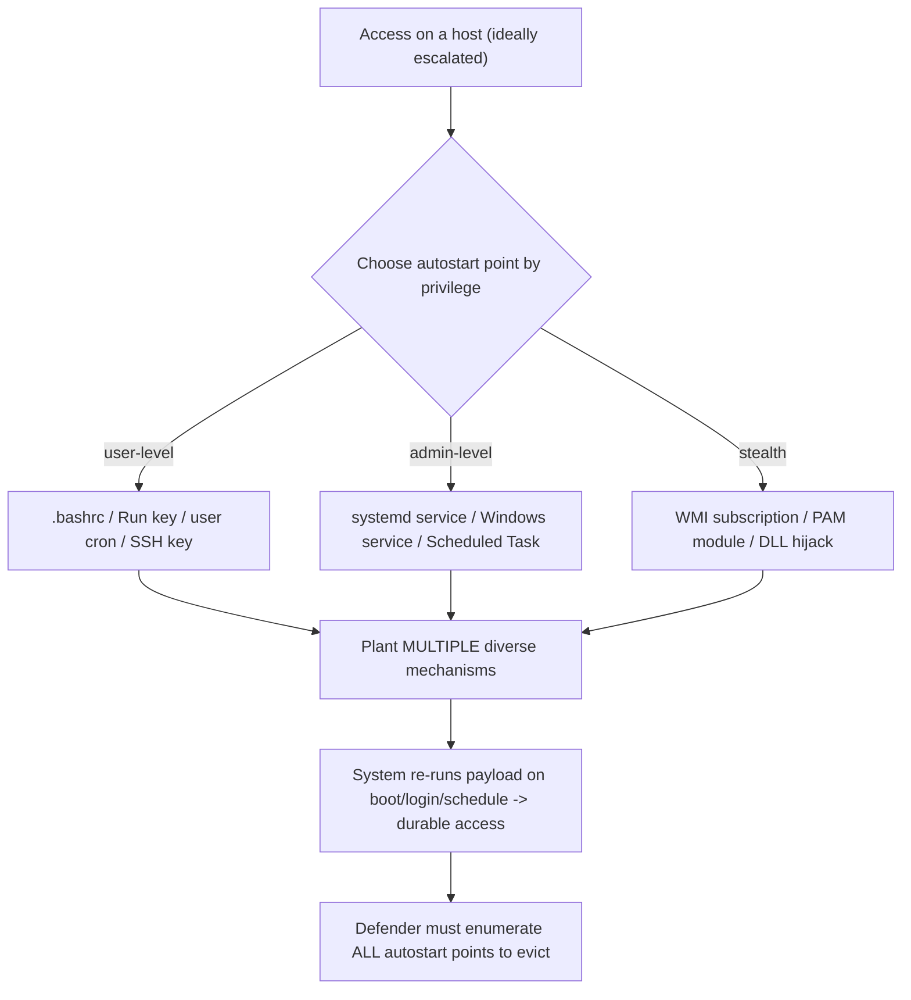

# ⚓ Persistence Techniques

> [!warning] Authorized simulation only
> Persistence deliberately survives reboots and cleanup — so it is easy to leave behind by accident. Track every persistence mechanism you create, prove it with a benign marker, and remove all of it at engagement close. Test only on lab or in-scope hosts.

## Parent Learning Order
Credential Access & Secret Hunting -> Local Privilege Escalation -> Persistence Techniques -> Pivoting & Tunneling -> Data Collection & Post-Exploitation Cleanup

## Making Access Survive

> *You have a shell. The machine reboots. What now?*
>
> Hold your answer — the section below is the response.

A foothold is temporary: the machine reboots, the vulnerable process restarts, a defender kills your session, and you are locked out. **Persistence** is planting a mechanism that re-establishes your access *automatically* after those events — so a single successful compromise keeps paying off without re-exploiting anything. It is what separates a momentary intrusion from a durable one, and on a real assessment it demonstrates a critical impact: that an attacker who got in *once* can stay in.

The universal idea is simple: **hook something the system runs on its own** — on boot, on a schedule, on login, or when a service starts — and make it run your code. Every operating system has many such automatic-execution points, and persistence is the craft of choosing one that is reliable, matches your privilege level, and blends in. Higher privilege (from the escalation leaf) unlocks stealthier, more durable persistence; a low-priv foothold can still persist in user-scoped locations.

> [!tip] The analogy, and where it breaks
> Persistence is like hiding a spare key and also bribing the building's automatic door to reopen for you every morning — even after the locks are "changed," the system itself lets you back in on schedule. The analogy breaks on multiplicity and detectability: a real attacker plants *several* independent mechanisms so removing one doesn't evict them, and unlike a hidden key, each mechanism is a *configuration change* that leaves a forensic trace a defender can hunt for.

**Prerequisites:** the OS Internals leaves on Linux services/cron/systemd and Windows services/scheduled tasks/registry-run keys; local privilege escalation (privilege determines which persistence is available).

## The Automatic-Execution Points

Persistence maps to the OS's legitimate autostart mechanisms — the same features admins use, abused:

| Trigger | Linux | Windows |
| --- | --- | --- |
| **On boot / service start** | systemd unit, init script | Windows service, driver |
| **On a schedule** | cron job, systemd timer | Scheduled Task |
| **On user login** | `.bashrc`/profile, autostart `.desktop` | Run/RunOnce registry keys, Startup folder |
| **On another event** | PAM module, SSH `authorized_keys` | WMI event subscription, DLL hijack |
| **Credential-based** | added SSH key / new user | new local account, cached cred |

**Scheduled execution (cron / Scheduled Tasks)** and **login hooks (registry Run keys / `.bashrc`)** are the most common because they are reliable and available at modest privilege. The stealthier options (WMI subscriptions, PAM modules, service/driver installs) require more privilege but blend into legitimate configuration better. The defender's job is the mirror image: enumerate every autostart point and spot the illegitimate entry.

```bash
# a low-priv, reliable Linux persistence: a cron job that re-runs your payload every minute
(crontab -l 2>/dev/null; echo '* * * * * /tmp/.canary-persist.sh') | crontab -
crontab -l | tail -1
```

```text
* * * * * /tmp/.canary-persist.sh
```

That single cron line means the system itself re-runs your script every minute — surviving your shell dying or a reboot. The Windows equivalent, a Run key or Scheduled Task, achieves the same automatic re-execution on login/boot.

## Reliability, Privilege, and Stealth Tradeoffs

Choosing a mechanism is a three-way tradeoff:

- **Reliability** — does it survive reboot? A memory-only implant does not; a systemd service does.
- **Privilege** — a system-wide service needs root/SYSTEM; a `.bashrc` or user Run key works as a normal user but only triggers for that user.
- **Stealth** — a new obvious cron job is easy to find; a WMI event subscription or a modified legitimate service is harder. Naming a malicious service to mimic a real one ("Windows Update Helper") is a classic blend-in.

Real intrusions plant **multiple, diverse mechanisms** so that removing one (the defender finds the cron job) does not evict them (the systemd timer and the added SSH key remain). This redundancy is exactly why eradication is hard and why defenders must enumerate *all* autostart points, not stop at the first find.



## Every mechanism you plant, you must remove

- **Leaving persistence behind.** This is the cardinal engagement risk — every mechanism you plant must be logged and removed at close, or you have created a real backdoor. Track meticulously.
- **Privilege mismatch.** Installing a system service without SYSTEM/root fails; a user-only hook won't trigger for other users or at boot. Match the mechanism to your privilege and goal.
- **Noisy mechanisms.** An obvious new admin account or a cron job named `hack.sh` is trivially caught; stealth requires blending into legitimate configuration.
- **Redundancy cuts both ways.** Planting many mechanisms is durable but increases forensic footprint and the chance of detection — a real red team balances durability against noise.
- **Cleanup verification.** Removing the *entry* but leaving the payload file (or vice versa) is incomplete; verify both the trigger and the payload are gone.

**The deliberate break:** persistence reads as an attacker capability to be studied and demonstrated — a technique to show working.

In an authorised test every mechanism you install is **a liability from the moment it exists**. It can be discovered and used by someone who is not you, it survives your session and your engagement, and it outlives the report entirely if the inventory that was supposed to remove it is incomplete. The technique is the easy part; the accounting around it is the professional part, and it is what separates a test from an intrusion you were paid for.

**How you'd spot it:** keep the inventory as you go rather than reconstructing it at the end — mechanism, host, identifier and removal step, recorded at the moment of installation, because that is the only moment you reliably know all four. The failure signature is a retest months later that finds the tester's own scheduled task still running: simultaneously a finding, an embarrassment, and a contractual problem.

## Security Implications — Detection & Defense

- **Baseline and monitor autostart points.** The core defense is knowing what *should* auto-run — services, scheduled tasks, run keys, cron, startup folders, SSH `authorized_keys` — and alerting on additions/changes. Tools like autoruns (Windows) and cron/systemd audits (Linux) enumerate these.
- **Integrity monitoring** on service binaries, startup locations, and `authorized_keys`/`.bashrc` catches the file-level changes persistence requires.
- **Least privilege limits scope:** without root/SYSTEM, an attacker is confined to user-level persistence, which is easier to detect and narrower in effect — another payoff of the escalation defenses.
- **Detection:** new or modified services/tasks/run-keys, unexpected accounts, new SSH keys, and unusual parent-child process lineage at boot/login are the signals; EDR that watches autostart modification is highly effective here.
- **Eradication requires enumerating everything.** Because attackers plant redundant mechanisms, incident response must sweep *all* autostart points — finding one is not eviction (the same lesson as domain persistence's krbtgt reset).

## Summary

You should now be able to:

- Explain why a foothold is temporary and how hooking an automatic-execution point makes access durable.
- Plant a reliable persistence mechanism appropriate to your privilege, prove it re-executes, and then fully remove it.
- Explain the reliability/privilege/stealth tradeoff, why attackers plant redundant mechanisms (so eradication must enumerate all autostart points), and how baselining/integrity-monitoring/EDR detect the configuration changes persistence requires.

---
> 🔼 Up: [[Post-Exploitation & Persistence]]
